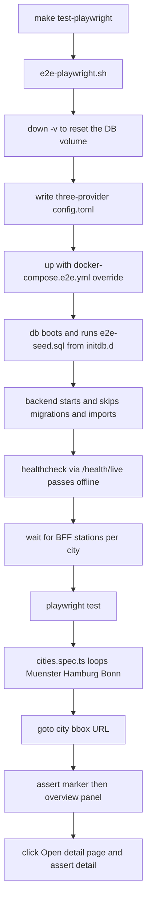

# 71 - Multi-city Playwright map/overview/detail tests

Status: implemented

## Problem

[`scripts/e2e-playwright.sh`](../scripts/e2e-playwright.sh:1) boots the stack
with a Münster-only temporary `config.toml` and waits for the Münster station
`Bohlweg` before running the specs. The map/overview/detail specs
([`map.spec.ts`](../frontend/e2e/map.spec.ts:1),
[`detail.spec.ts`](../frontend/e2e/detail.spec.ts:1)) only ever exercise
Münster, so the UI is never verified against Hamburg or Bonn data. Extending
this naively means the test run re-imports large datasets from three providers
(Münster GitHub archive, Bonn OpenData 2023–2025 backfill, Hamburg 5-min
SensorThings history) on every run — slow and network-dependent.

## Goal

Run the map/overview/detail specs for **all three cities** (Münster, Hamburg,
Bonn) against a **single Docker stack boot**, using a **small committed SQL
fixture derived from the current database** instead of importing from the
providers.

## Decisions

- Single boot for all Playwright tests (confirmed with the user).
- **Seed, don't import.** A committed fixture [`scripts/e2e-seed.sql`](../scripts/e2e-seed.sql:1)
  is loaded by Postgres on a fresh volume (`docker-entrypoint-initdb.d` via
  [`docker-compose.e2e.yml`](../docker-compose.e2e.yml:1)). It contains the full
  schema, the refinery migration history, the three `data_sources`, every
  counting station + channel, and **synthesized recent measurements** for the
  alphabetically-first stations of each city (see "Why synthesized" below). No
  provider data is fetched during the run.
- **Fully offline.** [`docker-compose.e2e.yml`](../docker-compose.e2e.yml:1)
  also overrides the backend healthcheck to `/health/live`, so readiness never
  pings the providers, and the committed [`tiles/map.pmtiles`](../tiles/map.pmtiles:1)
  archive (plus seeded FINISHED `tiles_update`/`asset_cleanup` jobs) means no
  Protomaps download and no tile rebuild either.
- **Suppress the startup import.** The seed inserts a `FINISHED` `jobs` row per
  scheduled job type — `data_source_update`, `asset_cleanup`, `tiles_update`.
  [`run_if_due`](../backend/src/core/application/data_source_update_service.rs:71)
  then finds a recent successful run and skips (the `data_source_update`
  `finished_at` is in the future so the cron-based overdue test can never fire).
- **Data-source ids are deterministic.** [`DataSource::id_from_name`](../backend/src/core/domain/data_source/data_source.rs:30)
  derives a UUIDv5 from the name, so the seeded `data_sources` rows (dumped from
  the real DB) match exactly what [`StartupService`](../backend/src/core/application/startup_service.rs:98)
  upserts from `config.toml` (`ON CONFLICT (id) DO UPDATE`). The three providers
  remain in the e2e `config.toml`, so startup keeps (not deletes) the seeded
  `data_sources` and their counting stations.
- **Why synthesized measurements.** A committed snapshot with real timestamps
  would age: "Last 24 hours"/"This week" charts would empty out as the data gets
  old. The seed instead generates a small, plausible dataset per curated channel
  with `now() - interval ...` timestamps, so the fixture is always current, tiny
  on disk (one `INSERT ... SELECT generate_series`), and the station/channel
  structure (names, coordinates, resolutions) still comes from the current DB.
- **Deterministic per-city target station.** Dense/co-located markers (e.g. Bonn
  bridge stations, Hamburg MQ1.2/MQ1.3 a few metres apart) intercept pointer
  events, so a bare marker click is flaky. The spec instead opens the overview
  through the app's own shared-link `station` URL param after asserting the city
  markers render, and the marker-click interaction stays covered by `map.spec.ts`
  (Münster).
- **Destructive to local volumes.** The e2e uses `docker compose down -v`, so
  the local `postgres_data`/`minio_data` volumes are reset and re-seeded from
  the fixture. Regenerate the fixture first (`scripts/dump-e2e-fixture.sh`) if
  the real dev data is needed afterwards.

## Fixture contents ([`scripts/e2e-seed.sql`](../scripts/e2e-seed.sql:1))

Generated by [`scripts/dump-e2e-fixture.sh`](../scripts/dump-e2e-fixture.sh:1)
from the running stack:

- `pg_dump --schema-only` (tables, indexes, functions and triggers, including
  the `refinery_schema_history` table and the V13/V14/V15 triggers).
- `refinery_schema_history` data (all migration rows), so the backend's
  `create_pool` skips migrations.
- `data_sources`, `assets`, `counting_stations` (all 215), `channels`, plus the
  persistent-state / provider-message tables (data-only).
- `UPDATE counting_stations SET image_asset_id = NULL` — the e2e MinIO bucket
  only holds the builtin bike icon, so the fallback is used.
- Synthesized recent measurements for the alphabetically-first stations of each
  city (Münster: Bismarckallee/Bohlweg/Coesfelder Kreuz; Bonn:
  BN - Bröltalbahnweg/Brühler Straße/Estermannufer; Hamburg:
  MQ1.2/MQ1.3/MQ10.1+10.2), generated relative to load time at each city's real
  resolution (900 s / 3600 s / 300 s).
- Three `FINISHED` `jobs` rows (`data_source_update`, `asset_cleanup`,
  `tiles_update`), the update job's `finished_at` in the future.

## Run flow

## Changes

### New [`docker-compose.e2e.yml`](../docker-compose.e2e.yml:1)

- Override mounting `./scripts/e2e-seed.sql` into the `db` service at
  `/docker-entrypoint-initdb.d/e2e-seed.sql:ro`.
- Override the `backend` healthcheck to `/health/live` (fast poll) so the
  compose healthcheck and the frontend `depends_on` never ping the providers.

### New [`scripts/dump-e2e-fixture.sh`](../scripts/dump-e2e-fixture.sh:1)

- Produces [`scripts/e2e-seed.sql`](../scripts/e2e-seed.sql:1) as described
  above (schema + refinery history + small tables + synthesized measurements +
  finished jobs), by running `pg_dump`/`psql` through the running `db` service.

### New [`scripts/e2e-seed.sql`](../scripts/e2e-seed.sql:1)

- The committed fixture (generated by the script above; verified to load cleanly
  into a scratch database: 3 data sources, 215 stations, 389 channels, ~62 k
  measurements, 3 jobs, 15 migration-history rows).

### [`scripts/e2e-playwright.sh`](../scripts/e2e-playwright.sh:1)

- Use `docker compose -f docker-compose.yml -f docker-compose.e2e.yml` and
  `down -v --remove-orphans` to guarantee a clean, seeded DB.
- Write the three-provider `config.toml` (all three `[[data_sources]]` blocks,
  still required for startup sync).
- Wait on `${APP_URL}/health/live` instead of `/health/ready` (offline).
- Replace the `Bohlweg` wait with a per-city station check (poll the BFF until
  each city bbox returns at least one station).
- Keep the backup/restore of a pre-existing `config.toml`.

### [`frontend/e2e/helpers.ts`](../frontend/e2e/helpers.ts:1)

- Add a `CITY_BOUNDS` map (name → `Bounds`) and a `cityUrl(city)` helper that
  returns `/?min_lat=...&min_lng=...&max_lat=...&max_lng=...`.

### New [`frontend/e2e/cities.spec.ts`](../frontend/e2e/cities.spec.ts:1)

- For each city: resolve a seeded target station id via the search API
  (`CITY_TARGET` in [`helpers.ts`](../frontend/e2e/helpers.ts:1)), load
  `cityUrl(city) + "&station=<id>"` (the app's shared-link flow opens the
  overview), assert the city markers render, assert the overview panel
  (`Total bikes (all time)`, `Last 24 hours`, the `Open detail page` link),
  click `Open detail page`, assert the `/stations/<id>` URL, the `Back to map`
  link, one map and no sidebar.

## Verification

- `make test-playwright` green with all three cities exercised from the seeded
  fixture and no live provider import.
- The existing Münster-only specs still pass unchanged (the seed keeps
  `Bohlweg` and the alphabetically-first stations, so search/sidebar/url/summary
  all still have data).

## Gates

- `make test-playwright` green (frontend UI change).

## Definition of done

- [x] Fixture generator + committed seed added and verified.
- [x] e2e script boots once, seeds the DB, and runs without provider imports.
- [x] `cities.spec.ts` covers map/overview/detail for Münster, Hamburg, Bonn.
- [x] `make test-playwright` green.
- [x] `agents.md` / `README.md` updated.
