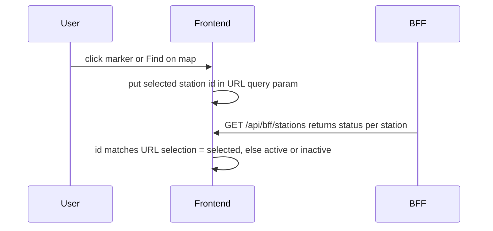

# 78 - Station flags (active / selected / inactive), overview banner, full-width share, Playwright timeouts

Status: implemented

## Problem

The map uses one emerald pin-with-bike marker for every station, so there is no
visual difference between a normal station, the currently selected station and a
station that is no longer provided by the data source. The overview banner that
opens when a station is selected only shows the name plus two icon buttons. The
"Share by channel" chart on the detail page is trapped in a two-column grid where
it wastes half a row, and the Playwright suite has no upper bound on individual
actions/navigations or the whole run, so a hanging step can wait forever.

## Goal

1. Three distinct station flags rendered by map state:
   - `active` (normal),
   - `selected` (the station the user opened, either by clicking a marker or by
     search + "Find on map"),
   - `inactive` (a station that was present in a previous import but is missing
     from the adapter's current output).
2. The BFF is stateless and only reports the persisted backend status
   (`active` | `inactive`). The URL stores only the selected station id; the
   frontend derives the `selected` flag from that id and otherwise falls back to
   the BFF-provided status.
3. The overview banner shows a small station-image icon (the bike icon, top
   right), the station name, the description and the channel count.
4. The "Share by channel" card spans the full width of the nerd-stats section.
5. Playwright fails on long-running steps instead of waiting indefinitely.

## Design decisions

- The three flags are **frontend Vite SVG assets** under
  [`frontend/src/features/map/`](../frontend/src/features/map), matching the
  existing marker relocation from plan 40. They are NOT backend/MinIO assets —
  the marker is rendered client-side and served by nginx.
- The persisted station attribute is `status` (`active` | `inactive`). The BFF
  returns exactly that status on the map-marker DTO. The transient UI state
  `selected` is never persisted and never sent back by the BFF — the frontend
  derives it from the selected station id in the URL.
- The URL keeps the existing `station=<id>` query parameter; it carries only
  "which station is selected", not a full state string.
- Marker rendering: if `station.id === selectedStationId` → `selected` flag,
  else `active` or `inactive` based on the BFF `status`.

## Flow

## Approach

### Task 1 — selected flag

Backend:

- Add a `StationStatusDto` enum in
  [`backend/src/adapter/driving/bff/dto.rs`](../backend/src/adapter/driving/bff/dto.rs:60)
  serialized lowercase as `active` | `inactive`.
- Add `status: StationStatusDto` to
  [`StationMapDto`](../backend/src/adapter/driving/bff/dto.rs:63), populated from
  the persisted station `status`.
- [`list_bff_stations`](../backend/src/adapter/driving/bff/handlers.rs:204) maps
  each in-bounds station to `status` from the domain entity; no selection logic
  and no new query parameter.

Frontend:

- Create
  [`frontend/src/features/map/station-flag.svg`](../frontend/src/features/map/station-flag.svg)
  as a copy of the current
  [`map-flag-counting-station.svg`](../frontend/src/features/map/map-flag-counting-station.svg:1)
  (emerald `#059669`).
- Create
  [`frontend/src/features/map/station-flag-selected.svg`](../frontend/src/features/map/station-flag-selected.svg)
  as a visually distinct selected variant (e.g. an amber/orange accent ring and a
  slightly larger pin so a selected marker clearly stands out).
- Delete
  [`frontend/src/features/map/map-flag-counting-station.svg`](../frontend/src/features/map/map-flag-counting-station.svg:1).
- In [`frontend/src/lib/map.tsx`](../frontend/src/lib/map.tsx:13) import the three
  SVGs; extend
  [`stationMarkerImage`](../frontend/src/lib/map.tsx:28) with a
  `state: 'active' | 'selected' | 'inactive'` option that picks the URL and adds
  `station-marker--selected` / `station-marker--inactive` classes.
- Extend [`StationMap`](../frontend/src/features/stations/types.ts:2) with
  `status: 'active' | 'inactive'`.
- Pass `selectedStationId` from
  [`MapPage`](../frontend/src/features/map/MapPage.tsx:38) into
  [`MapView`](../frontend/src/features/map/MapView.tsx:16); in the marker loop
  compute the resolved state
  (`station.id === selectedStationId ? 'selected' : station.status`) and pass it
  to `stationMarkerImage`.
- [`fetchMapStations`](../frontend/src/features/stations/api.ts:14) and
  [`useVisibleStations`](../frontend/src/features/stations/useVisibleStations.ts:10)
  stay unchanged (the BFF is not given the selection).
- Update [`DetailMap`](../frontend/src/features/stationDetail/DetailMap.tsx:48)
  to render the selected flag (`state: 'selected'`).
- [`SummaryMap`](../frontend/src/features/stationsSummary/SummaryMap.tsx:38)
  keeps its existing `disabled` grayscale behaviour; its markers stay `active`.

### Task 2 — inactive stations

Backend:

- Add migration
  [`V17__add_counting_station_status.sql`](../backend/migrations/V17__add_counting_station_status.sql)
  that adds `status text NOT NULL DEFAULT 'active'` plus a CHECK constraint
  (`status IN ('active', 'inactive')`).
- Add a `StationStatus` value object (`Active` / `Inactive`) and a `status` field
  to [`CountingStation`](../backend/src/core/domain/counting_stations/counting_station.rs:7).
- Update the Postgres repository
  ([`counting_station_repository.rs`](../backend/src/adapter/driven/postgres/counting_station_repository.rs:8))
  to read/write `status` (`STATION_COLUMNS`, `map_row`, `save`, `update`).
- In
  [`sync_counting_stations`](../backend/src/core/application/data_import_service.rs:119):
  - New stations are created with `status = Active`.
  - Existing stations that appear in the provider output are updated to
    `status = Active` (reactivation).
  - After processing the provider records, load all stations of the current data
    source and mark any station whose `external_datasource_id` is not in the
    provider's current set as `status = Inactive` (only when the update actually
    changes the row).
- **No-current-data marking:** after a data source's measurements are imported
  (in [`import`](../backend/src/core/application/data_import_service.rs:95) and
  [`update_data_source`](../backend/src/core/application/data_import_service.rs:394)),
  a served station is marked `Inactive` when none of its channels has a
  measurement newer than `STALE_STATION_AFTER_HOURS` (48 h) before now. Reactivation
  is driven by `sync_counting_stations` (present in the provider output → Active)
  and only sticks when the stale check finds current data again. Backed by a new
  `MeasurementRepository::latest_by_channel` query (Postgres `DISTINCT ON`).
- Add/adjust unit tests in
  [`data_import_service.rs`](../backend/src/core/application/data_import_service.rs:467)
  and the repository tests covering the reactivation + inactive-marking paths
  (including the missing-from-provider, stale-data and reactivation-with-current-data
  cases).
- Update every `CountingStation { ... }` literal across the codebase (tests and
  fixtures) with the new field.

Frontend:

- Create
  [`frontend/src/features/map/station-flag-inactive.svg`](../frontend/src/features/map/station-flag-inactive.svg)
  as a muted/gray variant of the pin.

BFF:

- The `status` field from Task 1 already surfaces the persisted status as
  `inactive`; the frontend renders the inactive flag for those markers.

### Task 3 — overview banner

- Rework the header/banner of
  [`StationOverview`](../frontend/src/features/stationOverview/StationOverview.tsx:29)
  to show:
  - the station name (still the detail link),
  - the description,
  - a channel-count badge,
  - the existing detail + close buttons on the top right (no separate icon — the
    user asked to remove it; the large station image stays in the body).
- Remove the now-duplicated description + channel-count badge from the overview
  body (keep the large image, "Updated …" and the stats card). No BFF/DTO change
  is needed — `image_url`, `description` and `channel_count` are already in
  [`StationOverviewPage`](../frontend/src/features/stationOverview/types.ts:20).

### Task 6 — map popup context

- The map marker popup in
  [`MapView`](../frontend/src/features/map/MapView.tsx:63) currently shows only
  the station name and a detail link. Enrich it with the same identity used by
  the sidebar, but smaller, laid out so long text wraps instead of overflowing:
  - top left: a small station-image icon (`image_url`, falling back to the
    built-in bike icon),
  - beside it the station name (still a detail link) with the detail icon
    button,
  - the channel count as a badge (rendered like the overview banner badge),
  - the description on its own line below both (wraps with `break-words`).
- The popup pins a `maxWidth` (overriding MapLibre's default) and uses
  `min-w-0`/`shrink-0` so names/buttons stay inside the popup bounds.
- No backend change is needed: the identity (`image_url`, `description`) already
  comes from the sidebar shell and the channel count from the sidebar stats,
  both already fetched by
  [`useVisibleStations`](../frontend/src/features/stations/useVisibleStations.ts:10).
- [`MapPage`](../frontend/src/features/map/MapPage.tsx:38) passes the resolved
  per-station identity/stats (a `Map` keyed by station id, derived from `shell`
  and `stats`) into `MapView`; the popup looks up the popup station by id and
  falls back to the plain name + link while the shell/stats are still loading.

### Task 4 — full-width share pies

- In
  [`StationDetail.tsx`](../frontend/src/features/stationDetail/StationDetail.tsx:441),
  move the "Share by channel"
  [`ChartCard`](../frontend/src/features/stationDetail/StationDetail.tsx:448) out
  of the `md:grid-cols-2` grid into its own full-width slot below the
  Weekdays/Hours radars.
- Do the same for the summary page's "Share by station" card in
  [`StationsSummary.tsx`](../frontend/src/features/stationsSummary/StationsSummary.tsx:496).

### Task 5 — Playwright timeouts

- In [`frontend/playwright.config.ts`](../frontend/playwright.config.ts:15):
  - keep the per-test `timeout: 90_000` and `expect.timeout: 20_000`,
  - add `globalTimeout` (a generous whole-suite cap, e.g. 15 minutes),
  - add `use.actionTimeout` and `use.navigationTimeout` (e.g. 30 seconds) so a
    single hung action/navigation fails instead of waiting forever.

## e2e tests

- New [`frontend/e2e/flags.spec.ts`](../frontend/e2e/flags.spec.ts):
  - clicking a map marker puts `station=<id>` in the URL and adds
    `station-marker--selected` to that marker (located by `alt`),
  - search + "Find on map" flies to the station and adds
    `station-marker--selected` to the found marker,
  - a map-void click clears the selected state (the marker returns to the normal
    `active` flag),
  - the seeded inactive station renders with `station-marker--inactive`.
- Extend [`frontend/e2e/map.spec.ts`](../frontend/e2e/map.spec.ts:54) to assert
  the overview banner shows the small station-image icon, the station name, the
  description and a channel-count badge; adjust the existing
  `overview.locator('img')` assertion if the banner icon introduces a second
  ``.
- Extend the existing popup test
  ([`frontend/e2e/map.spec.ts`](../frontend/e2e/map.spec.ts:17)) to assert the
  popup shows the small station-image icon, the station name, the description
  and the channel count.

### e2e fixture / inactive station seed

- The committed fixture
  ([`frontend/e2e/e2e-seed.sql`](../frontend/e2e/e2e-seed.sql:144)) currently
  lags the latest migration (V16 is applied by refinery at startup). After adding
  V17 the same "refinery fills the gap" behaviour applies; the seed does not need
  to contain the column for the stack to boot.
- To test the inactive flag deterministically, seed one inactive station. Primary
  approach (repo convention per
  [`scripts/dump-e2e-fixture.sh`](../scripts/dump-e2e-fixture.sh:1)): run the
  stack so V17 applies, regenerate the fixture, then set one peripheral Münster
  station (one that is not the alphabetically-first station used by the other
  specs, e.g. `Kanalpromenade Abschnitt 6` or `Schmeddingstraße`) to `inactive`
  in the regenerated `counting_stations` COPY.
- Fallback if regeneration is not possible: manually patch the seed's
  `counting_stations` CREATE TABLE + COPY with the `status` column and add the
  V17 row to the `refinery_schema_history` COPY using refinery's real checksum
  (or, alternatively, inject the inactive status in
  [`scripts/e2e-playwright.sh`](../scripts/e2e-playwright.sh:179) with a `psql`
  `UPDATE` after the backend becomes ready).

## Files to change

Backend:

- [`backend/migrations/V17__add_counting_station_status.sql`](../backend/migrations/V17__add_counting_station_status.sql)
  (new)
- [`backend/src/core/domain/counting_stations/counting_station.rs`](../backend/src/core/domain/counting_stations/counting_station.rs:7)
- [`backend/src/adapter/driven/postgres/counting_station_repository.rs`](../backend/src/adapter/driven/postgres/counting_station_repository.rs:8)
- [`backend/src/core/application/data_import_service.rs`](../backend/src/core/application/data_import_service.rs:119)
- [`backend/src/adapter/driving/bff/dto.rs`](../backend/src/adapter/driving/bff/dto.rs:60)
- [`backend/src/adapter/driving/bff/handlers.rs`](../backend/src/adapter/driving/bff/handlers.rs:204)
- [`backend/src/adapter/driving/rest/tests/bff.rs`](../backend/src/adapter/driving/rest/tests/bff.rs:36)
  and fixtures/mocks for the new `status` field.

Frontend:

- [`frontend/src/features/map/station-flag.svg`](../frontend/src/features/map/station-flag.svg)
  (new)
- [`frontend/src/features/map/station-flag-selected.svg`](../frontend/src/features/map/station-flag-selected.svg)
  (new)
- [`frontend/src/features/map/station-flag-inactive.svg`](../frontend/src/features/map/station-flag-inactive.svg)
  (new)
- Delete [`frontend/src/features/map/map-flag-counting-station.svg`](../frontend/src/features/map/map-flag-counting-station.svg:1)
- [`frontend/src/lib/map.tsx`](../frontend/src/lib/map.tsx:13)
- [`frontend/src/features/stations/types.ts`](../frontend/src/features/stations/types.ts:2)
- [`frontend/src/features/map/MapPage.tsx`](../frontend/src/features/map/MapPage.tsx:38)
  (pass selected id + popup identity/stats into the map view)
- [`frontend/src/features/map/MapView.tsx`](../frontend/src/features/map/MapView.tsx:16)
  (selected-flag resolution + enriched popup)
- [`frontend/src/features/stationDetail/DetailMap.tsx`](../frontend/src/features/stationDetail/DetailMap.tsx:48)
- [`frontend/src/features/stationOverview/StationOverview.tsx`](../frontend/src/features/stationOverview/StationOverview.tsx:29)
- [`frontend/src/features/stationDetail/StationDetail.tsx`](../frontend/src/features/stationDetail/StationDetail.tsx:441)
- [`frontend/playwright.config.ts`](../frontend/playwright.config.ts:15)
- [`frontend/e2e/flags.spec.ts`](../frontend/e2e/flags.spec.ts) (new)
- [`frontend/e2e/map.spec.ts`](../frontend/e2e/map.spec.ts:54)
- [`frontend/e2e/e2e-seed.sql`](../frontend/e2e/e2e-seed.sql:144) (regenerated /
  patched with one inactive station)

Docs:

- [`plans/README.md`](../plans/README.md:1) (register this plan)
- [`README.md`](../README.md:1), [`ToDo.md`](../ToDo.md:1) (status notes)

## Out of scope

- No provider / importer change beyond marking missing stations inactive: no
  station deletion and no channel/measurement cleanup for inactive stations.
- No new flag for the station-summary page's disabled (grayscale) toggle.
- No hiding of inactive stations from search/sidebar (they stay listed, just
  flagged).

## Definition of done

- Map markers render the normal, selected and inactive flags; the BFF reports the
  persisted `status`, and selecting via marker click or "Find on map" updates the
  URL and the marker (frontend-derived `selected`).
- Stations missing from a provider's current output are marked `inactive` in the
  DB and surfaced as `status: inactive` by the BFF.
- The overview banner shows the small station-image (bike) icon, name,
  description and channel count, covered by Playwright.
- "Share by channel" is full width.
- Playwright has action/navigation/global timeouts.
- `make check`, `make test` / `make test-rest`, `make coverage` and
  `make test-playwright` green.

## Implementation notes

- **Inactive-station e2e via script injection, not a seed change.** The committed
  [`e2e-seed.sql`](../frontend/e2e/e2e-seed.sql:144) lags the newest migration
  (like V16) and refinery applies V17 at startup, so the `status` column does not
  exist at initdb time. Instead of regenerating the fixture (which needs a
  populated dev stack), [`scripts/e2e-playwright.sh`](../scripts/e2e-playwright.sh:179)
  marks one Münster station (`Gartenstraße`) inactive with a `psql` `UPDATE`
  right after the backend becomes ready. The
  [`flags.spec.ts`](../frontend/e2e/flags.spec.ts:77) inactive test asserts the
  `station-marker--inactive` class on that marker.
- **`getByAltText` needs `exact: true`.** The enriched overview banner and popup
  add ` icon">` / ` image">`; Playwright's
  `getByAltText` substring-matches by default, so the flag specs target the
  marker with `{ exact: true }`.
- **`StationStatusDto` has two values only.** `selected` is not a persisted
  status; the frontend derives it from the URL `station` param and the BFF stays
  stateless.
- **UI feedback round.** After the first implementation the user refined the UI:
  the overview banner no longer shows a separate icon (only name + description +
  channel badge); the map popup lays out the icon top-left with the name beside
  it and the description wrapping on a line below (pinning `maxWidth` + `break
  -words` so long names/descriptions and the buttons never overflow); the
  detail-page preview marker uses the **active** flag (not the selected one);
  and the summary page's "Share by station" card is full width too.
- **Inactive beats selected.** When a station is both selected (the URL
  `station` param) and inactive, the marker now shows the **inactive** flag (the
  selected state no longer overrides a decommissioned status). Covered by a
  dedicated Playwright assertion (`flags.spec.ts`).
- **No current data ⇒ inactive.** A station the provider still serves is also
  marked `inactive` when, after an import, none of its channels has a
  measurement newer than the 48 h staleness window (e.g. MQ80.2 in the user's
  dev stack: it is still in the provider output and its last sync succeeded, so
  it stayed active; once it stops producing current data it flips). Reactivation
  only sticks when the station reappears **and** has current data.
- **Gate results:** `make check` ✓, `make test` (474) ✓, `make test-rest` (100)
  ✓, `make coverage` ✓ (overall 87.25%, core 95.45%), `make test-playwright`
  (41) ✓.
