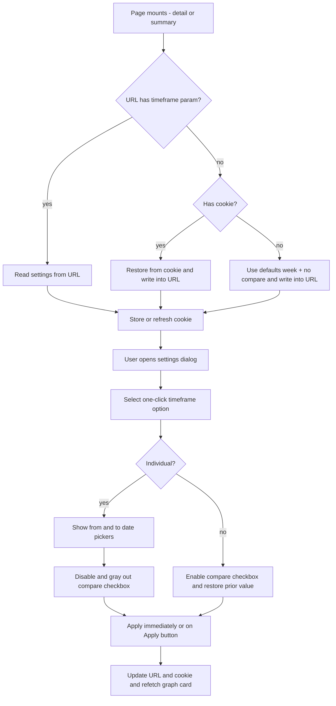

# 79 - Shared timeframe settings, individual date range + URL/cookie persistence

Status: implemented

## Problem

The timeframe dropdown ("Timeframe") and the "Compare previous period" checkbox
are rendered inline in the "Detailed statistics" header of both the counting
station detail page and the station-summary page, duplicated almost verbatim.
There is no way to pick an arbitrary date range, the selected view is not
shareable, and the choice is lost when the user leaves the page. The two pages
should share one settings component, the timeframe/compare controls should move
into the existing settings dialogue, and an "Individual" option should allow a
custom from/to range with sensible bucket grouping.

## Goal

1. One shared timeframe-settings component powers both the detail page
   ([`StationDetail.tsx`](../frontend/src/features/stationDetail/StationDetail.tsx:331))
   and the summary page
   ([`StationsSummary.tsx`](../frontend/src/features/stationsSummary/StationsSummary.tsx:397)).
2. The timeframe dropdown and the "Compare previous period" checkbox move out of
   the page header and into the settings dialogue (which already hosts the
   "Exclude new stations" switch). The timeframe options are rendered as
   one-click options.
3. A new "Individual" timeframe option shows two date pickers (`from`/`to`). The
   selection applies immediately (background) and is also confirmed by an Apply
   button; both behave identically.
4. With "Individual" selected, "Compare previous period" is disabled and grayed
   out. Switching back to any interval re-enables it and restores the value it
   had before "Individual" was chosen.
5. The timeframe/compare/individual settings are stored in the URL (shareable)
   and mirrored into a cookie (survives a bare URL revisit). On entering a view
   with no settings in the URL, the cookie restores them and writes them back
   into the URL.
6. A custom "Individual" range groups the time-series buckets calendar-aligned:
   `<= 24h` → 15 minutes, `<= 48h` → 1 hour, `<= 30d` → 1 day, `<= 90d` →
   1 week, `<= 2y` → 1 month, `> 2y` → 1 quarter. The standalone monthly bar
   chart and the overview section are untouched.
7. The selected settings are printed left of the settings button (where the
   inline dropdown/checkbox used to sit).

## Design decisions

- The fixed timeframes (`day`, `week`, `last_30_days`, `year`) keep their exact
  current bucket widths; the grouping thresholds only apply to the "Individual"
  custom range.
- Bucket grouping for the custom range is **calendar-aligned**: `date_trunc`
  for day/week/month/quarter (the repository already uses `date_trunc` for
  monthly totals in
  [`sum_by_month`](../backend/src/adapter/driven/postgres/measurement_repository.rs:494)
  and `date_bin` for fixed seconds in
  [`sum_buckets`](../backend/src/adapter/driven/postgres/measurement_repository.rs:248)).
  The 15-minute and 1-hour levels stay fixed-width `date_bin`, aligned to local
  time boundaries via the existing `origin` argument.
- The custom range has **no previous period** (compare is disabled), so the
  backend returns empty `previous` series/radars and no like-for-like previous
  window. `exclude_new_stations` still filters to groups that fully cover the
  custom window (and `is_new` reflects that single window on the detail page).
- The weekday radar is only derived from bucketed series when buckets are
  `<= 1 day` wide. For week/month/quarter custom ranges the aggregate weekday
  radar uses the existing
  [`sum_weekdays`](../backend/src/core/domain/measurements/repository_port.rs:174)
  and a new `sum_weekdays_by_channel`; the hour-of-day radar already uses the
  raw-measurement `sum_hours`/`sum_hours_by_channel` and needs no change.
- The URL is the source of truth when present; the cookie is only a fallback for
  bare URLs and is refreshed whenever the URL carries settings. URL parameter
  names: `timeframe` (`day|week|last_30_days|year|individual`), `from`, `to`
  (`YYYY-MM-DD`), `compare` (presence = on), `exclude_new_stations` (presence = on).
- The "Exclude new stations" switch stays app-global via
  [`TrendSettingsContext`](../frontend/src/features/settings/TrendSettingsContext.tsx:27)
  (localStorage) but is **also written into the URL/cookie round-trip** (and
  restored from a shared link), so a shared view carries the filter too. The
  dialog toggle updates both the context and the URL; the detail/summary pages
  sync the URL flag back into the context when the param is present.

## Flow

## Approach

### Task 1 — Backend: bucket granularity + custom window model

- Add a `BucketGranularity` enum in the station-analytics domain (or
  `graphs.rs`): `Fixed { seconds: i64 }`, `Day`, `Week`, `Month`, `Quarter`.
- Extend the internal `Window` struct in
  [`graphs.rs`](../backend/src/core/application/station_analytics/graphs.rs:37)
  to carry `granularity` in addition to `from`/`to`/`origin`.
- Add `custom_window(from, to) -> Window` that computes `granularity` from the
  span using the thresholds above, plus a `custom_windows`/selection path.
- Keep [`graph_windows`](../backend/src/core/application/station_analytics/graphs.rs:86)
  and the four fixed timeframes exactly as they are.

### Task 2 — Backend: repository granularity support

- Extend the `MeasurementRepository` port
  ([`repository_port.rs`](../backend/src/core/domain/measurements/repository_port.rs:147))
  so `sum_buckets`/`sum_buckets_by_channel` accept the granularity instead of
  only `bucket_seconds`/`origin` (or add a granularity parameter while keeping
  the fixed-seconds path).
- Implement in
  [`measurement_repository.rs`](../backend/src/adapter/driven/postgres/measurement_repository.rs:248):
  `Fixed` → existing `date_bin`; `Day`/`Week`/`Month`/`Quarter` →
  `date_trunc('day'|'week'|'month'|'quarter', timestamp AT TIME ZONE tz) AT
  TIME ZONE tz`.
- Add `sum_weekdays_by_channel` (mirroring `sum_hours_by_channel`) for
  per-channel weekday radars over wide buckets.

### Task 3 — Backend: update mocks/tests for the changed port

- Update the in-memory/mock repositories in
  [`backend/src/adapter/driving/rest/tests/mocks.rs`](../backend/src/adapter/driving/rest/tests/mocks.rs:248)
  and any other `MeasurementRepository` impls for the new signature.

### Task 4 — Backend: service custom-range computation

- Generalize the service port methods
  ([`service_port.rs`](../backend/src/core/domain/station_analytics/service_port.rs:83))
  `detail_graphs_timeframe` and `stations_summary_graphs_timeframe` (or add
  parallel `*_graphs_custom` methods) to accept either a `GraphTimeframe` or a
  custom `{ from, to }` selection.
- In
  [`service.rs`](../backend/src/core/application/station_analytics/service.rs:513),
  build the custom `Window` and call
  [`period_graphs_per_channel`](../backend/src/core/application/station_analytics/graphs.rs:451)
  /
  [`period_graphs_per_station`](../backend/src/core/application/station_analytics/graphs.rs:533)
  with no previous window; derive weekday/hour radars from the raw-measurement
  repository methods when buckets are wider than one day.

### Task 5 — Backend: handlers + DTOs for from/to

- Add optional `from`/`to` (`Option<DateTime<Utc>>`, both-or-neither, `from < to`)
  to `AsOfQueryParams`
  ([`dto.rs`](../backend/src/adapter/driving/bff/dto.rs:281)) and
  `BffStationSummaryQueryParams`
  ([`dto.rs`](../backend/src/adapter/driving/bff/dto.rs:501)).
- In
  [`get_bff_station_detail_graphs`](../backend/src/adapter/driving/bff/handlers.rs:515)
  and
  [`get_bff_stations_summary_graphs`](../backend/src/adapter/driving/bff/handlers.rs:805),
  when both `from`/`to` are present, use the custom range (the `{timeframe}`
  path segment stays valid but is ignored); otherwise keep the timeframe path.
- Return a 400 `InvalidQuery` for partial or inverted ranges.

### Task 6 — Backend: tests

- Unit-test the span→granularity mapping and the custom-window computation.
- Repository tests for `date_trunc` week/month/quarter alignment and
  `sum_weekdays_by_channel`.
- REST BFF tests for `from`/`to` validation and a custom-range graph response in
  [`backend/src/adapter/driving/rest/tests/bff.rs`](../backend/src/adapter/driving/rest/tests/bff.rs:639).

### Task 7 — Frontend: URL + cookie persistence hook

- Add a small cookie helper (read/write/parse JSON) and a
  `useTimeframeSettings` hook that:
  - parses `timeframe`/`from`/`to`/`compare` from `useSearchParams`,
  - falls back to the cookie and writes the restored values into the URL
    (`replace: true`),
  - defaults to `week` + compare off and writes that into the URL when neither
    exists,
  - mirrors every change into the cookie and the URL,
  - keeps the compare value separate while `individual` is active and restores
    it on switching back.

### Task 8 — Frontend: timeframe type + config

- Extend `Timeframe` in
  [`types.ts`](../frontend/src/features/stationDetail/types.ts:42) with
  `individual`.
- Extend
  [`timeframes.ts`](../frontend/src/features/stationDetail/timeframes.ts:80)
  with the individual config (label, titles, axis/tooltip formatters suitable
  for day/week/month/quarter buckets) and a helper that maps the selected
  from/to span to the same resolution thresholds for labels/domain.

### Task 9 — Frontend: shared settings UI

- Rework
  [`SettingsDialog.tsx`](../frontend/src/features/settings/SettingsDialog.tsx:18)
  to render, above the existing exclude switch:
  - the timeframe options as one-click radio-like options (day/week/last 30
    days/year/individual),
  - the "Individual" from/to date pickers (native `<input type="date">` via the
    existing [`Input`](../frontend/src/components/ui/input.tsx:5) component) when
    individual is selected,
  - the "Compare previous period" checkbox (disabled + grayed out for
    individual),
  - an Apply button plus immediate on-change application.
- Add a small `SelectedTimeframeLabel` component (or render inline) that prints
  the current selection (e.g. `This week · Compare previous period` or
  `Individual 01.01.2024 – 31.12.2024`) left of the settings button.

### Task 10 — Frontend: wire both pages

- In
  [`StationDetail.tsx`](../frontend/src/features/stationDetail/StationDetail.tsx:241)
  and
  [`StationsSummary.tsx`](../frontend/src/features/stationsSummary/StationsSummary.tsx:290),
  remove the inline `Select`/`Checkbox`, consume `useTimeframeSettings`, render
  the shared `SettingsDialog` + selected-settings label, and pass the resolved
  timeframe/from/to to the graph hooks.
- Update
  [`useStationGraphs`](../frontend/src/features/stationDetail/useStationGraphs.ts:8)
  /
  [`useStationsSummaryGraphs`](../frontend/src/features/stationsSummary/useStationsSummaryGraphs.ts:9)
  (and the summary `fetchSummaryGraphs`) to append `from`/`to` to the graph URL
  for individual mode.

### Task 11 — Frontend: e2e + formatting

- Update
  [`settings.spec.ts`](../frontend/e2e/settings.spec.ts:1),
  [`url.spec.ts`](../frontend/e2e/url.spec.ts:1),
  [`summary.spec.ts`](../frontend/e2e/summary.spec.ts:1) and
  [`detail.spec.ts`](../frontend/e2e/detail.spec.ts:1) for the moved controls,
  the individual date pickers, compare disable/restore and the URL/cookie
  round-trip.
- Run `npm run format` (Prettier) in [`frontend/`](../frontend).

### Task 12 — Plan registration + gates

- Register this plan in [`plans/README.md`](../plans/README.md) as the current
  plan.
- Run `make check`, `make test`/`make test-rest`, `make coverage` and
  `make test-playwright` per the Definition of Done in
  [`agents.md`](../agents.md).

### Follow-up fix — zero-fill the custom range (sparse individual chart)

The individual range chart only drew bars for months/weeks that had traffic
(e.g. `01.01.2025 – 30.10.2026` showed only Feb 2025 and May–Aug 2026) because
the repository returns only buckets with data. A follow-up fix zero-fills the
custom range so the whole selected period is always drawn:

- In
  [`graphs.rs`](../backend/src/core/application/station_analytics/graphs.rs:247):
  `calendar_bucket_start` (UTC start of the local day/week/month/quarter in the
  station timezone, mirroring `date_trunc`), `add_local_months`,
  `bucket_starts` (the half-open `[from, to)` grid at the window granularity)
  and `zero_fill_buckets` (pads a series with `0` for missing grid buckets).
- `period_data` zero-fills the aggregate `current_series` and each per-group
  (per-channel / per-station) series when the custom range has no previous
  period — but only when the series is non-empty, so a range with no data at
  all still returns an empty chart.
- The test repo's `bucket_start`
  ([`tests.rs`](../backend/src/core/application/station_analytics/tests.rs:190))
  now truncates calendar buckets in the station timezone (Berlin) like the real
  Postgres `date_trunc`, so the zero-filled grid lines up with the test buckets.
- Added
  [`detail_custom_range_zero_fills_empty_buckets`](../backend/src/core/application/station_analytics/tests.rs:2245)
  and updated the week/month/quarter start assertions to the Berlin-aligned
  instants (e.g. a January bucket starts `2022-12-31T23:00:00Z`, a summer month
  `2023-03-31T22:00:00Z`). The e2e settings test waits for each date input's URL
  round-trip before filling the next (the inputs are controlled by the URL), and
  the sidebar viewport test waits for the sidebar/marker counts to stabilize
  after the final map zoom.

### Follow-up fix — map popup loading skeletons

The map popup rendered its enriched identity (icon, description, channel-count
badge) only once the sidebar shell + per-station stats arrived, so the content
popped in and flickered. [`MapView`](../frontend/src/features/map/MapView.tsx:28)
now renders `Skeleton` placeholders (the same `@/components/ui/skeleton` +
`aria-busy` mechanism as the overview) for the fields still loading — the icon
and description while the shell is pending, and the channel-count badge while
the stats sub-resource is pending — and
[`MapPage`](../frontend/src/features/map/MapPage.tsx:158) passes the shell/stats
error flags so the skeletons stop if a fetch fails rather than pulsing forever.
