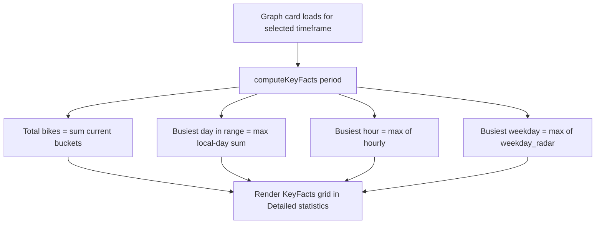

# 80 - Detail/summary: key facts, section reorder + wording fixes

Status: implemented

## Problem

The counting-station detail page and the station-summary page render the
"Bikes per month" chart in the middle of the page (between "Detailed
statistics" and "Nerd stats"), even though it is a standalone, all-history chart
that ignores the timeframe selector and the Bike-Trends settings. The
"Detailed statistics" section shows charts but no at-a-glance key facts, so the
user has to read the chart to know the totals for the selected timeframe. The
section is called "Nerd stats", which is inconsistent with the polished wording
elsewhere, and the Bike-Trends settings illustration uses the colloquial phrase
"recent months jump".

## Goal

1. Move the monthly "Bikes per month" section to the very bottom of both the
   detail page
   ([`StationDetail.tsx`](../frontend/src/features/stationDetail/StationDetail.tsx:407))
   and the summary page
   ([`StationsSummary.tsx`](../frontend/src/features/stationsSummary/StationsSummary.tsx:468)),
   below the "Detailed stats" section.
2. Rename "Nerd stats" to "Detailed stats" on both pages (section heading, the
   error message and the code comments that mention "nerd stats").
3. Add a hint above the "Bikes per month" chart explaining that the settings are
   not applied to it, so newly added counting stations may add bikes.
4. Add a row of key facts (same visual theme as the overview's metric boxes) to
   the "Detailed statistics" section of both pages, computed from the selected
   timeframe:
   - **Total bikes in selection** (sum of the current period's buckets).
   - **Busiest day in range** (the calendar day with the highest total, shown as
     its date).
   - **Busiest hour** (the peak hour-of-day with its bike count).
   - **Busiest weekday** (the peak weekday with its bike count).
   Minimum values are intentionally avoided because days/hours without data
   would always read `0`.
5. Rename the Bike-Trends illustration caption "a new station opens and adds
   bikes — recent months jump" to "a new station opens and adds bikes — sudden
   increase".
6. Extend the Playwright e2e suite for the new facts, the section order, the
   hint and the renamed wording.

## Design decisions

- **Key facts are derived client-side** from the already-fetched graph card
  (`PeriodGraphs` / `SummaryPeriodGraphs`). No backend or BFF changes are
  needed: `current` (time buckets), `hourly` (hour-of-day totals) and
  `weekday_radar` (weekday totals) are all present in the current payload.
- The facts share the overview's metric-box look: a bordered `rounded-md border
  p-3` box with a small label, a large value and an optional unit / detail line,
  laid out in the same `grid-cols-1 sm:grid-cols-2 lg:grid-cols-4` grid used by
  [`MetricCard`](../frontend/src/features/stationOverview/MetricCard.tsx:17).
- **Local-day grouping** for "Busiest day in range" sums the current period's
  buckets by browser-local calendar day (consistent with how the charts already
  align buckets to local time) and takes the maximum. This is exact for the four
  fixed timeframes (5-min, 1-hour and 1-day buckets) and for individual ranges
  with `15m` / `hour` / `day` resolution.
- The "Busiest day in range" fact is **always** rendered (no bucket-width
  gating). For coarse custom ranges (`week` / `month` / `quarter` buckets) each
  bucket is attributed to its start day, which is the most meaningful single day
  the data can express. The value shows the busiest day's date, with the bike
  count as a detail line.
- "Busiest hour" / "Busiest weekday" read the backend's `hourly` and
  `weekday_radar` arrays (already raw-measurement aggregates, so they stay
  correct for every timeframe). The hour is formatted as a locale `HH:00`
  value, the weekday as a locale weekday name, and each carries the matching
  bike count as a small detail line.
- The hint lives inside [`MonthlyBarChart`](../frontend/src/features/stationDetail/MonthlyBarChart.tsx:103)
  so both pages get it for free; it is rendered at the top of the card content,
  above the chart.
- The exact requested wording "sudden increase" is used verbatim (as supplied),
  so it replaces "recent months jump" in both the component and the e2e
  assertion.

## Flow

## Approach

### Task 1 — Shared key-fact component + computation

- Create [`KeyFacts.tsx`](../frontend/src/features/stationDetail/KeyFacts.tsx)
  exporting:
  - `computeKeyFacts(period)` that returns an ordered array of facts with stable
    keys (`total_bikes`, `busiest_day`, `busiest_hour`, `busiest_weekday`),
    skipping facts whose input array is empty.
  - `KeyFacts` presentational component styled like
    [`MetricCard`](../frontend/src/features/stationOverview/MetricCard.tsx:17).
- Reuse [`formatNumber`](../frontend/src/lib/format.ts:7) and
  [`LOCALE`](../frontend/src/lib/format.ts:5) for values/hour/weekday labels.

### Task 2 — Rename "Nerd stats" → "Detailed stats"

- In [`StationDetail.tsx`](../frontend/src/features/stationDetail/StationDetail.tsx:424)
  and [`StationsSummary.tsx`](../frontend/src/features/stationsSummary/StationsSummary.tsx:484):
  change the `<h2>` to `Detailed stats`, the error message to
  `Could not load the detailed stats.`, and the surrounding code comments.
- Also update the "nerd stats" mentions in the comments of
  [`WeekdayRadar.tsx`](../frontend/src/features/stationDetail/WeekdayRadar.tsx:30),
  [`HourRadar.tsx`](../frontend/src/features/stationDetail/HourRadar.tsx:23)
  and [`Skeletons.tsx`](../frontend/src/features/stationDetail/Skeletons.tsx:72).

### Task 3 — Move the monthly section to the bottom

- In [`StationDetail.tsx`](../frontend/src/features/stationDetail/StationDetail.tsx:407)
  move the whole `Monthly bar chart card` `<section>` block to after the
  "Detailed stats" section.
- Do the same in [`StationsSummary.tsx`](../frontend/src/features/stationsSummary/StationsSummary.tsx:468).

### Task 4 — Monthly chart heading + hint

- Give the monthly section its own `<h2>` heading (`Bikes per month`) and render
  the remark underneath it, like the "Detailed stats" section, on both pages
  ([`StationDetail.tsx`](../frontend/src/features/stationDetail/StationDetail.tsx:466),
  [`StationsSummary.tsx`](../frontend/src/features/stationsSummary/StationsSummary.tsx:527)):
  `The settings are not applied to this chart — newly added counting stations may add bikes.`

### Task 5 — Key facts on the detail page

- Import `KeyFacts` and `computeKeyFacts` in
  [`StationDetail.tsx`](../frontend/src/features/stationDetail/StationDetail.tsx:28).
- Render `<KeyFacts facts={computeKeyFacts(period)} />` as the first item inside
  the `period ? (...)` grid in the "Detailed statistics" section
  ([`StationDetail.tsx`](../frontend/src/features/stationDetail/StationDetail.tsx:398)).
  The facts are always computed — there is no bucket-width gating.

### Task 6 — Key facts on the summary page

- Mirror Task 5 in [`StationsSummary.tsx`](../frontend/src/features/stationsSummary/StationsSummary.tsx:442)
  using `SummaryPeriodGraphs` (same `current` / `hourly` / `weekday_radar`
  shape).

### Task 7 — Bike-Trends illustration wording

- In [`TrendSettingsIllustration.tsx`](../frontend/src/features/settings/TrendSettingsIllustration.tsx:80)
  change `recent months jump` to `sudden increase`.

### Task 8 — e2e updates

- In [`detail.spec.ts`](../frontend/e2e/detail.spec.ts:36) and
  [`summary.spec.ts`](../frontend/e2e/summary.spec.ts:73) rename the
  `Nerd stats` heading assertions to `Detailed stats`, including the
  "too many data-streams" scoping in
  [`summary.spec.ts`](../frontend/e2e/summary.spec.ts:160).
- In [`settings.spec.ts`](../frontend/e2e/settings.spec.ts:118) replace
  `/recent months jump/` with the new caption text.
- Add new tests:
  - Detail page: the "Detailed statistics" section shows all four key facts
    ("Total bikes in selection", "Busiest day in range", "Busiest hour",
    "Busiest weekday") for the default (week) timeframe.
  - Detail page: the "Bikes per month" card is the last `section` on the page
    and shows the settings hint.
  - Summary page: the "Detailed stats" heading and the key-facts row render.

### Task 9 — Gates

- Run `make check` (Prettier + Rust gates) and `make test-playwright`.

## Files touched

- [`frontend/src/features/stationDetail/KeyFacts.tsx`](../frontend/src/features/stationDetail/KeyFacts.tsx) (new)
- [`frontend/src/features/stationDetail/StationDetail.tsx`](../frontend/src/features/stationDetail/StationDetail.tsx)
- [`frontend/src/features/stationDetail/MonthlyBarChart.tsx`](../frontend/src/features/stationDetail/MonthlyBarChart.tsx)
- [`frontend/src/features/stationsSummary/StationsSummary.tsx`](../frontend/src/features/stationsSummary/StationsSummary.tsx)
- [`frontend/src/features/settings/TrendSettingsIllustration.tsx`](../frontend/src/features/settings/TrendSettingsIllustration.tsx)
- [`frontend/src/features/stationDetail/WeekdayRadar.tsx`](../frontend/src/features/stationDetail/WeekdayRadar.tsx) (comment only)
- [`frontend/src/features/stationDetail/HourRadar.tsx`](../frontend/src/features/stationDetail/HourRadar.tsx) (comment only)
- [`frontend/src/features/stationDetail/Skeletons.tsx`](../frontend/src/features/stationDetail/Skeletons.tsx) (comment only)
- [`frontend/e2e/detail.spec.ts`](../frontend/e2e/detail.spec.ts)
- [`frontend/e2e/summary.spec.ts`](../frontend/e2e/summary.spec.ts)
- [`frontend/e2e/settings.spec.ts`](../frontend/e2e/settings.spec.ts)
- [`plans/README.md`](../plans/README.md)
