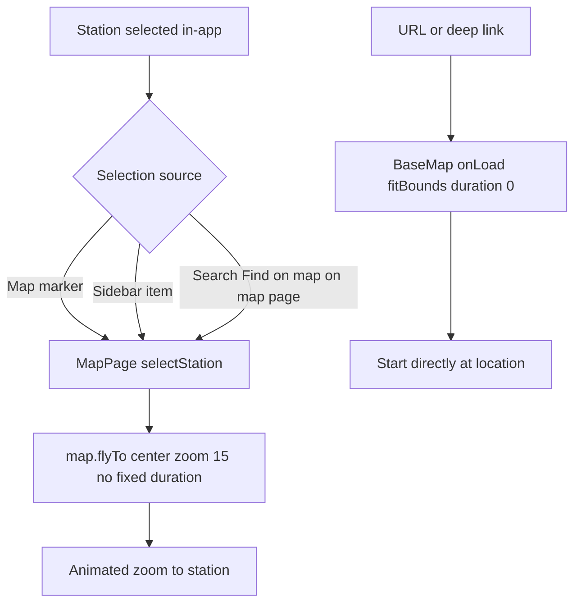

# 82 - Animated zoom when selecting a station

Status: implemented

## Implementation

- [`MapPage.selectStation`](../frontend/src/features/map/MapPage.tsx:107) now
  calls `map.flyTo({ center: [longitude, latitude], zoom: 15 })` without a fixed
  `duration`, so MapLibre scales the flight with the distance (a clearly visible
  zoom animation; nearby stations fly briefly, far cities take longer). The
  built-in `prefers-reduced-motion` fallback still collapses it to an instant
  `jumpTo`.
- [`detail.spec.ts`](../frontend/e2e/detail.spec.ts:200) waits for URL stability
  instead of a fixed `1200 ms` timeout before capturing the settled bounds.
- Gates: `make check` green; `make test-playwright` green (48/48, including the
  hardened detail spec and the search/map-click selection specs).

## Problem

Selecting a counting station on the map currently feels like a sudden jump to
the station instead of a smooth zoom animation. The selection handler already
calls MapLibre's `flyTo`, but it pins `duration: 0.8` (800 ms), which is so
short that a selection far away effectively teleports the viewport rather than
animating it.

The desired behavior:

- **Map marker click** -> animated zoom/flight to the station.
- **Search bar "Find on map"** (while on the map page) -> animated zoom/flight
  to the station.
- **Sidebar station item click** -> animated zoom/flight to the station.
- **URL / deep link** (`/?min_lat=...&station=...`, e.g. "Find on map" from the
  detail/summary pages) -> start directly at that location, no animation.

All three in-app selection paths converge on
[`MapPage.selectStation`](../frontend/src/features/map/MapPage.tsx:104), so the
change is a single-line fix plus a test-timing hardening.

## Current behavior

[`MapPage.selectStation`](../frontend/src/features/map/MapPage.tsx:104) is the
single entry point used by the map marker click
([`MapView`](../frontend/src/features/map/MapView.tsx:85)), the sidebar item
([`Sidebar`](../frontend/src/features/sidebar/Sidebar.tsx:75)) and the on-map
search result ([`SearchableHeader`](../frontend/src/features/header/SearchableHeader.tsx:40)
via `findAndClose`):

```ts
const selectStation = ({ id, latitude, longitude }: StationLocation) => {
  const map = mapRef.current
  if (map && latitude !== null && longitude !== null) {
    map.flyTo({ center: [longitude, latitude], zoom: 15, duration: 0.8 })
  }
  setSelectedStationId(id)
}
```

MapLibre's `flyTo` already produces the classic zoom-out-then-in flight arc, but
the hard-coded `duration: 0.8` overrides the default distance-aware duration, so
the animation is imperceptibly fast for anything but the closest stations.

The URL-driven path is separate and is already correct for the stated goal:

- [`BaseMap.onLoad`](../frontend/src/features/map/BaseMap.tsx:118) restores a
  shared/deep-linked view with `map.fitBounds(fitBounds, { padding: 0, duration: 0 })`,
  i.e. an instant start at the target location.
- The detail/summary "Find on map" actions build that URL via
  [`stationBounds`](../frontend/src/lib/geo.ts:39) and
  [`serializeBounds`](../frontend/src/lib/geo.ts:26), so they land directly on
  the station without animating.

## Proposed change

### 1. Animate the in-app selection

Change [`MapPage.selectStation`](../frontend/src/features/map/MapPage.tsx:107)
to omit the fixed `duration` and let MapLibre compute a natural, distance-scaled
duration (MapLibre `flyTo` auto-computes `duration = 1000 * S / V` from the
flight path length when `duration` is absent, see
[`camera.ts`](../frontend/node_modules/maplibre-gl/src/ui/camera.ts:1135)):

```ts
map.flyTo({ center: [longitude, latitude], zoom: 15 })
```

This keeps the target street-level zoom of 15, produces a clearly visible zoom
animation for nearby stations, and a longer, still-bounded flight for far-away
cities. MapLibre's built-in `prefers-reduced-motion` fallback
([`camera.ts`](../frontend/node_modules/maplibre-gl/src/ui/camera.ts:1016))
still collapses it to an instant `jumpTo` for users who opt out of motion, so
accessibility is preserved for free.

No other camera call is needed: the URL bounds are still mirrored on `moveend`
after the flight completes, so the shareable URL ends up at the final view.

### 2. Keep URL / deep-link arrival instant

No change to [`BaseMap.onLoad`](../frontend/src/features/map/BaseMap.tsx:118).
The `fitBounds(..., duration: 0)` is the desired "start at that location
directly" behavior for shared links and cross-page "Find on map". This decision
is documented here so a future reader does not "fix" it into an animation.

### 3. Harden the e2e fly-settle wait

[`detail.spec.ts`](../frontend/e2e/detail.spec.ts:202) currently waits a fixed
`1200` ms after a marker click before capturing the settled URL:

```ts
await mapMarkers(page).first().click()
await expect(page).toHaveURL(/[?&]station=[^&]+/)
await page.waitForTimeout(1200)
const expectedMapUrl = page.url()
```

With a distance-scaled duration this fixed wait is no longer guaranteed to cover
the flight. Replace it with a URL-stability poll that waits until the URL stops
changing across a short window (the `moveend`-driven bounds write is the signal
the flight has settled):

```ts
await mapMarkers(page).first().click()
await expect(page).toHaveURL(/[?&]station=[^&]+/)
// Wait for the fly-to animation to settle so the URL holds the final bounds.
await expect
  .poll(
    async () => {
      const before = page.url()
      await page.waitForTimeout(250)
      return page.url() === before
    },
    { timeout: 10_000 },
  )
  .toBe(true)
const expectedMapUrl = page.url()
```

This is duration-independent and keeps the "Back to map restores the previous
view" assertion deterministic.

## Selection flow



## Files touched

- [`frontend/src/features/map/MapPage.tsx`](../frontend/src/features/map/MapPage.tsx:107) — drop the fixed `duration` from `flyTo`.
- [`frontend/e2e/detail.spec.ts`](../frontend/e2e/detail.spec.ts:204) — poll for URL stability instead of a fixed wait.
- [`plans/README.md`](../plans/README.md) — register this plan.

## Gates

- `make check` (frontend Prettier check included).
- `make test-playwright` (the change touches the frontend UI and an e2e spec).
