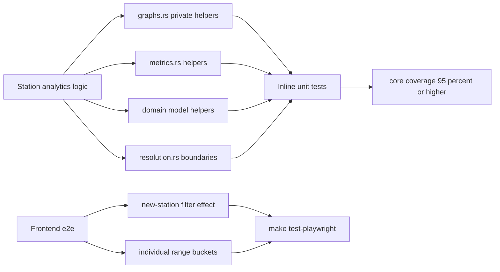

# 83 - Station analytics test increase: direct unit tests for private helpers + missing e2e

Status: implemented

## Problem

The station-analytics service layer is already tested thoroughly via
[`station_analytics/tests.rs`](../backend/src/core/application/station_analytics/tests.rs)
(≈60 tests driving the public service + domain models through in-memory mocks,
on top of the inline tests in
[`resolution.rs`](../backend/src/core/application/station_analytics/resolution.rs)).
The suite currently reports **overall 87.34% / core 95.23%** production coverage
(486 backend tests, 48 Playwright tests).

A refinement of the station-analytics module is planned. Before refactoring it,
the remaining **untested business logic** has to be locked down so the refactor
cannot silently change behaviour. The major gaps are not in the service layer but
in the **private helper functions** of
[`graphs.rs`](../backend/src/core/application/station_analytics/graphs.rs) and
[`metrics.rs`](../backend/src/core/application/station_analytics/metrics.rs),
which today are only exercised indirectly through the service and are therefore
the riskiest code to refactor. A few domain-model helpers and a boundary path in
`resolution.rs` are also untested.

The frontend e2e suite covers the UI mechanics of the Bike-Trends settings and
the "Individual" range (dialog, URL/cookie persistence, example-graph toggle),
but it never asserts the **actual data effect**: that `exclude_new_stations`
really drops a newly-introduced station from the summary/detail aggregation, or
that the "Individual" range really renders its own buckets without a
previous-period overlay.

## Goal

Add the missing tests with the smallest, highest-value surface:

1. Direct unit tests for the private aggregation helpers in `graphs.rs` and
   `metrics.rs` (so the upcoming refactor is covered at the unit level, not only
   through the service).
2. Domain-model tests for `GraphTimeframe::from_key` and
   `GeoBounds::is_valid`/`contains`.
3. Boundary-precision tests for `covers_window` in `resolution.rs`.
4. Two missing e2e assertions: the real effect of the new-station filter and the
   real bucket output of the "Individual" range.

## Decisions

- **Inline test modules, not more of `tests.rs`.** The helpers to cover are
  private (`fn`, not `pub(super)`), so
  [`station_analytics/tests.rs`](../backend/src/core/application/station_analytics/tests.rs)
  cannot reach them. Add `#[cfg(test)] mod tests` inside `graphs.rs` and
  `metrics.rs` (the same pattern `resolution.rs` already uses), keeping the
  existing service-level `tests.rs` untouched.
- **Focus on the tier boundaries and calendar/DST maths** in `graphs.rs`, because
  those are the pure functions a refactor is most likely to change:
  - [`custom_granularity`](../backend/src/core/application/station_analytics/graphs.rs:189) —
    the exact thresholds `<= 24h` → 15 min, `<= 48h` → 1 h, `<= 30d` → day,
    `<= 90d` → week, `<= 730d` (2y) → month, otherwise → quarter, including the
    boundary values themselves.
  - [`is_daily_or_finer`](../backend/src/core/application/station_analytics/graphs.rs:178) —
    Fixed seconds at/above/below one day and the Day/Week/Month/Quarter arms.
  - [`calendar_bucket_start`](../backend/src/core/application/station_analytics/graphs.rs:247) —
    day/week/month/quarter anchoring, and the unreachable Fixed arm.
  - [`add_local_months`](../backend/src/core/application/station_analytics/graphs.rs:276) —
    month arithmetic across a DST transition and over year boundaries.
  - [`bucket_starts`](../backend/src/core/application/station_analytics/graphs.rs:287),
    [`zero_fill_buckets`](../backend/src/core/application/station_analytics/graphs.rs:336),
    [`weekday_totals`](../backend/src/core/application/station_analytics/graphs.rs:361),
    [`fold_weekdays`](../backend/src/core/application/station_analytics/graphs.rs:385) —
    representative cases incl. empty input, zero-fill of a full window, weekday
    folding across groups.
- **`metrics.rs` unit tests** for
  [`sum_window`](../backend/src/core/application/station_analytics/metrics.rs:32),
  [`last_update`](../backend/src/core/application/station_analytics/metrics.rs:48)
  (per-source newest vs. finished-job fallback) and
  [`metric_windows`](../backend/src/core/application/station_analytics/metrics.rs:82):
  the edge case `exclude_new_stations` + a station with **no measurements at
  all** (earliest is `None` → `is_new`), and the like-for-like previous-window
  selection.
- **Domain-model tests** in
  [`station_analytics/mod.rs`](../backend/src/core/domain/station_analytics/mod.rs):
  [`GraphTimeframe::from_key`](../backend/src/core/domain/station_analytics/mod.rs:246)
  for every key and an unknown key → `None`, plus
  [`GeoBounds::is_valid`](../backend/src/core/domain/station_analytics/mod.rs:363)
  and [`GeoBounds::contains`](../backend/src/core/domain/station_analytics/mod.rs:368)
  boundary/edge cases.
- **`resolution.rs` boundary precision**: extend the inline tests for
  [`covers_window`](../backend/src/core/application/station_analytics/resolution.rs:45)
  with points exactly at `from + interval` and `to - interval` (and just outside),
  locking the one-interval tolerance.
- **e2e (Playwright)**:
  - `exclude_new_stations`: if the
    [`e2e-seed.sql`](../frontend/e2e/e2e-seed.sql) fixture does not already contain
    a station with no previous-period data, add one (a station whose earliest
    synthesized measurement is inside the selected window), then assert the
    summary/detail aggregation excludes it when the setting is on and includes it
    when off. The fixture is regenerated via
    [`scripts/dump-e2e-fixture.sh`](../scripts/dump-e2e-fixture.sh) if needed.
  - "Individual" range: assert the graph actually renders buckets for the custom
    from/to (not just that the URL/request carries the params) and that no
    previous-period overlay is shown.

## Flow

## Deliverables

- [x] Inline `#[cfg(test)]` tests in `graphs.rs` for the private helpers listed above (14 tests)
- [x] Inline `#[cfg(test)]` tests in `metrics.rs` for `last_update` (3 tests) + edge-case tests in `tests.rs` for `metric_windows` (2 tests)
- [x] Domain-model tests for `GraphTimeframe::from_key` and `GeoBounds::is_valid`/`contains` (4 tests)
- [x] Extended `resolution.rs` `covers_window` boundary tests (1 test)
- [x] Playwright e2e: new-station filter real effect (no fixture change needed — the seeded ~45-day history already makes the month/year metrics "new")
- [x] Playwright e2e: "Individual" range real buckets + no previous-period overlay
- [x] `plans/README.md` registered; this plan updated with final numbers
- [x] Gates green: `make check`, `make test-rest`, `make test`, `make coverage`, `make test-playwright`

## Result (measured, final)

- Backend suite grew from **486 to 510 tests**; station analytics grew from ~63 to **87 tests**.
- Coverage gate: overall (production) **87.34%** (>= 80), core (production) **95.23%** (>= 95).
- Playwright e2e grew from **48 to 50 tests**; all green against the real seeded stack.
- **Pre-existing flake fixed** (unrelated to station analytics but blocking the gates on cron-fire days):
  `tiles_update_service::tests::does_not_run_when_the_last_run_is_recent` used a `now - 1 day`
  anchor against `DEFAULT_MAPS_UPDATE_CRON` (`0 0 3 1 1,3,5,7,9,11 *`). On the 1st of an odd
  month (e.g. 2026-09-01) the next cron trigger falls within that day, so the run was correctly
  reported overdue and the test flaked. It now anchors a job finished "just now", which is
  deterministically never due, while still exercising the same `run_if_due` skip path.

## Out of scope

- Raising the coverage thresholds beyond the current 80/95 defaults.
- Re-testing the already-covered service-level flows in `tests.rs`.
- CI wiring or coverage-report tooling changes.
- Provider parsing / data-import tests (the refinement targets station analytics only).
