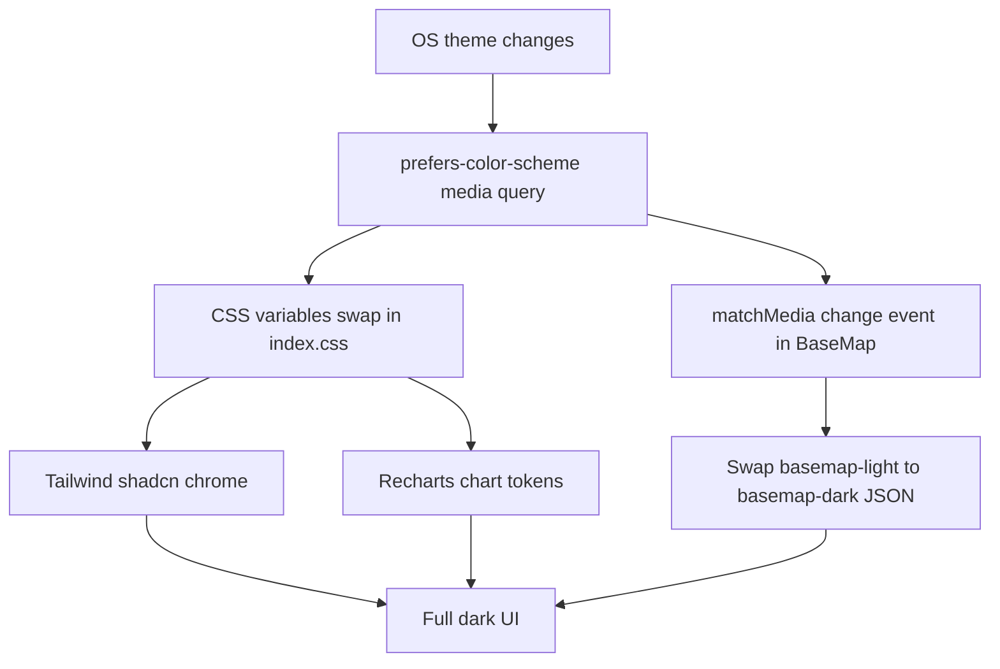

# 84 - System-following dark mode (no toggle)

Status: implemented

## Problem

The frontend migrated to Tailwind v4 + shadcn/ui in
[`28_frontend_shadcn_ui_migration_plan.md`](28_frontend_shadcn_ui_migration_plan.md),
so the full dark palette already exists in
[`frontend/src/index.css`](../frontend/src/index.css) as a `.dark { ... }` block
(background/foreground/card/popover/primary/secondary/muted/accent/destructive/
border/input/ring and the five `--chart-*` tokens). The dark variant is wired as
**class-based** —

```css
@custom-variant dark (&:is(.dark *));
```

— but nothing ever adds the `.dark` class to `<html>`, so the app is effectively
light-only. The self-hosted MapLibre basemap
([`frontend/public/styles/basemap.json`](../frontend/public/styles/basemap.json))
is also hard-coded light, and the shadcn chart wrapper still emits its optional
per-series dark theme colours under the `.dark` selector.

The requirement is a dark mode that **follows the operating system**
(`prefers-color-scheme`) with **no manual toggle**.

## Goal

Make the whole frontend — Tailwind/shadcn chrome, Recharts graphs, and the
MapLibre basemap — follow `prefers-color-scheme: dark` automatically:

1. Dark variant driven by the `prefers-color-scheme: dark` media query instead of
   the `.dark` class.
2. The existing shadcn dark token block applied under that media query.
3. Recharts series/tooltips/axes pick up the dark tokens through the existing
   `var(--color-chart-*)` palette and `chart.tsx` media-query theme selector.
4. A dark basemap style variant, selected with `matchMedia` and swapped live when
   the OS preference changes.
5. MapLibre popup/controls restyled with the app's CSS tokens so they are not
   light islands on the dark map.

No settings entry, cookie, URL param or toggle is added.

## Decisions

- **Media query, not a class.** Replace
  [`@custom-variant dark (&:is(.dark *));`](../frontend/src/index.css:4) with

  ```css
  @custom-variant dark (@media (prefers-color-scheme: dark));
  ```

  and move the existing `.dark { ... }` block into
  `@media (prefers-color-scheme: dark) { :root { ... } }`. Every existing
  `dark:*` utility (e.g. `dark:bg-input/30`, `dark:bg-destructive/60` in the
  shadcn primitives) keeps working unchanged — it is just variant resolution that
  changes.
- **`color-scheme: light dark`** on `:root`, so native scrollbars, date inputs and
  the page backdrop also follow the OS preference instead of flashing white.
- **Charts need no palette work.** All charts already colour series from
  [`CHART_PALETTE`](../frontend/src/features/stationDetail/chartUtils.ts:4)
  (`var(--color-chart-1)` … `--color-chart-5`), which is light/dark aware once
  the media query swaps the variables. The only `chart.tsx` fix is the optional
  `ChartConfig.theme` mechanism ([`THEMES`](../frontend/src/components/ui/chart.tsx:10)),
  currently `.dark`-selector based, so a future `theme:` config also follows the
  system.
- **Second basemap style file**, not a CSS filter. A dedicated
  `basemap-dark.json` keeps markers/popups/controls un-inverted (a canvas
  `filter: invert(1)` would also require counter-inverting every overlay) and is
  a direct, readable copy of the current 18-layer style with a dark palette.
- **`matchMedia` in [`BaseMap`](../frontend/src/features/map/BaseMap.tsx)** is the
  single owner of the style URL. The three maps (map page, detail preview,
  summary map) all render through `BaseMap`, so one change covers all of them.
  React re-fetches the style JSON and the `@vis.gl/react-maplibre` `<Map>`
  switches `mapStyle` when the preference changes.
- **Scope is frontend-only**; no backend or BFF change. Gates: `make check` and
  `make test-playwright` (the suite defaults to light, so it exercises the
  existing light rendering; a new spec forces dark via `page.emulateMedia`).

## Changes

### 1. [`frontend/src/index.css`](../frontend/src/index.css)

- Replace the class-based custom variant with the media query variant.
- Wrap the current `.dark` variables in
  `@media (prefers-color-scheme: dark) { :root { ... } }`.
- Add `color-scheme: light dark;` to `:root`.
- Add MapLibre overlay styling using the app tokens (popup content + tip,
  control group, control buttons, attribution) so map overlays match the theme.
  **These rules are deliberately unlayered and use `!important`:** maplibre-gl.css
  is imported as an unlayered stylesheet, and unlayered styles beat any `@layer`
  rule regardless of source order — without `!important` the popup keeps
  maplibre's hard-coded white background, which hides the light station name
  (`text-foreground` in dark mode) on white. This is guarded by a dedicated e2e
  assertion (see item 5).

### 2. [`frontend/src/components/ui/chart.tsx`](../frontend/src/components/ui/chart.tsx)

- Change `THEMES` from `{ light: '', dark: '.dark' }` to a representation the
  `ChartStyle` generator renders as
  `@media (prefers-color-scheme: dark) { [data-chart=...] { ... } }` (e.g. keep
  the selector mapping and special-case the `@media` prefix in the emitted
  `<style>` template). Light output stays identical.

### 3. [`frontend/public/styles/basemap-dark.json`](../frontend/public/styles/basemap-dark.json) (new)

- Copy of `basemap.json` with a dark palette for the 18 layers:
  - `background`/`earth` → dark neutral (e.g. `#1b1b1f`)
  - `landcover`/`landuse` → slightly lighter dark tones
  - `water` family → dark blue (`#274a66`)
  - `roads` → mid grey (`#3a3a3f`)
  - `boundaries` → dim grey
  - `buildings` → dark warm grey
  - label `text-color` → light grey; `text-halo-color` → the dark background
- Keep the identical `REPLACED_AT_RUNTIME` source placeholder, layer ids and
  filters so `BaseMap`'s runtime URL substitution and the map behaviour are
  unchanged.

### 4. [`frontend/src/features/map/BaseMap.tsx`](../frontend/src/features/map/BaseMap.tsx)

- Add `MAP_STYLE_DARK = '/styles/basemap-dark.json'`.
- Add a small `usePrefersColorSchemeDark()` hook (or inline state):
  `window.matchMedia('(prefers-color-scheme: dark)')` read once, then a
  `change` listener updating state.
- Derive the fetched style URL from the current preference; add it to the
  `useEffect` dependency array so a preference change re-fetches and swaps the
  style (keeping the existing `cancelled` guard and `REPLACED_AT_RUNTIME`
  replacement).
- Keep the fallback path and the rest of the map behaviour identical.

### 5. [`frontend/e2e/dark-mode.spec.ts`](../frontend/e2e/dark-mode.spec.ts) (new)

Four tests using `page.emulateMedia({ colorScheme: ... })`. Theme assertions
resolve the rendered background to a 0-255 luminance via a 1×1 canvas, which is
independent of how the browser serialises the oklch colour:

- dark system: dark body background (`luminance < 64`) + `/styles/basemap-dark.json`
  requested;
- light system: light body background + `/styles/basemap.json` requested;
- live switch: flipping the OS preference while the page is open requests the
  dark basemap and the palette follows;
- **popup regression**: opening a marker popup in dark mode asserts the popup
  background is dark (`luminance < 64`), so the light station name stays readable
  (catches the unlayered-maplibre cascade bug from item 1).

### 6. [`plans/README.md`](../plans/README.md)

- Register `84_dark_mode_plan.md` under "Current plan".

## Verification

- `make check` — prettier check + cargo gates stay green.
- `make test-playwright` — existing suite plus the new dark-mode spec.
- Manual: `cd frontend && npm run dev`, toggle the OS appearance; confirm the
  chrome, charts and basemap all switch with no manual control.

## Flow


