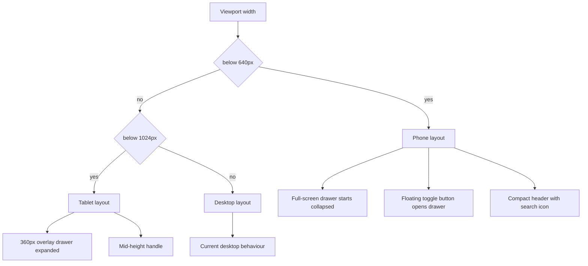

# 85 - Responsive mobile + tablet layouts

Status: implemented

## Problem

The frontend migrated to Tailwind v4 + shadcn/ui in
[`28_frontend_shadcn_ui_migration_plan.md`](28_frontend_shadcn_ui_migration_plan.md),
and the detail/summary pages already use a few responsive grid classes. The app
is still desktop-first in three places:

1. The map page lays a fixed-width 360 px [`LeftPanel`](../frontend/src/features/sidebar/LeftPanel.tsx)
   as an **absolute overlay over the map** and **starts expanded**. On a phone
   (~360–430 px wide) the station list therefore covers the entire map on load,
   and the mid-height [`SidebarHandle`](../frontend/src/features/sidebar/SidebarHandle.tsx)
   tab is a poor touch target.
2. The [`TopBar`](../frontend/src/features/header/TopBar.tsx) is a single-line
   three-column grid (brand / 32 rem search trigger / global summary). On narrow
   screens the three fight for space and the summary truncates awkwardly.
3. The [`SearchDialog`](../frontend/src/features/search/SearchDialog.tsx) is
   capped at `max-h-[70vh]` with `top-[5rem]`, leaving dead space on phones.

There is also no Playwright coverage at phone or tablet viewport sizes: the
suite runs a single 1280×800 desktop viewport
([`playwright.config.ts`](../frontend/playwright.config.ts:24)).

## Goal

Make the existing web app adapt its layout via Tailwind breakpoints. The
breakpoints operate on **CSS viewport pixels**, not physical device pixels:
`devicePixelRatio` (retina/2x/3x) is irrelevant to Tailwind and `matchMedia`, and
a phone held in landscape (~640–1000 CSS px wide) intentionally falls into the
tablet bucket below — responsive layout should follow available space, not
device class.

- **Phone portrait (< 640 px, below `sm`)**: map-first layout. The station
  list/overview
  becomes a full-screen drawer that starts collapsed, opened by a floating
  toggle button and closed by a header close button. The header collapses to
  brand + a search icon button, and the search dialog goes near full height.
- **Tablet (640–1023 px, `sm` through just below `lg`)**: keep the current
  overlay drawer (360 px) and mid-height handle, expanded by default.
- **Desktop (≥ 1024 px, `lg`+)**: unchanged.

Add Playwright e2e for the phone and tablet layouts.

## Decisions

- **Phone drawer is full-screen and starts collapsed.** [`MapPage`](../frontend/src/features/map/MapPage.tsx)
  initialises `sidebarCollapsed` from
  `window.matchMedia('(min-width: 640px)').matches` (lazy `useState`
  initialiser, no SSR in this app), so phones start map-first while tablets and
  desktops keep the current expanded default. No live resize listener is
  required: layout differences are driven by CSS breakpoints, and the initial
  collapsed state only has to be right on first paint.
- **Responsive width in [`LeftPanel`](../frontend/src/features/sidebar/LeftPanel.tsx):**
  `w-full sm:w-[360px]`. On phones the panel covers the map; on `sm+` it keeps
  the current 360 px overlay. The slide animation and `-translate-x-full`
  collapse mechanics stay unchanged.
- **Two different open/close affordances by breakpoint.**
  - `sm+`: the existing [`SidebarHandle`](../frontend/src/features/sidebar/SidebarHandle.tsx)
    tab stays, now marked `hidden sm:flex`.
  - Phones: a floating action button (FAB) rendered only when the panel is
    collapsed (`sm:hidden`), positioned top-left over the map, opens the drawer.
    Because the drawer is full-screen on phones, the open drawer gets its own
    close button in the [`Sidebar`](../frontend/src/features/sidebar/Sidebar.tsx)
    header (`sm:hidden`); the [`StationOverview`](../frontend/src/features/stationOverview/StationOverview.tsx)
    already has a close (X) button. The map-void close that already closes the
    overview continues to work wherever the map is visible (tablet/desktop).
- **Header collapses on phones.** [`TopBar`](../frontend/src/features/header/TopBar.tsx)
  uses a two-column mobile grid (`auto 1fr`): brand + a right-aligned compact
  search icon button (`sm:hidden`); the wide search trigger and the global
  summary become `hidden sm:flex`. Nothing else about the header changes.
- **Search dialog goes full height on phones.** [`SearchDialog`](../frontend/src/features/search/SearchDialog.tsx)
  switches its max-height/offset to `max-h-[calc(100dvh-4rem)] top-[4rem]` below
  `sm` and keeps the current `sm:max-w-[560px] sm:max-h-[70vh] sm:top-[5rem]`
  behaviour above.
- **Detail/summary pages get light polish only.** They already stack their grid
  columns at `sm`/`md`/`lg`; the changes are reduced vertical padding on phones
  and a verification pass for horizontal overflow (Recharts uses responsive
  containers, so no chart rework is expected).
- **E2E via per-test viewports, not new Playwright projects.** The existing specs
  assume the 1280×800 desktop viewport (e.g. fixed click positions in
  [`sidebar.spec.ts`](../frontend/e2e/sidebar.spec.ts:41)), so adding projects
  would break them. A new [`responsive.spec.ts`](../frontend/e2e/responsive.spec.ts)
  sets `test.use({ viewport })` per `describe` block instead.
- **Frontend-only scope**; no backend or BFF change. Relevant gates: `make check`
  and `make test-playwright`.

## Changes

### 1. [`frontend/src/features/sidebar/LeftPanel.tsx`](../frontend/src/features/sidebar/LeftPanel.tsx)

- Change the `aside` width from `w-[360px]` to `w-full sm:w-[360px]`.
- Keep the rest (absolute positioning, `z-[500]`, slide transform, handle child)
  unchanged.

### 2. [`frontend/src/features/sidebar/SidebarHandle.tsx`](../frontend/src/features/sidebar/SidebarHandle.tsx)

- Add `hidden sm:flex` to the button classes so the mid-height tab only renders
  on tablet/desktop. Keep the icon/aria logic as-is.

### 3. [`frontend/src/features/sidebar/Sidebar.tsx`](../frontend/src/features/sidebar/Sidebar.tsx)

- Add an optional `onClose?: () => void` prop.
- When provided, render a mobile-only (`sm:hidden`) icon close button in the
  header row next to the badge (label "Close station list"), calling `onClose`.

### 4. [`frontend/src/features/map/MapPage.tsx`](../frontend/src/features/map/MapPage.tsx)

- Initialise `sidebarCollapsed` via
  `useState(() => !window.matchMedia('(min-width: 640px)').matches)`.
- Pass `onClose={() => setSidebarCollapsed(true)}` to [`Sidebar`](../frontend/src/features/sidebar/Sidebar.tsx).
- Render a mobile-only FAB (`sm:hidden`, absolute top-left over the map, `z-[600]`)
  only when `sidebarCollapsed` is true; clicking it calls `setSidebarCollapsed(false)`.
  Use a lucide `Menu` icon and accessible name "Show station list".
- Keep the keyboard `H` shortcut and URL sync untouched.

### 5. [`frontend/src/features/header/TopBar.tsx`](../frontend/src/features/header/TopBar.tsx)

- Mobile grid: `grid-cols-[auto_1fr] sm:grid-cols-[minmax(0,1fr)_auto_minmax(0,1fr)]`
  and `gap-2 sm:gap-4`.
- Add a compact search icon `Button` (`sm:hidden`, aria-label "Search counting
  stations") that calls `onOpenSearch`; make the wide trigger `hidden sm:flex`.
- Make the global-summary column `hidden sm:flex`.

### 6. [`frontend/src/features/search/SearchDialog.tsx`](../frontend/src/features/search/SearchDialog.tsx)

- Adjust the `DialogContent` classes: `top-[4rem] max-h-[calc(100dvh-4rem)]` on
  phones, `sm:top-[5rem] sm:max-h-[70vh] sm:max-w-[560px]` above. Keep the
  pinned input row and scrollable results list.

### 7. Detail + summary page polish

- [`frontend/src/features/stationDetail/StationDetail.tsx`](../frontend/src/features/stationDetail/StationDetail.tsx)
  and
  [`frontend/src/features/stationsSummary/StationsSummary.tsx`](../frontend/src/features/stationsSummary/StationsSummary.tsx):
  reduce the page container padding on phones (e.g. `px-4 py-4 sm:py-6`), make
  the line charts twice as tall on phones (mobile `aspect-[20/15.3]` /
  `aspect-[21/18]` reverting to `sm:aspect-[20/7.65]` / `sm:aspect-[21/9]` —
  a narrow screen makes the fixed desktop ratios render too short), and verify
  no horizontal overflow (maps already responsive).

### 8. [`frontend/e2e/responsive.spec.ts`](../frontend/e2e/responsive.spec.ts) (new)

Phone `describe` with `test.use({ viewport: { width: 390, height: 844 } })`:

- map loads and the drawer starts collapsed (FAB "Show station list" visible,
  the `complementary` panel's station-list heading not visible);
- tapping the FAB opens the full-screen list (badge + rows visible) and the
  header close button returns it to collapsed;
- the compact header search icon opens the search dialog and results render;
- navigating to a station detail page shows no horizontal overflow
  (`document.documentElement.scrollWidth <= clientWidth`).

Tablet `describe` with `test.use({ viewport: { width: 834, height: 1112 } })`:

- the drawer is expanded by default (badge + rows visible, mid-height handle
  present) and the wide search trigger is visible.

### 9. [`plans/README.md`](../plans/README.md)

- Register `85_responsive_mobile_tablet_plan.md` under "Current plan".

## Verification

- `make check` — prettier check stays green (frontend-only change).
- `make test-playwright` — existing suite plus the new responsive spec.
- Manual: `cd frontend && npm run dev`, use browser device emulation for a phone
  (~390 px) and a tablet (~834 px) and confirm the drawer/header/search behave
  as specified.

## Flow

