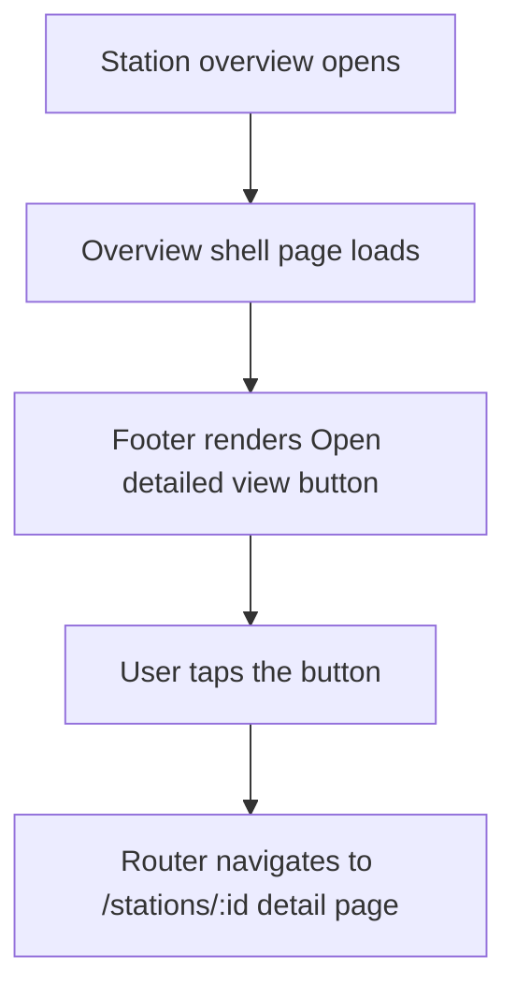

# 86 - Prominent "Open detailed view" button on the station overview

Status: implemented

## Problem

The single-station overview panel (opened when a map marker or sidebar item is
selected) is the "at a glance" screen for one station. The only way from there
into the full detail page is a small icon button in the header — plus the
clickable station name — which is easy to miss, especially on phones where the
overview renders as a full-screen drawer. The station-list sidebar already has a
pinned, full-width footer action ("Summarize visible stations"), so the overview
should get the same kind of easy-to-find footer button that opens that station's
detail page.

## Goal

Add a single, prominent full-width footer button to the station overview panel
that links to the station's detail page. Keep the existing header icon button
and the clickable station name. It must work on mobile, where the overview is
the full-screen `LeftPanel` drawer.

## Design decisions

| Concern | Decision |
|---|---|
| Label | **Open detailed view** — chosen because the user asked us to pick it; deliberately distinct from the header icon's `Open detail page` accessible name so existing e2e locators stay unambiguous. |
| Placement | Pinned footer below the overview's [`ScrollArea`](../frontend/src/features/stationOverview/StationOverview.tsx:136), mirroring the sidebar's "Summarize visible stations" footer (`shrink-0 border-t p-3`). |
| Element | `Button asChild` wrapping a `Link` to `page.detail_url`, full width. |
| Icon | `ExternalLink` (already imported in the component). |
| Visibility | Only shown while a station is selected — the overview component itself is only mounted on selection — and rendered once the overview `page` is loaded (`detail_url` is part of the shell). |
| Mobile | The overview lives inside the full-screen drawer; the footer stays pinned at the bottom, so the button is thumb-reachable. |

## Flow



## Approach

### Task 1 — Add the footer button to [`StationOverview.tsx`](../frontend/src/features/stationOverview/StationOverview.tsx:1)

- After the closing `</ScrollArea>` and before the closing fragment, add a pinned
  footer block rendered only when `page` is truthy:

  ```tsx
  {page && (
    <div className="shrink-0 border-t p-3">
      <Button asChild className="w-full">
        <Link to={page.detail_url}>
          <ExternalLink />
          Open detailed view
        </Link>
      </Button>
    </div>
  )}
  ```

- No new imports are needed: `ExternalLink`, `Button` and `Link` are already
  imported.

### Task 2 — Playwright e2e coverage

- [`frontend/e2e/map.spec.ts`](../frontend/e2e/map.spec.ts:119) — extend the
  existing "overview detail link navigates in the same tab" test (or add a new
  one) to assert the new `Open detailed view` footer link has an
  `/stations/...` href and navigates in the same tab.
- [`frontend/e2e/responsive.spec.ts`](../frontend/e2e/responsive.spec.ts:41) —
  extend the phone-viewport overview test to assert the footer button is visible
  and tappable inside the full-screen drawer.

### Task 3 — Docs

- Update the plan file status to `implemented` and keep the registration in
  [`plans/README.md`](../plans/README.md:15) accurate.

## Definition of done

- [x] Plan file updated and registered in [`plans/README.md`](../plans/README.md)
- [x] Frontend Prettier check + TypeScript production build green (the change is
      frontend-only, so the backend gates — `cargo fmt`/`clippy`/`audit`,
      `make test-rest`, `make coverage` — are unaffected)
- [x] `make test-playwright` green (61 passed, including the two new
      footer-button tests)
