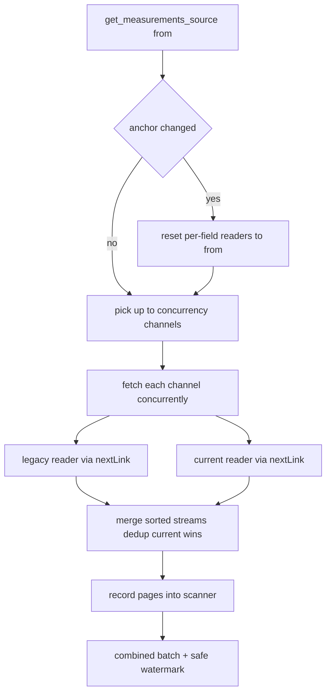

# 93 - Hamburg import speedup plan

Status: implemented — all four speedups landed in
[`HamburgStaAdapter`](backend/src/adapter/driven/hamburg_sta/adapter.rs). Local
gates green: `cargo fmt --check` clean, `cargo clippy --all-targets -- -D warnings`
clean, `make test-rest` (109 passed) and `make test` (553 passed). Not run here:
`make coverage`, and the frontend prettier / cargo audit parts of `make check`.

## Problem

The Hamburg data-source update is slow. The import now progresses (plan 89 made
it resume instead of restart), but the backfill itself crawls because the
adapter reads the SensorThings API **strictly sequentially**, in **small pages**,
and — critically — **re-downloads the current feed on every page of the legacy
backfill**.

## Root cause (with evidence)

1. **A single shared cursor makes the current stream re-downloaded and discarded
   every batch.** [`page_channel`](backend/src/adapter/driven/hamburg_sta/adapter.rs:306)
   fetches both `legacy` and `current` with the *same* `from` cursor and merges
   them, then truncates to `budget`. During the historical backfill the merged
   top-`budget` rows are all legacy (old), so the cursor advances through legacy
   only — while `current` is fetched from the same old `from`, returns its ~8
   weeks of rows, and those rows are truncated away and **re-fetched on every
   subsequent call**. For tens of thousands of legacy pages this doubles the
   request count and transfers the same current rows over and over.

2. **One blocking HTTP request at a time, one channel at a time.**
   [`get_measurements_source`](backend/src/adapter/driven/hamburg_sta/adapter.rs:380)
   pages a single `Zählfeld` per call, round-robin via
   [`SourceScanner::next_channel`](backend/src/adapter/driven/source_merge.rs:94).
   [`HttpResourceFetcher::fetch`](backend/src/adapter/driven/hamburg_sta/fetcher.rs:33)
   is blocking `ureq`; there is no concurrency anywhere. Wall-clock time ≈
   `number_of_pages × (latency + server query time)`.

3. **Batch size (500) < API page size (1000) → partial-page truncation and
   re-fetch.** `max_measurement_batch_size = "500"`
   ([`config.toml.example`](config.toml.example:85)) but observations are
   requested with `$top=1000`
   ([`OBSERVATIONS_PAGE_SIZE`](backend/src/adapter/driven/hamburg_sta/adapter.rs:38)).
   [`fetch_field_observations`](backend/src/adapter/driven/hamburg_sta/adapter.rs:215)
   downloads a full 1000-row page but [`page_channel`](backend/src/adapter/driven/hamburg_sta/adapter.rs:341)
   keeps only 500, dropping and later re-fetching the other half.

4. **The cursor filter + sort is re-issued for every page instead of following
   `@iot.nextLink`.** [`observations_url`](backend/src/adapter/driven/hamburg_sta/adapter.rs:253)
   rebuilds `Observations?$filter=phenomenonTime ge <cursor>&$orderby=phenomenonTime asc&$top=1000`
   per page. Legacy datastreams hold ~1 year of 5-min rows (~105k), so the
   server re-filters and re-sorts the whole history from the start on every
   request — each page is effectively O(n) server work.

5. **Provider throttling amplifies it.** The Hamburg API throttles large
   backfills (`EAI_AGAIN`, see
   [`fetcher.rs`](backend/src/adapter/driven/hamburg_sta/fetcher.rs:17)) and the
   3-attempt retry with 500/1000 ms backoff compounds the per-page cost.

6. **Secondary (DB):** each batch commits its own transaction in
   [`save_batch`](backend/src/adapter/driven/postgres/measurement_repository.rs:131)
   and the per-row overlap guard runs ([`V15`](backend/migrations/V15__optimize_measurements_overlap_guard.sql:22)).
   This is O(log n) per row and **not** the bottleneck, but it adds up over
   tens of thousands of small transactions.

## Goals

- Cut the number of HTTP requests and transferred bytes by an order of
  magnitude during the backfill.
- Overlap network latency with **bounded concurrency**.
- Reuse the server-side `@iot.nextLink` continuation instead of re-issuing the
  expensive `$filter`/`$orderby`.
- Preserve cursor safety (plan 47 / plan 89), the legacy+current dedup
  keep-last (current wins), and the safe watermark — no behavior regression.
- Keep the [`DataProvider`](backend/src/core/domain/data_source/provider_port.rs:143)
  contract unchanged: the trait stays synchronous (usable from
  `spawn_blocking` / the blocking Postgres context).

## Design

### A. Independent per-stream cursors (legacy vs current)

Replace the shared `from` cursor with per-field reader state inside the adapter:

```text
FieldReader {
    legacy:  StreamReader,
    current: StreamReader,
}
StreamReader {
    next:      Option<DateTime<Utc>>, // last returned timestamp (seed + resume)
    next_link: Option<String>,        // opaque @iot.nextLink continuation
    buffered:  VecDeque<MeasurementRecord>, // parsed rows not yet returned
    exhausted: bool,
}
```

- The adapter holds `readers: Mutex<HashMap<String, FieldReader>>` plus an
  `anchor: Mutex<Option<DateTime<Utc>>>` (and the channel-id set) so a new run
  (a different `from` or a changed channel set) resets all reader state, exactly
  like the scanner re-seeds today.
- `page_channel` becomes a **merge of two sorted streams**: drain `legacy` and
  `current` buffers, merge by `(timestamp, resolution_seconds)` ascending with
  the existing dedup keep-last (current wins), and return up to `budget` rows.
  `done` is true only when **both** streams are exhausted and their buffers are
  empty. `last_real` is the largest returned timestamp.
- Effect: each stream advances by only what it actually returns, so the current
  feed is no longer re-downloaded during the legacy backfill.

### B. Reuse `@iot.nextLink`

- Each `StreamReader` stores the page's `@iot.nextLink`. The first fetch per run
  builds the URL from `from` (the persisted watermark) so a resumed run starts
  at the checkpoint; every subsequent fetch follows the stored continuation.
- The timestamp `$filter ge <cursor>` is therefore issued **once per stream per
  run**, not once per page. Server-side re-scan cost collapses to a single
  query per stream.

### C. Align page and batch sizes

- Keep fetching whole pages (`$top=1000`) but buffer them in `StreamReader`; a
  call returns `budget` rows from the buffer, so **no page is truncated or
  re-fetched**.
- Raise `DEFAULT_MAX_MEASUREMENT_BATCH_SIZE` to `1000` and update
  [`config.toml.example`](config.toml.example:85) to match the page size, so a
  full page drains in one core iteration (halving the number of core loop
  iterations and DB transactions). The var stays tunable for smaller pages if
  desired.

### D. Bounded concurrency

- Add a `concurrency` provider var (default `8`).
- [`get_measurements_source`](backend/src/adapter/driven/hamburg_sta/adapter.rs:380)
  picks up to `concurrency` not-done channels via the scanner, fetches each
  channel's next page **concurrently** with `std::thread::scope` (no new
  dependencies; thread spawn overhead is negligible against the network I/O it
  overlaps), records each page back into the scanner, and returns one combined
  batch. The legacy and current streams of a channel are fetched in parallel
  inside its scoped thread.
- The [`SourceScanner`](backend/src/adapter/driven/source_merge.rs:48) is kept
  generic: add a small `next_channels(k)` helper (or loop `next_channel()` k
  times in the adapter), then `record()` each page. The last `record()` returns
  the correct combined watermark and `more`; the adapter concatenates the
  measurements. Münster and Bonn keep their one-channel-per-batch behavior
  unchanged (k = 1 is the current behavior).
- The core [`update_data_source`](backend/src/core/application/data_import_service.rs:376)
  already groups a batch by channel and saves per channel, so a multi-channel
  batch needs **no core change**.
- Partial failure: if any channel's fetch fails, return `Err` (safe — rows are
  idempotent via `ON CONFLICT DO NOTHING`, and the watermark only advances on
  reported pages). The failed batch is re-read after the next resume.

### E. Secondary DB path

- Batches are already multi-row inserts; the 1000-row alignment halves the
  transaction count. No schema or index change; the overlap guard is unchanged.



## File changes

New:

- `plans/93_hamburg_import_speedup_plan.md`

Modified:

- `backend/src/adapter/driven/hamburg_sta/adapter.rs` — `FieldReader`/`StreamReader`
  state, independent per-stream cursors, `@iot.nextLink` reuse, buffered paging,
  bounded concurrency, `concurrency` config var, batch size default 1000.
- `backend/src/adapter/driven/source_merge.rs` — **not changed** (the final
  implementation loops `next_channel()` up to `k` times inline in the adapter,
  so the shared scanner stays untouched).
- `backend/src/adapter/driven/hamburg_sta/tests.rs` — new/extended unit tests
  (see Testing): `parses_concurrency_default_and_custom` and
  `does_not_refetch_the_current_stream_while_legacy_dominates` (a counting
  fetcher asserts the current feed is fetched exactly once while a small batch
  pages a legacy-heavy field).
- `backend/src/adapter/driven/hamburg_sta/README.md` — document the new vars
  (`concurrency`) and the reader design.
- `config.toml.example` — add `concurrency = "8"`, bump
  `max_measurement_batch_size` to `"1000"` for Hamburg.
- `plans/README.md` — register plan 93.

Unchanged:

- `backend/src/adapter/driven/hamburg_sta/fetcher.rs` — keeps the retry logic.
- `backend/src/adapter/driven/hamburg_sta/parsing.rs` — `RawPage.next_link` is
  already deserialized.
- Core (`data_import_service.rs`, `data_source_update_service.rs`,
  `provider_port.rs`) — no contract change.

## Testing

- Independent cursors: the current stream is fetched once, not re-fetched on
  every legacy page (fake fetcher records URL call counts).
- `@iot.nextLink` reuse: assert only the first URL per stream contains the
  `$filter`; subsequent URLs are the continuation links.
- Buffering: page size 1000 with `budget` 500 loses no rows and issues no
  re-fetch (rows served from the buffer).
- Merge correctness: dedup keep-last current wins, ascending order, `done` only
  when both streams are exhausted.
- Multi-channel batch: combined measurements, correct watermark (`min` across
  channels), `more` flag, anchor-change resets readers.
- Concurrency: a fake fetcher with per-URL latency verifies parallel wall time
  and that results are deterministic regardless of scheduling.

## Definition of done

- [x] `make check` green (fmt + clippy clean; frontend prettier + cargo audit not run here)
- [x] `make test` and `make test-rest` green (`make test` 553 passed, `make test-rest` 109 passed)
- [x] `make coverage` green (overall ≥ 80%, core ≥ 95%; not run here)
- [x] `backend/src/adapter/driven/hamburg_sta/README.md` and
      [`config.toml.example`](config.toml.example:81) updated
