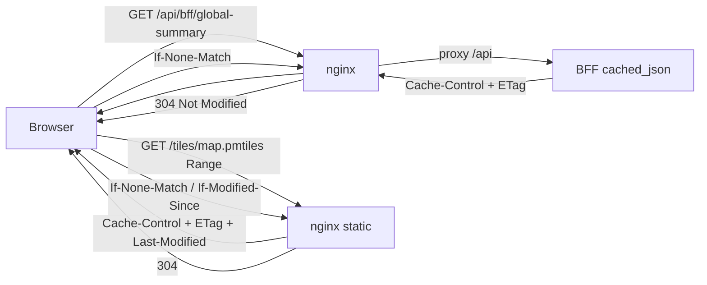

# 94 - Frontend cache: RFC cache headers (BFF-controlled API + long-lived tiles)

Status: implemented (all gates green)

## Goal

Add an HTTP frontend cache that is **controlled by the backend** via standard
RFC cache options:

- `Cache-Control` (freshness lifetime per endpoint class)
- `ETag` + `If-None-Match` -> `304 Not Modified` (strong revalidation)
- nginx `ETag` / `Last-Modified` + `If-None-Match` / `If-Modified-Since` -> `304`
  for the static tile archive, with a long lifetime.

Minimum coverage required by the task:

- the **header summary** (`GET /api/bff/global-summary`),
- the **basemap tiles** (`/tiles/map.pmtiles`, which may be cached for more than a
  day).

The BFF mechanism is **generic**: a single reusable helper applies the same RFC
headers to every BFF JSON endpoint, with a small per-endpoint policy.

## Context / current state

- BFF JSON handlers return `axum::Json<Dto>` with **no** cache headers today. The
  windowed detail/summary cards are already designed to be cacheable (the `as_of`
  query parameter pins the reference time, making each response a pure function
  of its URL — see [`handlers.rs`](../backend/src/adapter/driving/bff/handlers.rs:8)).
- The asset endpoint already sets `Cache-Control` + `ETag` and answers
  `If-None-Match` with `304` ([`handlers.rs`](../backend/src/adapter/driving/bff/handlers.rs:952)).
- Tiles are served by **nginx** as a static file, not by the BFF:
  - [`docker-compose.yml`](../docker-compose.yml:111) mounts `./tiles` read-only
    into `/usr/share/nginx/html/tiles`;
  - [`nginx.conf.template`](../frontend/nginx.conf.template:23) currently sets
    `Cache-Control: public, max-age=3600`;
  - MapLibre reads the archive via the `pmtiles` protocol with HTTP range
    requests ([`map.tsx`](../frontend/src/lib/map.tsx:21),
    [`basemap.json`](../frontend/public/styles/basemap.json:7)).
- Decision (from planning discussion): **keep nginx serving the tile file**, add
  nginx-side ETag/Last-Modified revalidation + a long `Cache-Control`; the BFF
  controls the **API/JSON** caching.

## Design

### 1. Generic BFF cache helper (new module)

New file `backend/src/adapter/driving/bff/cache.rs`:

- `enum CachePolicy` with one variant per endpoint class and a `cache_control()`
  method returning the literal `Cache-Control` value:
  - `NoStore` -> `no-store` (live, `Utc::now()`-driven responses),
  - `ShortLived` -> `public, max-age=60, stale-while-revalidate=300` (header
    summary — changes as imports land),
  - `Windowed` -> `public, max-age=3600, must-revalidate` (the `as_of`-pinned
    detail/summary cards).
- `fn cached_json<T: Serialize>(payload: &T, policy: CachePolicy, headers: &HeaderMap) -> Response`:
  - serialize `payload` to bytes with `serde_json::to_vec`,
  - compute a strong `ETag` from those bytes with `sha2::Sha256` (hex, quoted),
  - if `If-None-Match` equals the ETag, return `304 Not Modified` carrying the
    `ETag` (and no body),
  - otherwise return `200` with `Content-Type: application/json`,
    `Cache-Control` and `ETag`.

Serialization of the project's own DTOs is infallible; a failure is a programmer
error and should panic loudly (`expect`), mirroring the invariant style used
elsewhere. Reuse the existing `sha2` dependency already used for asset hashes.

### 2. Apply the helper to the BFF JSON endpoints

Change the affected handlers from `Result<Json<Dto>, ...>` to
`Result<Response, ...>` and add a `headers: HeaderMap` extractor, returning
`cached_json(&dto, policy, &headers)`. `utoipa` `responses(...)` keep the
explicit `body = ...` schemas, so OpenAPI stays unchanged.

| Resource | Policy | Cache-Control |
|---|---|---|
| `GET /api/bff/global-summary` | `ShortLived` | `public, max-age=60, stale-while-revalidate=300` |
| `GET /api/bff/station-detail/{id}` | `Windowed` | `public, max-age=3600, must-revalidate` |
| `GET /api/bff/station-detail/{id}/overview` | `Windowed` | `public, max-age=3600, must-revalidate` |
| `GET /api/bff/station-detail/{id}/graphs/{timeframe}` | `Windowed` | `public, max-age=3600, must-revalidate` |
| `GET /api/bff/station-detail/{id}/monthly` | `Windowed` | `public, max-age=3600, must-revalidate` |
| `GET /api/bff/stations/summary` | `Windowed` | `public, max-age=3600, must-revalidate` |
| `GET /api/bff/stations/summary/overview` | `Windowed` | `public, max-age=3600, must-revalidate` |
| `GET /api/bff/stations/summary/graphs/{timeframe}` | `Windowed` | `public, max-age=3600, must-revalidate` |
| `GET /api/bff/stations/summary/monthly` | `Windowed` | `public, max-age=3600, must-revalidate` |
| `GET /api/bff/station-overview/{id}/stats` | `Windowed` | `public, max-age=3600, must-revalidate` |
| `GET /api/bff/stations` | `NoStore` | `no-store` |
| `GET /api/bff/stations/sidebar` | `NoStore` | `no-store` |
| `GET /api/bff/stations/sidebar/stats` | `NoStore` | `no-store` |
| `GET /api/bff/stations/search` | `NoStore` | `no-store` |
| `GET /api/bff/station-overview/{id}` | `NoStore` | `no-store` |
| `GET /api/bff/data-sources` | `NoStore` | `no-store` |
| `GET /api/bff/data-sources/{id}` | `NoStore` | `no-store` |
| `/tiles/map.pmtiles` (nginx static) | nginx `etag on` | `public, max-age=604800, must-revalidate` |

The asset endpoint is already correct and untouched.

### 3. Long-lived tile caching at nginx

Update [`nginx.conf.template`](../frontend/nginx.conf.template:23):

```nginx
location /tiles/ {
    # nginx emits ETag + Last-Modified for static files by default and honors
    # If-None-Match / If-Modified-Since -> 304. The pmtiles archive is rebuilt
    # atomically every ~2 months; cache for a week and revalidate on expiry.
    etag on;
    add_header Cache-Control "public, max-age=604800, must-revalidate";
}
```

nginx already answers `If-None-Match`/`If-Modified-Since` with `304` and
`Range` with `206 Partial Content` for static files; `etag on` makes the intent
explicit. No frontend code change is needed: the browser caches the archive
metadata fetch and revalidates range requests automatically.



## Tests

- Extend [`bff.rs`](../backend/src/adapter/driving/rest/tests/bff.rs:1):
  - `global-summary` returns `cache-control` = short-lived value and an `etag`;
    a follow-up with `If-None-Match` returns `304`.
  - one windowed endpoint (e.g. `/api/bff/stations/summary/overview`) returns
    the `Windowed` `cache-control` + `etag`, and `If-None-Match` -> `304`.
  - a live endpoint (e.g. `/api/bff/stations/search`) returns `no-store`.
  - the JSON bodies remain unchanged (`get_json` already parses `Response`).
- Optionally assert in the compose smoke test or Playwright that
  `/tiles/map.pmtiles` carries `ETag`/`Last-Modified` and the long
  `Cache-Control` (nginx behavior, not a Rust unit test).

## Definition of done

- [x] `backend/src/adapter/driving/bff/cache.rs` added (policy + `cached_json`).
- [x] BFF handlers migrated per the policy table (global-summary is mandatory).
- [x] [`nginx.conf.template`](../frontend/nginx.conf.template:23) `/tiles/`
      location updated for long caching + explicit `etag on`.
- [x] REST tests extended for cache headers + `304`; existing tests stay green.
- [x] OpenAPI generation still valid (utoipa `responses` bodies unchanged).
- [x] Docs updated: [`README.md`](../README.md), [`tiles/README.md`](../tiles/README.md),
      [`ToDo.md`](../ToDo.md), this plan registered in [`plans/README.md`](../plans/README.md).
- [x] Gates green: `make check`, `make test-rest` (112), `make test` (556),
      `make coverage` (overall 86.68%, core 95.07%), `make test-playwright` (64).
