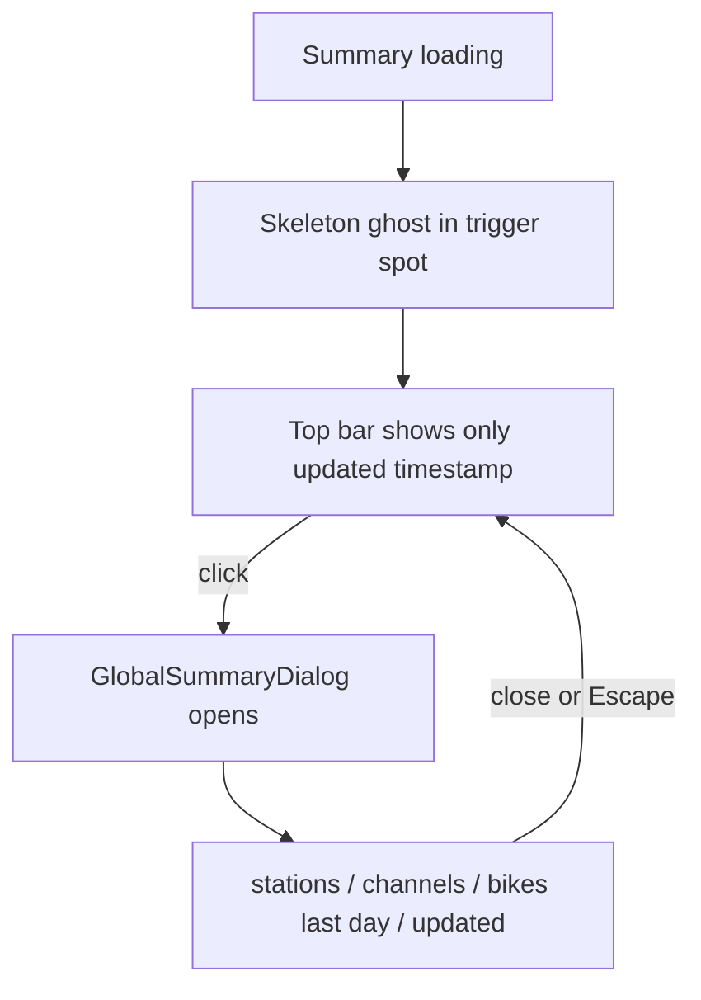

# 95 - Global summary popup dialog

Status: drafted

## Problem

The top bar currently renders the whole global summary inline (see
[`TopBar.tsx`](../frontend/src/features/header/TopBar.tsx)):

```
215 stations · 389 channels · 222.625 bikes / last day  updated 03.09.26, 11:13
```

The user wants this turned into a popup dialogue where **only the date stays
always visible**:

- Only `updated <timestamp>` remains in the top bar — as a clickable trigger.
- The stats part (`stations · channels · bikes / last day`) moves into a popup
  dialog.
- The popup also repeats the update timestamp, so no information is lost.
- The trigger and the popup must work on **mobile as well as desktop** (today
  the whole summary is hidden below `sm` via `hidden sm:flex`).
- While the summary is loading, show a **loading ghost** (skeleton), matching
  the skeleton loading used on the other screens.

## Goal

- Show only `updated <timestamp>` in the header, on every screen size, as a
  button that opens a dialog.
- Render `stations`, `channels` and `bikes / last day` (plus the update
  timestamp) inside that dialog.
- Show a `Skeleton` placeholder while the summary request is in flight.
- Keep the existing error state (`Global summary unavailable.`) and the
  data-loading hook untouched.

## Approach

### 1. New component: `GlobalSummaryDialog`

Create [`frontend/src/features/header/GlobalSummaryDialog.tsx`](../frontend/src/features/header/GlobalSummaryDialog.tsx)
following the modal pattern already used by
[`SearchDialog.tsx`](../frontend/src/features/search/SearchDialog.tsx):

- Props: `{ summary: GlobalSummary; onClose: () => void }` (import the type from
  [`types.ts`](../frontend/src/features/header/types.ts)).
- Render the shadcn primitives from
  [`dialog.tsx`](../frontend/src/components/ui/dialog.tsx): `Dialog`,
  `DialogContent`, `DialogHeader`, `DialogTitle`, `DialogDescription`.
- `Dialog open onOpenChange={(open) => !open && onClose()}` (same controlled
  pattern as `SearchDialog`).
- A `DialogHeader` with title `Global summary` and a short description
  (`Whole-system counting statistics.`), then a small definition list of the
  three facts using [`formatNumber`](../frontend/src/lib/format.ts) and
  [`formatTimestamp`](../frontend/src/lib/format.ts):

  | Label             | Value                                        |
  | ----------------- | -------------------------------------------- |
  | Counting stations | `summary.station_count`                      |
  | Channels          | `formatNumber(summary.channel_count)`        |
  | Bikes / last day  | `formatNumber(summary.bikes_last_day_total)` |
  | Updated           | `formatTimestamp(summary.last_update)`       |

- Keep the default close button (`showCloseButton` defaults to `true`).

### 2. Update `TopBar`

In [`TopBar.tsx`](../frontend/src/features/header/TopBar.tsx):

- Add local state: `const [summaryOpen, setSummaryOpen] = useState(false)`.
- Replace the current summary block (the `hidden … sm:flex` container, lines
  57–74) with:
  - A trigger that is visible on **all** breakpoints (drop `hidden sm:flex`).
    When `summary` is loaded, render a `Button` (ghost style, matching the
    header's `text-primary-foreground/80` look) showing
    `updated {formatTimestamp(summary.last_update)}` with an affordance icon
    (e.g. `Info` from `lucide-react`) so it reads as clickable.
  - A loading ghost: while the summary is still loading (`!summary && !error`),
    render a [`Skeleton`](../frontend/src/components/ui/skeleton.tsx) placeholder
    in the trigger's spot (e.g. `h-4 w-24 animate-pulse`), matching the skeleton
    loading used on the sidebar/detail screens. The skeleton must be sized to the
    same height/width as the loaded `updated …` trigger (same line height and
    padding, no extra spacing) so the skeleton→content swap causes no layout
    shift.
  - Keep the `error` fallback text as-is.
  - Render `{summaryOpen && summary && <GlobalSummaryDialog summary={summary} onClose={close} />}`.
- `formatNumber` is no longer needed in `TopBar` (the stats move into the
  dialog); keep `formatTimestamp`.

### 3. Mobile layout

The header is a two-column grid on phones (`grid-cols-[auto_1fr]`) where the
right column currently holds only the search icon. To fit the always-visible
date trigger next to it:

- Turn the mobile right side into a small flex row (`flex items-center gap-2
justify-self-end`) containing the existing compact search icon button **and**
  the new date trigger, or place the date trigger as a second `justify-self-end`
  item in that column.
- Let the date text truncate (`truncate`, `min-w-0`) so long timestamps cannot
  push the brand off-screen; the full value remains available in the popup.

### 4. e2e coverage

- Add a Playwright spec (or extend an existing header/settings spec) asserting:
  - the header shows a clickable `updated …` trigger and **not** the raw
    `stations`/`channels` inline text;
  - the trigger is a real `button` (keyboard/assistive-tech reachable);
  - clicking the trigger opens the dialog, which shows the stations, channels,
    bikes and the updated timestamp;
  - closing (Escape or the close button) hides the dialog;
  - the loading `Skeleton` is rendered while the request is in flight (guard the
    assertion so it does not race the fast fixture response).
- Add a **layout-stability gate** (in
  [`header-summary.spec.ts`](../frontend/e2e/header-summary.spec.ts)): delay the
  `/api/bff/global-summary` response (Playwright `page.route`), measure the
  `Skeleton` bounding box, then release and measure the loaded trigger box,
  asserting the skeleton and the trigger have the **same height** (≤ 1 px) and
  that the app-bar (`header`) bounding box is unchanged — i.e. the
  skeleton→content swap causes **no layout shift**. (The trigger's width is
  text-derived and unknown before the fetch, so the deterministic size guarantee
  is the shared `h-8` height plus the stable bar.)
- The existing [`settings.spec.ts`](../frontend/e2e/settings.spec.ts) assertion
  that the `/api/bff/global-summary` request carries `exclude_new_stations=true`
  remains valid and must stay green.

### 5. Style / formatting

- Match the codebase conventions: `///` doc comments, `@/` path aliases, and the
  existing `Dialog`/`Skeleton`/`Button` component APIs.
- Run Prettier over the new/changed files so `make check` stays green
  (`prettier --check` is part of the gate).

## Scope decision

- The always-visible element is the `updated <timestamp>` text, rendered as a
  button on mobile and desktop.
- The dialog shows the stats **and** the update timestamp (no information loss).
- While loading, a `Skeleton` ghost stands in for the trigger; on error the
  existing `Global summary unavailable.` text remains.
- No backend / BFF change: the summary data is already fetched by
  [`useGlobalSummary`](../frontend/src/features/header/useGlobalSummary.ts).

## Flow



## Definition of done

- [ ] `frontend/src/features/header/GlobalSummaryDialog.tsx` created.
- [ ] `frontend/src/features/header/TopBar.tsx` updated (trigger + skeleton + dialog wiring).
- [ ] Mobile layout shows the date trigger next to the search icon.
- [ ] Playwright e2e added/updated for the new popup.
- [ ] Layout-stability gate passes: skeleton and loaded trigger share the same height and the app bar does not shift.
- [ ] `make check` and `make test-playwright` green.
- [ ] [`plans/README.md`](../plans/README.md) updated.
