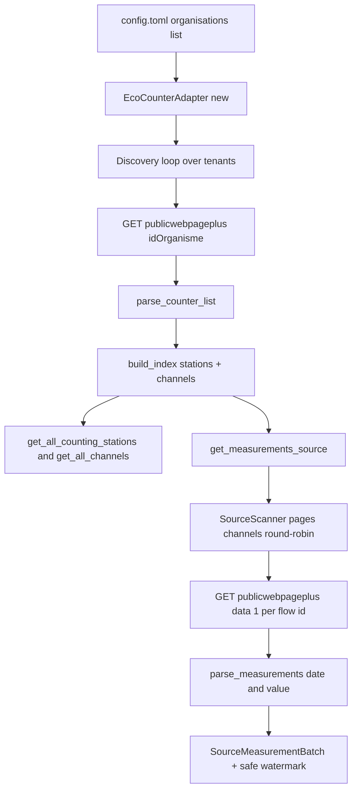

# 99 - Eco-Counter (Eco-Visio) multi-city HTTP adapter

Status: implemented

## Addendum 2: three switchable modes (`api_v1`, `api_v2`, `screen_scraping`)

Per the operator's follow-up, the adapter was restructured so that one provider
type (`eco_counter_http_provider`) offers **three mode toggles**. They are
enabled **in parallel — all inside a single data source** via the comma-separated
`modes` provider var (`modes = "api_v1, api_v2, screen_scraping"`; a one-element
list such as `modes = "api_v1"` is fine). The older single `mode` var was
**removed**.

- `api_v1` (**default**) — the legacy publicwebpage API described below; its
  station catalog + config moved to
  [`eco_counter/v1/stations.yml`](../backend/src/adapter/driven/eco_counter/v1/stations.yml:1),
  and the V1 HTTP access now lives in a dedicated API-client file
  [`eco_counter/v1/client.rs`](../backend/src/adapter/driven/eco_counter/v1/client.rs:1)
  used by [`v1/provider.rs`](../backend/src/adapter/driven/eco_counter/v1/provider.rs:1).
- `api_v2` — the **official** Eco-Counter API
  ([`eco_counter/v2/`](../backend/src/adapter/driven/eco_counter/v2/mod.rs:1)),
  authenticated with an organisation OAuth **access token**
  (`Authorization: Bearer`, var `v2_access_token`); stations are discovered at
  runtime from `/site` (no catalog) and paged from `/data/site/{id}`.
- `screen_scraping` — a **scaffold**
  ([`eco_counter/scraping/`](../backend/src/adapter/driven/eco_counter/scraping/mod.rs:1))
  for scraping an accessible public web view (parser not implemented yet).

Because the provider vars are a flat string map, each mode reads its own values
under a mode **var prefix** (`v1_…`, `v2_…`, `web_…`): `v1_base_url`,
`v1_step`, `v2_access_token`, `v2_domain_id`, `web_scrape_url`, etc.

The dispatcher is [`eco_counter/adapter.rs`](../backend/src/adapter/driven/eco_counter/adapter.rs:1):
it parses the `modes` list (default `api_v1`). One mode delegates directly (ids
unprefixed); several modes are wrapped in a [`Composite`](../backend/src/adapter/driven/eco_counter/adapter.rs:1)
data provider that unions stations/channels, round-robins the measurement
paging of all members in one import run and prefixes their external ids by mode
key (`v1/`, `v2/`, `web/`) so the same counter reached through different access
paths never collides. Shared HTTP/fetcher and helpers live in
[`eco_counter/fetcher.rs`](../backend/src/adapter/driven/eco_counter/fetcher.rs:1)
and [`eco_counter/common.rs`](../backend/src/adapter/driven/eco_counter/common.rs:1).
`config.toml.example` keeps `api_v1` active by default and documents the
parallel `modes` list + the mode-prefixed vars.

## Addendum 1: verified live findings + final design (2026-09-05)

Implementing the plan showed that the original **"discover every station at
runtime per tenant"** design is **not possible today** for the German tenants on
the legacy API, so the adapter was delivered with the **bundled YAML station
catalog** approach the operator requested (the catalog lives inside the adapter;
stations are **not** in the runtime TOML).

Verified against the live API on 2026-09-05:

- `GET /pbl/publicwebpageplus/{idOrganisme}` (tenant discovery) now returns
  **404 for every documented German tenant** (Hessen `8080`, Bonn `4701`,
  Köln `677`, Düsseldorf `857`, Rostock `888`, Stuttgart `607`, …). They migrated
  to the new Eco-Counter platform: `https://api.eco-counter.com/api/v2/pages?domainId=<id>`
  maps them to per-city subdomains (e.g. `4701`→`stadtbonn.eco-counter.com`,
  `8080`→`hessen-mobil.eco-counter.com`) whose API requires an **API key**
  (401 `"Invalid or missing API key"`).
- The per-counter metadata `GET /pbl/publicwebpage/{idPdc}` and cumulative data
  `GET /pbl/publicwebpage/data/{idPdc}?begin&end&step&domain&withNull&t=<token>`
  endpoints **still work without a key** for counters that have not migrated
  (validated against the German counter `100063085`, Stadt Stein). `end` is
  exclusive; rows carry an epoch-ms `timestamp` (unambiguous).
- The `publicwebpageplus/data` variant is avoided: it returns **MM/DD/YYYY**
  labels, hourly rows with **no hour** in the label (24 positional rows per day)
  and **sums** multiple `flowIds`.

Final adapter design (implemented):

- Provider type **`eco_counter_http_provider`**; module
  [`backend/src/adapter/driven/eco_counter/`](../backend/src/adapter/driven/eco_counter/mod.rs:1).
- Stations come from the **bundled YAML catalog**
  [`v1/stations.yml`](../backend/src/adapter/driven/eco_counter/v1/stations.yml:1)
  (the operator lists the `idPdc` counters to import) — per the operator's
  direction; runtime TOML keeps only the behaviour knobs (`step`, `base_url`,
  `cache_duration`, `max_measurement_batch_size`, `page_days`,
  `import_days_back`, optional `stations` path override).
- Station = catalog counter; channel = the site's **cumulative** series (one per
  station). Live metadata (token/domain/name/coordinates) is cached from
  `publicwebpage/{id}`.
- Measurements are paged in day windows from `publicwebpage/data/{id}` over the
  shared [`SourceScanner`](../backend/src/adapter/driven/source_merge.rs:48);
  the `imported_until` watermark is safe (never fabricated); the first import
  looks back `import_days_back` days.
- Counters whose metadata carries no token (migrated/stale) are skipped with a
  `WARNING`; if no catalog counter resolves, the source reports itself
  unreachable so the import fails loudly.

The "Open questions to verify" section below is largely superseded; the answered
questions and the delivered behaviour are recorded in the adapter `README.md`.

## Problem

The application currently imports three data sources — Münster, Bonn and Hamburg —
each served by a dedicated [`DataProvider`](../backend/src/core/domain/data_source/provider_port.rs:151)
driven adapter. This plan adds **Eco-Counter** as a fourth kind of source. Unlike
the existing providers, Eco-Counter data is served per **tenant** (French
`idOrganisme`, German *Träger* — roughly "organisation"), where one tenant groups
all counters of a city, district or federal state (e.g. `8080` = Hessen,
`4701` = Bonn, `677` = Köln). A single Eco-Counter instance therefore has to
serve **several cities at once**, so the adapter must be **configurable**: the
tenant list and all behavioural knobs live in the TOML config, while the
**individual counting stations are discovered at runtime** from those tenants and
are **never** hard-coded into TOML (there are thousands of them).

The example repository under [`example/eco-visio-api/`](../example/eco-visio-api/README.md:1)
describes the upstream access. This plan **examines that API** (endpoints,
authentication, request/response shapes, known quirks), documents the findings
below, and turns them into precise implementation instructions for the coding
agent. It does **not** implement anything and does **not** cover the future
screen-scraping adapter (that will be a separate, self-contained provider — see
[Scope](#scope)).

## Scope

- **In scope:** a new API-driven `DataProvider` adapter that reads the public,
  **unauthenticated** Eco-Visio JSON API (`publicwebpageplus`) and imports
  stations/channels/measurements for a configurable list of tenants.
- **Out of scope:** the authenticated **official Eco-Counter API**
  (`apieco.eco-counter-tools.com`, OAuth2) — documented below but not used, as it
  requires credentials and a per-site token.
- **Out of scope:** any future HTML screen-scraping adapter. It must be built as a
  **separate** provider type/module, decoupled from this adapter.

## Source inspection (from `example/eco-visio-api/`)

The example repo describes **two distinct API surfaces**:

### A. Official Eco-Counter API (authenticated) — *not used*

[`openapi_Eco-Counter_v1.1.yaml`](../example/eco-visio-api/openapi_Eco-Counter_v1.1.yaml:10)
documents the vendor's own API:

- Base URL: `https://apieco.eco-counter-tools.com/api/1.0`
- Auth: **OAuth2** implicit flow (`authorizationUrl: https://apieco.eco-counter-tools.com/authorize`),
  `x-auth-type: Application & Application User`, `x-throttling-tier: Unlimited`.
- Endpoints:
  - `GET /data/site/{id}` — site time series; query `begin`/`end`
    (ISO-8601 `yyyy-mm-ddThh:mm:ss`, begin inclusive / end exclusive),
    `step` (`15m`/`hour`/`day`/`week`/`month`/`year`, default `hour`),
    `complete` (fill holes with null, default `true`).
  - `GET /tag` — list tags (`domain_id` optional).
  - `GET /site/{id}` — one site (`attributes` optional).
  - `GET /site` — list sites (`domain_id`, `attributes`).
  - `GET /counter` — list counters.
  - `GET /counter/{serial}` — one counter by serial number.
- No response schemas are published (all `content: {}`).

**Decision:** this surface requires vendor credentials and returns site-scoped
data; it is **not** the right fit for a zero-config multi-city import. It is
documented for future reference only.

### B. Public Eco-Visio "aladdin" JSON API (unauthenticated) — *used*

[`openapi.yaml`](../example/eco-visio-api/openapi.yaml:17),
[`README.md`](../example/eco-visio-api/README.md:17) and
[`api-example.R`](../example/eco-visio-api/api-example.R:8) describe the public,
unauthenticated JSON API used by the Eco-Visio dashboard:

- Base URL: `https://www.eco-visio.net/api/aladdin/1.0.0`

| Endpoint | Purpose | Parameters |
|---|---|---|
| `GET /pbl/publicwebpageplus/{idOrganisme}` | list all counters of a tenant | path `idOrganisme`; query `withNull` (bool, *no known effect*), `end` (`DD/MM/YYYY`), `begin` (`DD/MM/YYYY`), `pratique` (int filter, e.g. `2` = bicycles) |
| `GET /pbl/publicwebpageplus/data/1` | counter time series | query `idOrganisme` (mandatory), `idPdc` (mandatory), `interval` (mandatory, `1`–`6`), `flowIds` (mandatory, semicolon-separated flow ids), `fin`/`debut` (`DD/MM/YYYY`) |
| `GET /pbl/publicwebpage/{idPdc}` | single-counter metadata | path `idPdc`; query `withNull` |
| `GET /pbl/publicwebpage/data/{idPdc}` | single-counter time series | query `begin`/`end` (`YYYYMMDD`), `step`, `domain` (= idOrganisme), `withNull`, `t` (token) |
| `GET /pbl/publicwebpage/stats/{idPdc}` | single-counter stats | query `begin`/`end` (epoch ms), `step`, `domain`, `withNull`, `t`, `siteId` |

The **two `publicwebpageplus` endpoints are the ones the adapter uses**: the
first for discovery (tenants → stations → channels) and the second for
measurements. The `publicwebpage*` endpoints are single-counter variants that
require a per-counter `token` (`t`) — useful only as a fallback, not needed for
the initial adapter.

### `publicwebpageplus/{idOrganisme}` response shape

Returns a JSON **array** of counter objects ([`AllCounter`](../example/eco-visio-api/openapi.yaml:233)):

| Field | Type | Meaning |
|---|---|---|
| `idPdc` | int | counter id (station external id) |
| `id_pdc_img` | int | id of the counter's photo |
| `lat` / `lon` | float | WGS84 coordinates |
| `nom` | string | counter name |
| `photo[]` | array | objects `{ lien: <image URL> }` |
| `pratique[]` | array | objects `{ pratique: int, id: int }` — the counter's channels/flows |
| `mainPratique` | int | default counter type |
| `debut` / `debutPeriode` | `DD/MM/YYYY` | first data date(s) |
| `current_year_default` | int | `1` = "report all data since start of year" |
| `today` | `DD/MM/YYYY` | latest data date |
| `total` | int | lifetime total count |
| `lastDay` | int | yesterday's count |
| `moyD` | int | daily average |

`pratique` types: `1` = pedestrians, `2` = bicycles, `4` = cars, `12` = "star"
(per the README). Each `pratique` entry's `id` is the **flow id** consumed by the
data endpoint's `flowIds` parameter (semicolon-separated).

### `publicwebpageplus/data/1` response shape

Returns a JSON **array of `[date, value]` string pairs**, e.g.
`["01/01/2022", "5020"]`. The date format matches the requested `interval`:

- `interval` `2` = quarter hours (15 min)
- `interval` `3` = hours
- `interval` `4` = days
- `interval` `5` = weeks
- `interval` `6` = months
- `interval` `1` = **undocumented** (README says "1=Viertelstunden?" with a
  question mark)

`debut`/`fin` use `DD/MM/YYYY`; the documented daily example returns
`DD/MM/YYYY`-formatted dates.

### Tenant ids for German cities/regions

The OpenAPI enum and README map `idOrganisme` to names. The German-relevant ones:

```
8080 = Hessen                     6365 = Mecklenburg-Vorpommern
4728 = Berlin                     677  = Köln
4701 = Bonn                       6011 = Ludwigsburg
4206 = Heidelberg                 607  = Stuttgart
4702 = Rhein-Sieg-Kreis           857  = Düsseldorf
888  = Rostock                    5417 = Augsburg
5972 = Leipzig                    7119 = Bielefeld
4197 = Mannheim                   7581 = Reutlingen
7224 = Hürth                      4729 = Würzburg
7241 = Norderstedt                751  = Freiburg
6109 = Oberbergischer Kreis + Rheinisch-Bergischer Kreis
4699 = Rheinisch-Bergischer Kreis + Oberbergischer Kreis
6076 = Oberhausen                 6116 = Schwerin
7642 = Leverkusen                 6135 = Goslar
6997 = Greifswald                 6471 = Ludwigshafen
7058 = Siegen                     4626 = Essen
6603 = Bochum                     6481 = Aschaffenburg
6811 = Böblingen                  6150 = Dortmund
```

plus the two demo tenants `4586` ("Bike Count Display Interactive Map") and
`5024` ("National Database Demo"). The adapter **must not** hard-code this table;
it is the operator's job to list the desired tenant ids in TOML. The table is
reproduced here only so the coding agent knows valid seed values for the config
example and tests.

## Open questions to verify against the live API (record results in the adapter README)

The example repo is a third-party reverse-engineering effort, not an official
spec. The following details are **documented but not verified** and **must be
checked against the live API** before/while implementing, with the observed
behaviour recorded in the new adapter's `README.md`:

1. **`interval=1`** — what resolution does it actually return? Until verified,
   the adapter only accepts `2`–`6` and rejects/ignores `1`.
2. **Sub-daily date format** — the daily example returns `DD/MM/YYYY`; for
   `interval=2`/`3` the date part likely carries a time. Verify the exact format
   for hours and quarter hours.
3. **Multiple `flowIds`** — with `flowIds=101125116;102125116`, does the data
   endpoint return one summed series or a per-flow matrix? This decides whether
   measurements are fetched per station (one request) or per flow (one request
   each).
4. **Window size / row cap** — whether `fin`/`debut` actually bound the response
   (the Bonn investigation showed some Eco-Visio feeds ignore date params) and
   whether large windows are truncated or capped.
5. **`withNull`** — documented as "no known effect"; confirm it can be omitted.
6. **`today` freshness / lag** — how current the data is, to choose the
   incremental watermark behaviour.
7. **Rate limiting** — the public API has no documented throttling tier; observe
   whether sequential per-day paging is throttled and adjust the plan's paging
   strategy accordingly.
8. **`pratique` filter on discovery** — whether `?pratique=2` on
   `publicwebpageplus/{idOrganisme}` returns only bicycle counters *and* whether
   the returned `pratique[]` arrays still contain non-bicycle flows.

If the live API is not reachable from the coding environment, the adapter is
still implemented against the shapes documented above, and the unverified items
are called out as `WARNING`-level limitations in the adapter README instead of
being silently assumed.

## Design decisions

1. **Use the public `publicwebpageplus` API** (unauthenticated, tenant-scoped),
   not the OAuth2 vendor API. No credentials, no per-counter tokens.
2. **One provider type serves many tenants.** A single `[[data_sources]]` entry
   lists all tenant ids; stations are discovered at runtime and never configured.
3. **Station = `idPdc`, channel = `pratique` flow id.** Each counter becomes a
   station; each of its `pratique[]` entries becomes a channel whose external id
   is the flow id.
4. **Flat `vars` map encodes the tenant list as a comma-separated string.** The
   config layer only supports `HashMap<String, String>` vars
   ([`configuration.rs`](../backend/src/core/domain/configuration/configuration.rs:297)),
   so "list of tenants" is a comma-separated string parsed by the adapter — not a
   new config schema.
5. **In-memory discovery cache, no persistent state.** Discovery is a few cheap
   GETs (one per tenant); it is re-fetched after `cache_duration` seconds. The
   adapter does not override `attach_persistent_state`.
6. **Sequential measurement paging** (no parallelism in v1), reusing the shared
   [`SourceScanner`](../backend/src/adapter/driven/source_merge.rs:48) +
   `ChannelPage` helper exactly like Hamburg for fair channel interleaving and
   the safe `imported_until` watermark.
7. **Hourly resolution by default** (`interval=3`). The resolution is configurable
   but constant per data source; daily/weekly/monthly intervals set a
   calendar-anchored `interval_end` (DST-aware).
8. **German tenants ⇒ `Europe/Berlin` timezone.** All configured tenants are
   German; the station record's timezone is hard-coded to `Europe/Berlin` with a
   documented limitation for future non-German tenants.

## Fix design

### 1. New adapter module `backend/src/adapter/driven/eco_counter/`

Mirrors the Hamburg/Bonn module split. Provider type:
**`eco_counter_http_provider`**.

Files:

- `mod.rs` — module docs + `pub use adapter::EcoCounterAdapter`.
- `fetcher.rs` — copy the `ResourceFetcher` trait + `ureq`-based
  `HttpResourceFetcher` (with the transient-retry logic) from
  [`hamburg_sta/fetcher.rs`](../backend/src/adapter/driven/hamburg_sta/fetcher.rs:9).
- `parsing.rs` — JSON parsers (below).
- `adapter.rs` — `EcoCounterAdapter` + the `DataProvider` impl.
- `tests.rs` — unit tests (fixtures + fake fetcher).
- `README.md` — adapter docs, including the **live-verification results** from the
  "Open questions" section.

**Config vars** (parsed in `new(&DataSourceConfiguration)`, fail fast on
missing/invalid required vars):

| Var | Required | Default | Meaning |
|---|---|---|---|
| `organisations` | yes | — | comma-separated `idOrganisme` tenant ids (e.g. `"4701,677,857"`) |
| `pratique` | no | `2` | counter type filter for discovery + channel selection (`2` = bicycles) |
| `interval` | no | `3` | data aggregation interval `2`–`6` (default `3` = hourly) |
| `base_url` | no | `https://www.eco-visio.net/api/aladdin/1.0.0` | API root |
| `max_measurement_batch_size` | no | `500` | rows kept per source-level batch |
| `cache_duration` | no | `300` | seconds to cache the discovery index |

**`parsing.rs`**:

- `parse_counter_list(&str) -> Vec<RawCounter>` — parses the
  `publicwebpageplus/{idOrganisme}` array (fields per the table above), tolerating
  absent optional fields (`photo`, `pratique`, `debut`, `total`, …).
- `build_index(tenants, raw_counters_by_tenant, pratique_filter) -> EcoIndex` —
  groups raw counters into **stations** (`external_id = idPdc`, `name = nom`,
  `latitude/longitude = lat/lon`, `timezone = Europe/Berlin`, `image_sha256 =
  None`) and **channels** (one per `pratique[]` entry whose `pratique` type equals
  the configured filter): `external_id = pratique.id`, station link by `idPdc`,
  `name = "<nom> (<type label>)"` where the label maps `1`→Fußgänger,
  `2`→Fahrräder, `4`→Autos, `12`→Sternchen. Each channel also remembers its
  `id_organisme` and `id_pdc` (needed to build the data request). Stations with no
  matching `pratique` entry produce no channels and are skipped with a `DEBUG`.
- `parse_measurements(&str, interval) -> Vec<(NaiveDateTime-or-UTC, i64)>` — parses
  the `[date, value]` pairs from `publicwebpageplus/data/1`; maps the date string
  to a timestamp using the verified format for the configured `interval`, converts
  to UTC (Europe/Berlin, DST-aware), and drops rows whose value is not a valid
  integer. The resolution is fixed per data source from `interval`
  (`2`→900 s, `3`→3600 s, `4`→86400 s, `5`→604800 s, `6`→calendar month); daily/
  weekly/monthly set `interval_end` calendar-anchored.

**`adapter.rs`** — `EcoCounterAdapter` implementing
[`DataProvider`](../backend/src/core/domain/data_source/provider_port.rs:151):

- In-memory `Mutex<Option<CachedData>>` (parsed `EcoIndex` + `fetched_at`),
  refreshed under a `refresh_lock` after `cache_duration`; emits an `INFO`
  lifecycle line on refresh ("eco-counter discovery refreshed: N tenants, M
  stations, K channels").
- `get_all_counting_stations` / `get_all_channels` return the cached index.
- `get_measurements_source(from, max_batch_size)`:
  - ensures the index, seeds a [`SourceScanner`](../backend/src/adapter/driven/source_merge.rs:48)
    over the channel external ids (flow ids) anchored at `from`;
  - picks channels round-robin (no concurrency in v1);
  - for each picked channel fetches **one page** from
    `publicwebpageplus/data/1` with `idOrganisme=<tenant>`, `idPdc=<station>`,
    `interval=<configured>`, `flowIds=<single flow id>`, `debut`/`fin` bounding a
    day window (Europe/Berlin). **Verify first whether a single `flowIds` value is
    required for unambiguous per-channel values** (Open question 3) — if the API
    returns a per-flow matrix, page per station and split instead;
  - maps rows to `SourceMeasurement { channel_external_id, record }`, computing
    `last_real` and `done` (done = response has no rows beyond the watermark or
    reached `today`);
  - returns the `SourceScanner.record(..)` result so the core receives the safe
    `next_from` watermark and `more` flag.
- `check_health` — TCP connect to the host/port of `base_url`.
- `attach_provider_messages` + `emit` — mirrors Hamburg/Bonn.

**Provider messages**: `INFO` lifecycle on discovery refresh; `WARNING` for a
tenant that returns nothing/errors but does not abort the whole import (if the
tenant list is user-editable, a single bad id should not fail everything — decide
by live behaviour and record it); `DEBUG` for skipped stations/channels and
malformed rows.

### 2. Register the provider

- [`backend/src/adapter/driven/mod.rs`](../backend/src/adapter/driven/mod.rs:1):
  add `pub mod eco_counter;`.
- [`backend/src/adapter/driven/data_provider_factory.rs`](../backend/src/adapter/driven/data_provider_factory.rs:14):
  add an `EcoCounterAdapter::provider_type()` match arm + a
  `builds_eco_counter_provider_type` test.
- The empty [`hessen_ecovisio/`](../backend/src/adapter/driven/hessen_ecovisio)
  placeholder directory is left as-is for the future screen-scraping adapter (it
  has no files and does not conflict with the new `eco_counter/` module).

### 3. Configuration

- [`config.toml.example`](../config.toml.example:38): add one `[[data_sources]]`
  entry:

  ```toml
  [[data_sources]]
  name = "Eco-Counter"

  [data_sources.provider]
  type = "eco_counter_http_provider"

  [data_sources.provider.vars]
  # Comma-separated list of Eco-Visio tenant ids (cities/regions).
  organisations = "4701,677,857,888,8080"
  # Counter type: 2 = bicycles.
  pratique = "2"
  # Data aggregation interval: 3 = hourly.
  interval = "3"
  max_measurement_batch_size = "500"
  cache_duration = "300"
  ```

  Individual stations are intentionally **not** listed — they are discovered from
  the tenants at runtime.

### 4. Documentation

- [`README.md`](../README.md:212): add the Eco-Counter data source (provider type,
  vars, tenant-list semantics, public Eco-Visio API, stations = `idPdc`, channels
  = `pratique` flows, hourly data, `Europe/Berlin`, no per-station config).
- The new adapter `README.md` records the **live-verification results** from the
  "Open questions" section.

## Flow diagram



## File changes

- `backend/src/adapter/driven/eco_counter/mod.rs` (new) — modes dispatcher
- `backend/src/adapter/driven/eco_counter/adapter.rs` (new) — `modes`-list dispatcher + composite
- `backend/src/adapter/driven/eco_counter/fetcher.rs` (new) — shared HTTP (Bearer-aware)
- `backend/src/adapter/driven/eco_counter/common.rs` (new) — shared helpers
- `backend/src/adapter/driven/eco_counter/v1/mod.rs` (new) — API_V1 mode
- `backend/src/adapter/driven/eco_counter/v1/client.rs` (new) — V1 API client
- `backend/src/adapter/driven/eco_counter/v1/parsing.rs` (new)
- `backend/src/adapter/driven/eco_counter/v1/catalog.rs` (new)
- `backend/src/adapter/driven/eco_counter/v1/stations.yml` (new) — V1 catalog
- `backend/src/adapter/driven/eco_counter/v1/provider.rs` (new)
- `backend/src/adapter/driven/eco_counter/v1/tests.rs` (new)
- `backend/src/adapter/driven/eco_counter/v1/README.md` (new)
- `backend/src/adapter/driven/eco_counter/v2/*` (new) — API_V2 mode (client/parsing/provider/tests/README)
- `backend/src/adapter/driven/eco_counter/scraping/*` (new) — ScreenScraping scaffold
- `backend/src/adapter/driven/mod.rs` — module registration
- `backend/src/adapter/driven/data_provider_factory.rs` — factory arm + test
- `config.toml` / `config.toml.example` — Eco-Counter data source(s), `modes` + `v1_…` vars
- `README.md` — docs
- `plans/README.md` — register this plan

No migrations, no core changes, no REST/BFF changes, no frontend changes.

## Testing

Unit tests in `eco_counter/tests.rs` (fixtures + fake fetcher, no network), per
[`CONTRIBUTING.md`](../CONTRIBUTING.md:157):

1. Config: missing `organisations` → `ConfigError`; the list parses into ids
   (whitespace-tolerant, comma-separated); `pratique`/`interval`/`base_url`/
   `max_measurement_batch_size`/`cache_duration` defaults and custom values;
   invalid `interval` (`0`, `1`, `7`) → `ConfigError`.
2. `parse_counter_list`: fixture array → raw counters; optional fields absent →
   tolerated.
3. `build_index`: fixture counters → stations (`idPdc`, `nom`, lat/lon) and
   channels (only the configured `pratique` type, external id = flow id, name
   with type label, tenant/station link); stations without a matching flow
   skipped.
4. `parse_measurements`: fixture `[date, value]` pairs for the configured
   `interval` → UTC timestamps (assert a `DD/MM/YYYY` daily sample and, once
   verified, an hourly sample), correct `resolution_seconds` and calendar
   `interval_end`; non-integer values dropped.
5. `get_measurements_source`: pages channels fairly via the fake fetcher; `from`
   exclusive; ascending; `last_real`/`next_from` watermark via `SourceScanner`;
   empty window → no cursor; `more` flips to `false` when all channels done.
6. Cache: fresh index reused across calls (fetcher hit once per tenant); stale
   refetch after `cache_duration`.
7. `check_health`: `Down` for an unreachable host/port.
8. Factory: `builds_eco_counter_provider_type`; unknown type still rejected.

Live validation (manual, once; record results in the adapter `README.md`):

1. `publicwebpageplus/4701?pratique=2` returns bicycle counters with the
   documented fields.
2. `publicwebpageplus/data/1` with one flow id and `interval=3` returns hourly
   pairs; note the exact date format and whether `debut`/`fin` bound the result.
3. Confirm the single-vs-multi `flowIds` behaviour (Open question 3).
4. A small tenant import completes without advancing `imported_until` past the
   latest sample.

Gates: `make check`, `make test`, `make test-rest`, `make coverage`.

## Acceptance criteria

- A configured `eco_counter_http_provider` data source discovers stations and
  channels from every configured tenant at runtime; **no station id appears in
  TOML**.
- Stations = `idPdc`, channels = bicycle `pratique` flows; measurements are hourly
  (default) with the correct `resolution_seconds` and calendar `interval_end` for
  coarser intervals.
- Measurements are deduplicated on `(channel_id, timestamp)`; a re-run imports
  nothing new; `imported_until` never advances past the latest sample.
- A tenant that returns no counters degrades to a `WARNING` without failing the
  whole import.
- The "Open questions" items are verified and the results documented in the
  adapter `README.md`.
- `make check`, `make test`, `make test-rest`, `make coverage` are green.
