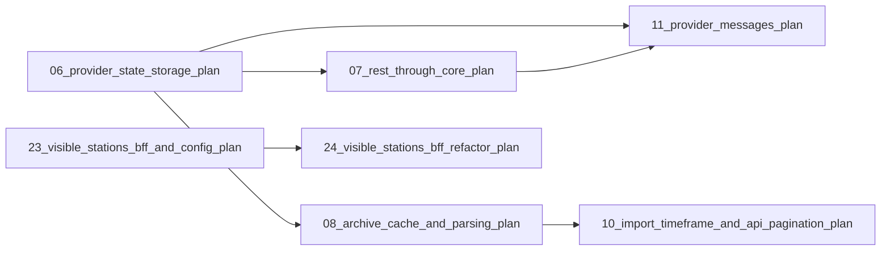

# Plans Overview / Progress

This page gives an overview of the plans in this repository. Each plan lives in
`plans/` and is numbered with a zero-padded two-digit prefix in chronological
order. Statuses:

- `[x]` — decided / closed
- `[-]` — in progress / drafted
- `[ ]` — planned / not started

## Current plan

| Status | Plan | File | Summary |
|---|---|---|---|
| [x] | Hour-of-day radar + weekday axis fix + radar compare | [`48_hourly_radar_and_axis_fix_plan.md`](48_hourly_radar_and_axis_fix_plan.md) | Adds a 24-hour radar next to the Weekdays radar (split half) on detail/summary + nerd stats, fixes the repeated weekday X-axis labels, and makes both radars honor the compare checkbox. |
| [-] | Fix Münster import cursor overshoot | [`47_muenster_import_cursor_overshoot_plan.md`](47_muenster_import_cursor_overshoot_plan.md) | Stops `imported_until` from jumping into the future when a channel has no new data, so the hourly import keeps working; preserves gap-skipping and never fabricates 0 measurements. |
| [-] | Provider-message log level, filtering and DB cap | [`46_provider_message_log_level_and_caps_plan.md`](46_provider_message_log_level_and_caps_plan.md) | Reclassifies the Münster missing-column quirk to DEBUG, adds a per-provider `log_level` (default WARNING) with core filtering and a 1000+1 message cap, a DB trigger capping 1001 messages per data source, plus a `CONTRIBUTING.md` adapter guide. |
| [x] | All-time bike counter + drop latest-year trend | [`45_all_time_bike_counter_and_latest_year_trend_plan.md`](45_all_time_bike_counter_and_latest_year_trend_plan.md) | Exposes an all-time `total_bikes` on overview/detail/summary and renders it as a counter; removes the misleading YoY trend on the latest-year monthly bar button. |
| [-] | Single-tab navigation, responsive search + detail/summary fixes | [`44_single_tab_navigation_and_detail_summary_fixes_plan.md`](44_single_tab_navigation_and_detail_summary_fixes_plan.md) | Keeps detail links in one tab, wraps search actions, renames timeframe dropdown, shrinks the first detail/summary chart. |
| [x] | Monthly bar chart axis labels, unit + YoY trend | [`43_monthly_bar_chart_axis_unit_and_trend_plan.md`](43_monthly_bar_chart_axis_unit_and_trend_plan.md) | Formats Y-axis ticks, appends `bikes` to year-button totals, shows a YoY % on every year button. |
| [x] | Chart grouping, nerd-stats layout + search fixes | [`42_frontend_chart_grouping_and_search_fixes_plan.md`](42_frontend_chart_grouping_and_search_fixes_plan.md) | Reworks "Bikes per month" into an interactive per-year bar chart, widens the first nerd-stats chart, fixes search-dialog scrolling/actions. |
| [-] | Station summary view | [`41_station_summary_view_plan.md`](41_station_summary_view_plan.md) | Adds a shareable `/summary` page aggregating the visible stations behind a new BFF endpoint. |
| [x] | Map-marker flag relocation + detail default week | [`40_map_marker_flag_and_detail_default_week_plan.md`](40_map_marker_flag_and_detail_default_week_plan.md) | Moves the flag SVG into the frontend; detail default timeframe becomes "Current + last week". |
| [x] | Frontend resilience + builtin asset folder sync | [`39_frontend_resilience_and_asset_folder_sync_plan.md`](39_frontend_resilience_and_asset_folder_sync_plan.md) | Adds an error boundary, unifies chart empty states, scans `backend/assets/` at compile time. |
| [x] | Bike icon branding + asset folder sync | [`38_bike_icon_and_asset_sync_plan.md`](38_bike_icon_and_asset_sync_plan.md) | Recolors bike SVGs, registers them as builtin assets, reconciles the bucket both ways. |
| [x] | Detail page timeframe selector + monthly bar chart | [`37_detail_page_timeframe_selector_and_yearly_bar_plan.md`](37_detail_page_timeframe_selector_and_yearly_bar_plan.md) | One shared timeframe selector drives all detail charts plus a per-calendar-month bar chart. |
| [x] | Detail page fixes | [`36_detail_page_fixes_plan.md`](36_detail_page_fixes_plan.md) | Shared header/search, open-detail action, corrected buckets, tooltip locale, pie/legend fixes. |
| [x] | Counting-station detail page | [`35_counting_station_detail_page_plan.md`](35_counting_station_detail_page_plan.md) | Full `/stations/:id` page: image, map preview, overview stats, and all time-series/nerd-stats charts. |
| [x] | Counting-station detail route + URL state | [`34_counting_station_detail_route_and_url_state_plan.md`](34_counting_station_detail_route_and_url_state_plan.md) | First client-side routing; map bounds and open station mirrored into the URL. |
| [-] | Overview detail-link polish + asset findings | [`33_overview_detail_link_and_asset_findings_fix_plan.md`](33_overview_detail_link_and_asset_findings_fix_plan.md) | Fixes plan-32 review findings: hash/bytes consistency, backpressure, icon "open detail" button. |
| [x] | Counting-station overview + provider images | [`32_counting_station_overview_and_images_plan.md`](32_counting_station_overview_and_images_plan.md) | Komoot-style station overview panel plus a MinIO-based assets subsystem with provider/builtin images. |
| [-] | Search dialog scroll fix | [`31_search_dialog_scroll_and_background_fix_plan.md`](31_search_dialog_scroll_and_background_fix_plan.md) | Pins the search bar and makes the results list scroll within the panel. |
| [-] | Quiet make output + local last-day summary | [`30_quiet_make_output_and_local_last_day_plan.md`](30_quiet_make_output_and_local_last_day_plan.md) | Quiets make/scripts and replaces the rolling 24 h window with a DST-aware per-station "last day". |
| [-] | Playwright end-to-end testing | [`29_playwright_e2e_plan.md`](29_playwright_e2e_plan.md) | Browser e2e suite against the real Docker stack with a real Münster import. |
| [x] | Frontend shadcn/ui migration | [`28_frontend_shadcn_ui_migration_plan.md`](28_frontend_shadcn_ui_migration_plan.md) | Migrates the frontend to Tailwind v4 + shadcn/ui components; deletes the old stylesheet. |
| [x] | Frontend component refactor + centered search | [`27_frontend_component_refactor_and_centered_search_plan.md`](27_frontend_component_refactor_and_centered_search_plan.md) | Splits the App monolith into features + lib, centers the header search. |
| [x] | Sidebar overlay + find-on-map popup | [`26_sidebar_overlay_and_find_on_map_popup_plan.md`](26_sidebar_overlay_and_find_on_map_popup_plan.md) | Turns the sidebar into an overlay; "Find on map" flies to and opens a marker popup. |
| [x] | BFF endpoint separation + global summary | [`25_bff_endpoint_separation_and_global_summary_plan.md`](25_bff_endpoint_separation_and_global_summary_plan.md) | Four widget-named BFF endpoints plus a global-summary service; removes the nginx log-level feature. |
| [-] | Backend station-summary refactor | [`24_visible_stations_bff_refactor_plan.md`](24_visible_stations_bff_refactor_plan.md) | Consolidates the station-summary domain/DTOs/service and renames the nginx log-level entrypoint. |
| [x] | Map view + GPS coordinates | [`22_map_view_gps_coordinates_plan.md`](22_map_view_gps_coordinates_plan.md) | Optional GPS coordinates + Leaflet map with one marker per station; PATCH endpoint. |
| [x] | Tooling upgrade | [`21_tooling_upgrade_plan.md`](21_tooling_upgrade_plan.md) | Upgrades npm/Node/deps and slims both Docker images. |
| [-] | Unique counting-station and channel names | [`19_counting_station_channel_name_uniqueness_plan.md`](19_counting_station_channel_name_uniqueness_plan.md) | Deduplicates names by appending external ids; unique indexes (migration V8). |
| [-] | Raise measurements `limit` default to 5000, drop the cap | [`18_remove_measurements_limit_cap_plan.md`](18_remove_measurements_limit_cap_plan.md) | Defaults `limit` to 5000 and removes the upper clamp. |
| [-] | Raw measurements export + messages HATEOAS fix | [`17_measurement_counting_station_filter_plan.md`](17_measurement_counting_station_filter_plan.md) | Adds `GET /measurements/raw` and fixes the provider-message `self` link. |
| [x] | Import cursor `imported_until` + `added_measurements` | [`16_imported_until_and_added_measurements_plan.md`](16_imported_until_and_added_measurements_plan.md) | Renames the incremental cursor, tracks inserted rows, adds a reset endpoint. |
| [x] | Coverage thresholds | [`15_coverage_thresholds_plan.md`](15_coverage_thresholds_plan.md) | 80% overall / 95% core production-line coverage gate. |

## Completed plans

| Status | Plan | File | Summary |
|---|---|---|---|
| [x] | Visible stations BFF + config consolidation | [`23_visible_stations_bff_and_config_plan.md`](23_visible_stations_bff_and_config_plan.md) | Adds `GET /api/bff/stations` and consolidates config into the root TOML. |
| [x] | Frontend + BFF monorepo restructure | [`20_frontend_bff_monorepo_plan.md`](20_frontend_bff_monorepo_plan.md) | Splits the repo into `/frontend` + `/backend`, adds React app and BFF module. |
| [x] | External data sources baseline | [`01_data_source_baseline_plan.md`](01_data_source_baseline_plan.md) | Data sources, `DataProvider` trait, persistence, factory, Münster baseline, REST API. |
| [x] | RESTful read-only API with HATEOAS & Swagger | [`02_rest_api_hateoas_plan.md`](02_rest_api_hateoas_plan.md) | Axum + utoipa GET endpoints with `_links` and Swagger UI. |
| [x] | Health check | [`03_health_check_plan.md`](03_health_check_plan.md) | Liveness/readiness with a real PostgreSQL probe + Docker HEALTHCHECK. |
| [x] | Persistence adapter optimization | [`04_persistence_adapter_optimization_plan.md`](04_persistence_adapter_optimization_plan.md) | Shared pool, migrations once, concurrent queries, multi-row inserts. |
| [x] | Generic job tracking, cron scheduler & updater | [`05_job_scheduler_plan.md`](05_job_scheduler_plan.md) | ShedLock-style `jobs` table, cron-driven incremental data-source updates. |
| [x] | Data source persistent-state storage + REST API | [`06_provider_state_storage_plan.md`](06_provider_state_storage_plan.md) | Opaque per-source KV store + two-phase handover + REST endpoints. |
| [x] | REST through the core | [`07_rest_through_core_plan.md`](07_rest_through_core_plan.md) | Moves read endpoints behind thin core application services. |
| [x] | Archive cache + CSV parsing | [`08_archive_cache_and_parsing_plan.md`](08_archive_cache_and_parsing_plan.md) | Münster ZIP cache + site/CSV parsing behind the external-id record interface. |
| [x] | Overdue-run for the update job | [`09_startup_overdue_update_plan.md`](09_startup_overdue_update_plan.md) | Runs the update when never succeeded or overdue; job logs include name/id. |
| [x] | Import time-batching + pagination/filters | [`10_import_timeframe_and_api_pagination_plan.md`](10_import_timeframe_and_api_pagination_plan.md) | Time-windowed imports, `offset`/`limit` pagination, natural-key upserts. |
| [x] | Data-provider messages (events) | [`11_provider_messages_plan.md`](11_provider_messages_plan.md) | Provider-message table, scoped sink, read-only REST endpoint, missing-column quirk. |
| [x] | Adapter structure refactor | [`12_adapter_refactor_plan.md`](12_adapter_refactor_plan.md) | Groups Postgres adapters and splits the Münster monolith into modules. |
| [x] | Domain structure refactor | [`13_domain_refactor_plan.md`](13_domain_refactor_plan.md) | Per-subject port files, scoped-handle impls in the adapter, driving port traits. |
| [x] | Coverage scan | [`14_coverage_scan_plan.md`](14_coverage_scan_plan.md) | `cargo-llvm-cov` coverage gate + conventions; superseded by plan 15. |

## Decided / closed

| Status | Item | Note |
|---|---|---|
| [x] | Adapter visibility enforcement | Decided not to enforce; single crate, boundary by convention. |
| [x] | Measurements partitioning | Scrapped; natural-key upserts remain the approach. |

## Plan dependency graph

Plan 24 refactors plan 23's visible-stations feature; plan 25 is superseded by
the consolidated plan 24.
