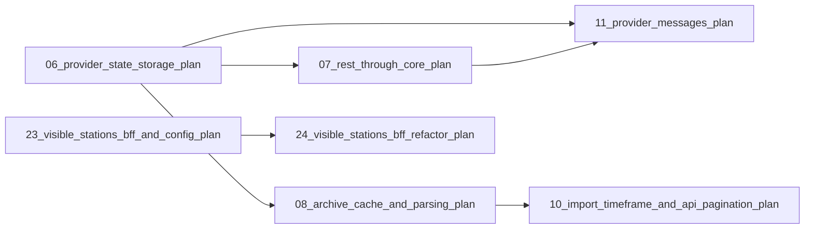

# Plans Overview / Progress

This page gives an overview of the plans in this repository. Each plan lives in
`plans/` and is numbered with a zero-padded two-digit prefix in chronological
order. Statuses:

- `[x]` — decided / closed
- `[-]` — in progress / drafted
- `[ ]` — planned / not started

## Current plan

| Status | Plan | File | Summary |
|---|---|---|---|
| [x] | Animated zoom when selecting a station | [`82_station_selection_zoom_animation_plan.md`](82_station_selection_zoom_animation_plan.md) | Makes the in-app station selection (map marker, sidebar item, on-map search "Find on map") animate with MapLibre's distance-aware `flyTo` instead of the fixed 0.8 s jump, while URL/deep-link arrivals keep starting directly at the location via `fitBounds(duration: 0)`; hardens the detail e2e fly-settle wait. |
| [x] | New-station filter: only exclude stations introduced in the timeframe | [`81_new_station_filter_semantics_plan.md`](81_new_station_filter_semantics_plan.md) | Changes the Bike-Trends "exclude new stations" rule from "full coverage of the window's start and end" to "earliest-ever measurement is not before the window start", so stations with data loss or outages are kept and only stations introduced during the compared period are dropped; adds a per-channel earliest measurement query; updates the settings copy. |
| [x] | Detail/summary key facts, section reorder + wording fixes | [`80_detail_key_facts_and_section_order_plan.md`](80_detail_key_facts_and_section_order_plan.md) | Moves the "Bikes per month" chart to the bottom of the detail + summary pages (with its own heading + settings hint underneath); renames "Nerd stats" to "Detailed stats"; adds timeframe-derived key facts (total bikes in selection, busiest day in range, busiest hour, busiest weekday) in the overview metric-box theme; renames "recent months jump" to "sudden increase"; adds Playwright e2e coverage. |
| [x] | Shared timeframe settings + individual date range + URL/cookie persistence | [`79_shared_timeframe_settings_individual_range_plan.md`](79_shared_timeframe_settings_individual_range_plan.md) | Moves the timeframe dropdown + compare checkbox into the shared settings dialogue on the detail and summary pages; adds an "Individual" option with two date pickers (compare disabled while active, value restored when switching back); persists the settings in the URL (shareable) and a cookie (bare-URL fallback); the backend accepts a custom `from`/`to` range and groups calendar-aligned (`<=24h` 15min, `<=48h` hour, `<=30d` day, `<=90d` week, `<=2y` month, else quarter); prints the selected settings left of the settings button. |
| [x] | Station flags (active/selected/inactive) + banner + popup + full-width share + Playwright timeouts | [`78_station_flags_and_status_plan.md`](78_station_flags_and_status_plan.md) | Adds three map flag SVGs; BFF reports persisted `status` (active/inactive) while the frontend derives the `selected` flag from the URL `station` id; marks stations inactive when missing from a provider's current output (V17 `status` column); enriches the overview banner and the map popup (bike-icon, name, description, channel count); makes "Share by channel" full width; adds Playwright action/navigation/global timeouts. |
| [x] | Small frontend fixes + last-updated fix | [`77_small_frontend_fixes_plan.md`](77_small_frontend_fixes_plan.md) | Widens the Bike-Trends settings dialog into a switch + inline all-vs-established illustration; turns the sidebar into a single sliding panel with a mid-height pull/push handle; fixes the header "updated never" by sourcing the timestamp from per-data-source `last_updated_at` (new V16 column) instead of the all-or-nothing update job. |
| [x] | Bike-Trends: exclude new stations from trends | [`76_bike_trends_new_station_filter_plan.md`](76_bike_trends_new_station_filter_plan.md) | Adds a settings dialogue that only includes stations with full-window coverage in the trend metrics and current-vs-previous graph comparisons on the summary page, detail page and global header summary (generic over any from/to window, date-picker ready); reports `is_new` on the detail page. |
| [x] | Move e2e files into frontend/e2e | [`75_playwright_e2e_files_reorg_plan.md`](75_playwright_e2e_files_reorg_plan.md) | Moves `docker-compose.e2e.yml` and `e2e-seed.sql` into `frontend/e2e/` (specs/helpers already live there); the orchestrator stays in `scripts/`; updates the seed bind-mount (project-root-relative) and every reference in scripts/docs/plans. |
| [x] | Isolate Playwright e2e from dev data | [`74_playwright_e2e_isolated_volumes_plan.md`](74_playwright_e2e_isolated_volumes_plan.md) | Moves the Playwright e2e `db`/`minio` onto dedicated `postgres_data_e2e`/`minio_data_e2e` volumes (and resets the dev volumes out of the merged config), so `docker compose down -v` in the e2e script can no longer wipe the development `postgres_data`/`minio_data` volumes. |
| [x] | Frontend chart data-stream limit | [`73_frontend_chart_stream_limit_plan.md`](73_frontend_chart_stream_limit_plan.md) | Hides any per-station/per-channel chart that would draw more than 5 data-streams (line, weekday radar, hour radar, share pie) and shows an info-note instead, on both the summary and detail pages; adds Playwright e2e coverage. |
| [x] | Startup migration logging | [`72_startup_migration_logging_plan.md`](72_startup_migration_logging_plan.md) | Concise `Starting DB-Migrations` / applied-list / `not necessary` output during backend startup. |
| [x] | Multi-city Playwright map/overview/detail tests | [`71_multicity_playwright_e2e_plan.md`](71_multicity_playwright_e2e_plan.md) | Single-boot Playwright run over a committed SQL fixture seeded from the current DB (Münster, Bonn, Hamburg), avoiding live provider imports; exercises map → overview → detail per city. |
| [x] | Frontend Prettier formatting | [`70_frontend_prettier_fmt_plan.md`](70_frontend_prettier_fmt_plan.md) | Adds Prettier as the single frontend formatter and wires it into `make fmt` (write) + `make check` (CI check); no linting. |
| [x] | Back to map preserves the previous view | [`67_back_to_map_preserves_view_plan.md`](67_back_to_map_preserves_view_plan.md) | Fixes the summary + detail "Back to map" links so they restore the prior map view: the summary link rebuilds `/?<bounds>` from the `/summary` URL, and the detail link history-backs when reached in-app (with a `/` fallback for deep links). |
| [x] | Dependency, base-image upgrade + cargo audit | [`68_dependency_upgrade_and_cargo_audit_plan.md`](68_dependency_upgrade_and_cargo_audit_plan.md) | Upgrades frontend npm deps, backend Rust crates (latest stable majors, refactored for breaking changes), Docker base images and the pinned `go_pmtiles`/Protomaps versions; adds a `cargo audit` gate (scripts/audit.sh + `make audit`, wired into `make check`). |
| [x] | Isolate PostgreSQL on an internal Docker network | [`69_postgres_network_isolation_plan.md`](69_postgres_network_isolation_plan.md) | Mirrors MinIO isolation: adds an internal `db_network`, moves Postgres onto it, removes the `5432` host port and attaches the backend to `default` + `asset_network` + `db_network`. Note: re-creating the volume for the PG18 bump wipes all imported data — it must be re-imported from the public provider APIs (see the plan's data-loss caveat). |
| [-] | Bundle the tiles init into the backend startup | [`65_bundle_tiles_init_into_backend_image_plan.md`](65_bundle_tiles_init_into_backend_image_plan.md) | Removes the separate `tiles` init container and drives the tile build from a Rust driven adapter during the startup init phase, reusing the official `go-pmtiles` CLI (no shell scripts, no reimplementation, no tiles baked into the image). Tiles are mandatory (no skip), the bbox is hard-coded, a cron-scheduled `tiles_update` job rebuilds them atomically, and the settings are grouped in a `[maps]` TOML section. The backend only reports ready once migrations + tiles are done. Keeps the deployment to two images. |
| [x] | Serverless PMTiles basemap | [`64_serverless_pmtiles_basemap_plan.md`](64_serverless_pmtiles_basemap_plan.md) | Supersedes 59/61/63: drops the Martin tile server and the buggy custom MVT generator in favor of a single static `.pmtiles` file (extracted once from the Protomaps public basemap) read directly by the browser via HTTP range requests. |
| [x] | World backdrop overzoom outside Germany | [`63_world_backdrop_overzoom_plan.md`](63_world_backdrop_overzoom_plan.md) | Superseded by 64. Removes the style-layer `maxzoom: 5` cutoff on the `world-water`/`world-land` layers so the coarse Natural Earth backdrop keeps rendering (overzoomed) above zoom 5 everywhere outside the Germany OSM basemap extent, instead of a blank void. |
| [x] | Map control scrollbar flicker | [`62_map_control_scrollbar_flicker_plan.md`](62_map_control_scrollbar_flicker_plan.md) | Contains transient sidebar-loading overflow within the full-screen map shell so the browser scrollbar cannot shift the top-right MapLibre navigation control. |
| [x] | Simplified self-hosted vector basemap (Martin + MapLibre) | [`61_simplified_self_hosted_basemap_plan.md`](61_simplified_self_hosted_basemap_plan.md) | Supersedes 59/60: keeps only the architecture (React + MapLibre → `/api/map/*` → BFF → Martin → OSM-derived data), removes caching and synthetic pre-rendering, and serves a Natural Earth world (z0–5) + a Germany OSM basemap (z0–14) with the integrated cities at street zoom. |
| [x] | Fix synthetic vector-tile layer version | [`60_fix_vector_tile_layer_version_plan.md`](60_fix_vector_tile_layer_version_plan.md) | Superseded by 61. Emits synthetic MVT layers with vector-tile spec v2 metadata so MapLibre renders the fixture without warnings. |
| [x] | Self-hosted vector basemap (Martin + MapLibre GL) | [`59_self_hosted_vector_tiles_plan.md`](59_self_hosted_vector_tiles_plan.md) | Superseded by 61. Replaces the CARTO raster tiles with a self-hosted MapLibre GL vector basemap: Martin tile server (pmtiles) behind a BFF tile proxy (`/api/bff/tiles/*path`), vendored style/glyphs/sprites, and a Leaflet → MapLibre frontend migration. |
| [x] | Optimize measurements overlap guard | [`58_optimize_measurements_overlap_trigger_plan.md`](58_optimize_measurements_overlap_trigger_plan.md) | Replaces the V14 overlap guard's unbounded `EXISTS` scan with a single indexed nearest-predecessor lookup, so per-row inserts stay `O(log n)` instead of degrading with table history. |
| [x] | Hamburg SensorThings adapter + measurement resolution | [`57_hamburg_adapter_and_resolution_plan.md`](57_hamburg_adapter_and_resolution_plan.md) | Adds Hamburg via the official SensorThings API and introduces a per-measurement `resolution_seconds` dimension so multiple resolutions (5-min/15-min/hourly/daily) coexist and aggregate correctly (finest resolution that covers the window) without double counting. |
| [x] | Bonn Open Data bicycle counter adapter | [`56_bonn_adapter_plan.md`](56_bonn_adapter_plan.md) | Adds Bonn as a second data source via a new `bonn_opendata` `DataProvider` adapter (CC0): stations from the official GeoJSON (excluding the three `(errechnete Gesamtzahl)` aggregate stations), hourly measurements from the Vortag CSV (`wann` UTC) plus a 2023–2025 hourly backfill from the wide yearly CSVs (DST-aware German timestamps, name alias table), joined by station name, registered in the factory and config example. |
| [x] | Small UI + script fixes | [`55_small_ui_and_script_fixes_plan.md`](55_small_ui_and_script_fixes_plan.md) | Removes `cd` from the Makefile and e2e script, groups the e2e `rm` calls, prints build/start/finish milestones during Playwright, links the header brand home, widens the search trigger, truncates the header summary on one line, and adds the bike-icon image to each search result row. |
| [x] | Align overview loading skeletons with the rendered cards | [`54_overview_loading_skeleton_alignment_plan.md`](54_overview_loading_skeleton_alignment_plan.md) | Fixes the overview panel's loading ghosts: replaces the single misaligned inline skeletons with a bordered total-card skeleton + four bordered metric-card skeletons in the same `gap-2` column as the rendered `TotalBikesCard`/`MetricCard`. |
| [x] | Station-overview shell + stats sub-resource | [`53_station_overview_shell_and_stats_plan.md`](53_station_overview_shell_and_stats_plan.md) | Splits `GET /api/bff/station-overview/{id}` into a light shell (identity + `channel_count` + `last_update` + `stats` link) and a stats sub-resource (`total_bikes` + metrics, reusing `detail_overview_stats`), so the overview panel renders the station name/image immediately and the stats fill in with a skeleton. |
| [x] | Sidebar shell + stats sub-resource + Skeleton loading | [`52_sidebar_shell_stats_and_skeleton_loading_plan.md`](52_sidebar_shell_stats_and_skeleton_loading_plan.md) | Splits the sidebar endpoint into a light shell (identity + `image_url` + visible/total counters + `stats` link) and a per-station stats sub-resource (`channel_count` + `bikes_last_day`) fetched in parallel; adds the shadcn `Skeleton` primitive and uses `Card`/`Skeleton` placeholders for the detail, summary and sidebar loading states. |
| [x] | Stats sub-requests (per-card) | [`51_stats_subrequests_plan.md`](51_stats_subrequests_plan.md) | Splits the two fat BFF stats page payloads into a HATEOAS page shell plus per-card sub-resources (overview / graphs per timeframe / monthly) for detail + summary; pins each windowed card with an `as_of` reference-time query param (cache + date-picker seam); extends `StationAnalyticsServicePort` while keeping the measurement domain + repositories unchanged. |
| [x] | Station analytics service split | [`50_station_analytics_service_split_plan.md`](50_station_analytics_service_split_plan.md) | Splits the ~2400-line `StationAnalyticsService` into a `station_analytics/` folder with `service.rs` (orchestration), `metrics.rs` (overview metrics) and `graphs.rs` (window/bucket aggregation) as repo-parameterized free functions; keeps the single `StationAnalyticsServicePort` trait and the date-picker + Redis/Valkey seams. |
| [x] | Station analytics consolidation + measurement sum N+1 fix | [`49_station_analytics_consolidation_plan.md`](49_station_analytics_consolidation_plan.md) | Merges the five station modules/services into one `station_analytics` module + `StationAnalyticsService` (shared window/metric/graph helpers, single test double) and makes `MeasurementRepository::sum` multi-channel to kill the N+1 loops. |
| [x] | Hour-of-day radar + weekday axis fix + radar compare | [`48_hourly_radar_and_axis_fix_plan.md`](48_hourly_radar_and_axis_fix_plan.md) | Adds a 24-hour radar next to the Weekdays radar (split half) on detail/summary + nerd stats, fixes the repeated weekday X-axis labels, and makes both radars honor the compare checkbox. |
| [-] | Fix Münster import cursor overshoot | [`47_muenster_import_cursor_overshoot_plan.md`](47_muenster_import_cursor_overshoot_plan.md) | Stops `imported_until` from jumping into the future when a channel has no new data, so the hourly import keeps working; preserves gap-skipping and never fabricates 0 measurements. |
| [-] | Provider-message log level, filtering and DB cap | [`46_provider_message_log_level_and_caps_plan.md`](46_provider_message_log_level_and_caps_plan.md) | Reclassifies the Münster missing-column quirk to DEBUG, adds a per-provider `log_level` (default WARNING) with core filtering and a 1000+1 message cap, a DB trigger capping 1001 messages per data source, plus a `CONTRIBUTING.md` adapter guide. |
| [x] | All-time bike counter + drop latest-year trend | [`45_all_time_bike_counter_and_latest_year_trend_plan.md`](45_all_time_bike_counter_and_latest_year_trend_plan.md) | Exposes an all-time `total_bikes` on overview/detail/summary and renders it as a counter; removes the misleading YoY trend on the latest-year monthly bar button. |
| [-] | Single-tab navigation, responsive search + detail/summary fixes | [`44_single_tab_navigation_and_detail_summary_fixes_plan.md`](44_single_tab_navigation_and_detail_summary_fixes_plan.md) | Keeps detail links in one tab, wraps search actions, renames timeframe dropdown, shrinks the first detail/summary chart. |
| [x] | Monthly bar chart axis labels, unit + YoY trend | [`43_monthly_bar_chart_axis_unit_and_trend_plan.md`](43_monthly_bar_chart_axis_unit_and_trend_plan.md) | Formats Y-axis ticks, appends `bikes` to year-button totals, shows a YoY % on every year button. |
| [x] | Chart grouping, nerd-stats layout + search fixes | [`42_frontend_chart_grouping_and_search_fixes_plan.md`](42_frontend_chart_grouping_and_search_fixes_plan.md) | Reworks "Bikes per month" into an interactive per-year bar chart, widens the first nerd-stats chart, fixes search-dialog scrolling/actions. |
| [-] | Station summary view | [`41_station_summary_view_plan.md`](41_station_summary_view_plan.md) | Adds a shareable `/summary` page aggregating the visible stations behind a new BFF endpoint. |
| [x] | Map-marker flag relocation + detail default week | [`40_map_marker_flag_and_detail_default_week_plan.md`](40_map_marker_flag_and_detail_default_week_plan.md) | Moves the flag SVG into the frontend; detail default timeframe becomes "Current + last week". |
| [x] | Frontend resilience + builtin asset folder sync | [`39_frontend_resilience_and_asset_folder_sync_plan.md`](39_frontend_resilience_and_asset_folder_sync_plan.md) | Adds an error boundary, unifies chart empty states, scans `backend/assets/` at compile time. |
| [x] | Bike icon branding + asset folder sync | [`38_bike_icon_and_asset_sync_plan.md`](38_bike_icon_and_asset_sync_plan.md) | Recolors bike SVGs, registers them as builtin assets, reconciles the bucket both ways. |
| [x] | Detail page timeframe selector + monthly bar chart | [`37_detail_page_timeframe_selector_and_yearly_bar_plan.md`](37_detail_page_timeframe_selector_and_yearly_bar_plan.md) | One shared timeframe selector drives all detail charts plus a per-calendar-month bar chart. |
| [x] | Detail page fixes | [`36_detail_page_fixes_plan.md`](36_detail_page_fixes_plan.md) | Shared header/search, open-detail action, corrected buckets, tooltip locale, pie/legend fixes. |
| [x] | Counting-station detail page | [`35_counting_station_detail_page_plan.md`](35_counting_station_detail_page_plan.md) | Full `/stations/:id` page: image, map preview, overview stats, and all time-series/nerd-stats charts. |
| [x] | Counting-station detail route + URL state | [`34_counting_station_detail_route_and_url_state_plan.md`](34_counting_station_detail_route_and_url_state_plan.md) | First client-side routing; map bounds and open station mirrored into the URL. |
| [-] | Overview detail-link polish + asset findings | [`33_overview_detail_link_and_asset_findings_fix_plan.md`](33_overview_detail_link_and_asset_findings_fix_plan.md) | Fixes plan-32 review findings: hash/bytes consistency, backpressure, icon "open detail" button. |
| [x] | Counting-station overview + provider images | [`32_counting_station_overview_and_images_plan.md`](32_counting_station_overview_and_images_plan.md) | Komoot-style station overview panel plus a MinIO-based assets subsystem with provider/builtin images. |
| [-] | Search dialog scroll fix | [`31_search_dialog_scroll_and_background_fix_plan.md`](31_search_dialog_scroll_and_background_fix_plan.md) | Pins the search bar and makes the results list scroll within the panel. |
| [-] | Quiet make output + local last-day summary | [`30_quiet_make_output_and_local_last_day_plan.md`](30_quiet_make_output_and_local_last_day_plan.md) | Quiets make/scripts and replaces the rolling 24 h window with a DST-aware per-station "last day". |
| [-] | Playwright end-to-end testing | [`29_playwright_e2e_plan.md`](29_playwright_e2e_plan.md) | Browser e2e suite against the real Docker stack with a real Münster import. |
| [x] | Frontend shadcn/ui migration | [`28_frontend_shadcn_ui_migration_plan.md`](28_frontend_shadcn_ui_migration_plan.md) | Migrates the frontend to Tailwind v4 + shadcn/ui components; deletes the old stylesheet. |
| [x] | Frontend component refactor + centered search | [`27_frontend_component_refactor_and_centered_search_plan.md`](27_frontend_component_refactor_and_centered_search_plan.md) | Splits the App monolith into features + lib, centers the header search. |
| [x] | Sidebar overlay + find-on-map popup | [`26_sidebar_overlay_and_find_on_map_popup_plan.md`](26_sidebar_overlay_and_find_on_map_popup_plan.md) | Turns the sidebar into an overlay; "Find on map" flies to and opens a marker popup. |
| [x] | BFF endpoint separation + global summary | [`25_bff_endpoint_separation_and_global_summary_plan.md`](25_bff_endpoint_separation_and_global_summary_plan.md) | Four widget-named BFF endpoints plus a global-summary service; removes the nginx log-level feature. |
| [-] | Backend station-summary refactor | [`24_visible_stations_bff_refactor_plan.md`](24_visible_stations_bff_refactor_plan.md) | Consolidates the station-summary domain/DTOs/service and renames the nginx log-level entrypoint. |
| [x] | Map view + GPS coordinates | [`22_map_view_gps_coordinates_plan.md`](22_map_view_gps_coordinates_plan.md) | Optional GPS coordinates + Leaflet map with one marker per station; PATCH endpoint. |
| [x] | Tooling upgrade | [`21_tooling_upgrade_plan.md`](21_tooling_upgrade_plan.md) | Upgrades npm/Node/deps and slims both Docker images. |
| [-] | Unique counting-station and channel names | [`19_counting_station_channel_name_uniqueness_plan.md`](19_counting_station_channel_name_uniqueness_plan.md) | Deduplicates names by appending external ids; unique indexes (migration V8). |
| [-] | Raise measurements `limit` default to 5000, drop the cap | [`18_remove_measurements_limit_cap_plan.md`](18_remove_measurements_limit_cap_plan.md) | Defaults `limit` to 5000 and removes the upper clamp. |
| [-] | Raw measurements export + messages HATEOAS fix | [`17_measurement_counting_station_filter_plan.md`](17_measurement_counting_station_filter_plan.md) | Adds `GET /measurements/raw` and fixes the provider-message `self` link. |
| [x] | Import cursor `imported_until` + `added_measurements` | [`16_imported_until_and_added_measurements_plan.md`](16_imported_until_and_added_measurements_plan.md) | Renames the incremental cursor, tracks inserted rows, adds a reset endpoint. |
| [x] | Coverage thresholds | [`15_coverage_thresholds_plan.md`](15_coverage_thresholds_plan.md) | 80% overall / 95% core production-line coverage gate. |

## Completed plans

| Status | Plan | File | Summary |
|---|---|---|---|
| [x] | Visible stations BFF + config consolidation | [`23_visible_stations_bff_and_config_plan.md`](23_visible_stations_bff_and_config_plan.md) | Adds `GET /api/bff/stations` and consolidates config into the root TOML. |
| [x] | Frontend + BFF monorepo restructure | [`20_frontend_bff_monorepo_plan.md`](20_frontend_bff_monorepo_plan.md) | Splits the repo into `/frontend` + `/backend`, adds React app and BFF module. |
| [x] | External data sources baseline | [`01_data_source_baseline_plan.md`](01_data_source_baseline_plan.md) | Data sources, `DataProvider` trait, persistence, factory, Münster baseline, REST API. |
| [x] | RESTful read-only API with HATEOAS & Swagger | [`02_rest_api_hateoas_plan.md`](02_rest_api_hateoas_plan.md) | Axum + utoipa GET endpoints with `_links` and Swagger UI. |
| [x] | Health check | [`03_health_check_plan.md`](03_health_check_plan.md) | Liveness/readiness with a real PostgreSQL probe + Docker HEALTHCHECK. |
| [x] | Persistence adapter optimization | [`04_persistence_adapter_optimization_plan.md`](04_persistence_adapter_optimization_plan.md) | Shared pool, migrations once, concurrent queries, multi-row inserts. |
| [x] | Generic job tracking, cron scheduler & updater | [`05_job_scheduler_plan.md`](05_job_scheduler_plan.md) | ShedLock-style `jobs` table, cron-driven incremental data-source updates. |
| [x] | Data source persistent-state storage + REST API | [`06_provider_state_storage_plan.md`](06_provider_state_storage_plan.md) | Opaque per-source KV store + two-phase handover + REST endpoints. |
| [x] | REST through the core | [`07_rest_through_core_plan.md`](07_rest_through_core_plan.md) | Moves read endpoints behind thin core application services. |
| [x] | Archive cache + CSV parsing | [`08_archive_cache_and_parsing_plan.md`](08_archive_cache_and_parsing_plan.md) | Münster ZIP cache + site/CSV parsing behind the external-id record interface. |
| [x] | Overdue-run for the update job | [`09_startup_overdue_update_plan.md`](09_startup_overdue_update_plan.md) | Runs the update when never succeeded or overdue; job logs include name/id. |
| [x] | Import time-batching + pagination/filters | [`10_import_timeframe_and_api_pagination_plan.md`](10_import_timeframe_and_api_pagination_plan.md) | Time-windowed imports, `offset`/`limit` pagination, natural-key upserts. |
| [x] | Data-provider messages (events) | [`11_provider_messages_plan.md`](11_provider_messages_plan.md) | Provider-message table, scoped sink, read-only REST endpoint, missing-column quirk. |
| [x] | Adapter structure refactor | [`12_adapter_refactor_plan.md`](12_adapter_refactor_plan.md) | Groups Postgres adapters and splits the Münster monolith into modules. |
| [x] | Domain structure refactor | [`13_domain_refactor_plan.md`](13_domain_refactor_plan.md) | Per-subject port files, scoped-handle impls in the adapter, driving port traits. |
| [x] | Coverage scan | [`14_coverage_scan_plan.md`](14_coverage_scan_plan.md) | `cargo-llvm-cov` coverage gate + conventions; superseded by plan 15. |

## Decided / closed

| Status | Item | Note |
|---|---|---|
| [x] | Adapter visibility enforcement | Decided not to enforce; single crate, boundary by convention. |
| [x] | Measurements partitioning | Scrapped; natural-key upserts remain the approach. |

## Plan dependency graph

Plan 24 refactors plan 23's visible-stations feature; plan 25 is superseded by
the consolidated plan 24.
