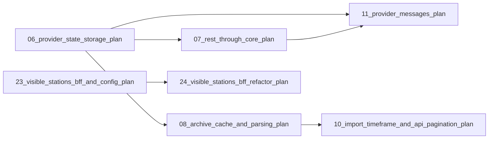

i# Plans Overview / Progress

This page gives an overview of the current and upcoming plans in this repository.
Each plan lives in this `plans/` directory and is numbered with a zero-padded
two-digit prefix in chronological order. Statuses:

- `[x]` — decided / closed
- `[-]` — in progress / drafted
- `[ ]` — planned / not started

## Current plan

| Status | Plan | File | Summary |
|---|---|---|---|
| [x] | Monthly bar chart: Y-axis labels, bikes unit + year-over-year trend | [`43_monthly_bar_chart_axis_unit_and_trend_plan.md`](43_monthly_bar_chart_axis_unit_and_trend_plan.md) | Adds formatted Y-axis tick labels to the "Bikes per month" bar chart, appends a lowercase `bikes` unit to each year button's total in the top-right header, and shows a year-over-year percentage change (p-%) with an up/down/flat arrow on every year button (`–` for the oldest year). Frontend-only, reusing the existing `TrendIcon`. |
| [x] | Frontend chart grouping, nerd-stats layout + search-dialog fixes | [`42_frontend_chart_grouping_and_search_fixes_plan.md`](42_frontend_chart_grouping_and_search_fixes_plan.md) | Reworks "Bikes per month" into the shadcn interactive bar-chart pattern with one clickable year button per year (showing that year's total) driving a single-year 12-bar view; makes the first Nerd-stats chart full width with a shorter aspect ratio on both the detail and summary pages; and fixes the search dialog so the results list actually scrolls and the "Find on map"/"Open detail" buttons collapse to icon-only on small screens. |
| [-] | Station summary view (aggregate visible stations) | [`41_station_summary_view_plan.md`](41_station_summary_view_plan.md) | Adds a sidebar "Summarize visible stations" action that opens a new shareable `/summary` page (fallback image, interactive map of the same view, aggregated stats + per-station Nerd stats, click-to-disable on the map flag). Stats are aggregated behind a new BFF endpoint reusing the existing `MeasurementRepository` primitives; map view + disabled stations are URL-encoded; a loading state covers the slow page. |
| [x] | Map-marker flag relocation + detail-page default week | [`40_map_marker_flag_and_detail_default_week_plan.md`](40_map_marker_flag_and_detail_default_week_plan.md) | Relocates the black map-flag (pin + bike) from `backend/assets/` to the frontend as a Vite-imported SVG recolored to emerald `#059669`, and uses it for both the main map marker and the detail-preview marker so editing the SVG updates the markers automatically; removes the backend asset so the folder scan stops syncing it; changes the detail-page default timeframe from 24 hours to "Current + last week". |
| [x] | Frontend resilience + builtin asset folder sync | [`39_frontend_resilience_and_asset_folder_sync_plan.md`](39_frontend_resilience_and_asset_folder_sync_plan.md) | Adds a React error boundary so a chart crash degrades to an inline error instead of blanking the whole page, unifies chart empty-state handling behind one shared component, scans `backend/assets/` at compile time so the builtin sync mirrors the folder without a hand-maintained list, and keeps exactly one copy of the brand bike icon (frontend only). The e2e stack keeps its persistent volumes so the real Münster import is not re-run per gate. |
| [x] | Bike icon branding + builtin asset folder sync | [`38_bike_icon_and_asset_sync_plan.md`](38_bike_icon_and_asset_sync_plan.md) | Recolors both bike SVGs to emerald-600 #059669, registers them as builtin assets (white-circle icon = header brand + browser favicon, plain icon = default station image), removes the old station placeholder from the repo and object storage, extends the builtin sync to add **and** remove assets so the bucket mirrors the assets folder, and moves the Leaflet zoom control to the right. |
| [x] | Detail page: shared timeframe selector, previous-period overlay and monthly bar chart | [`37_detail_page_timeframe_selector_and_yearly_bar_plan.md`](37_detail_page_timeframe_selector_and_yearly_bar_plan.md) | Reworks the detail-page statistics around one shared timeframe dropdown (24 hours / current + last week / last 30 days / last year) that drives the full-width main line chart, the weekday radar, the channel pie and the per-channel nerd stats, plus a "compare previous period" checkbox that overlays the previous period. Adds the missing previous windows for 24 h and 30 days, a per-calendar-month aggregate for a new standalone monthly bar chart (one bar per month, grand total in the top-right), and drops the now-bundled per-window line charts. |
| [x] | Detail page fixes: header/search actions, chart resolutions, tooltip locale, legends | [`36_detail_page_fixes_plan.md`](36_detail_page_fixes_plan.md) | Fixes the detail-page defects: a shared header + search shell so the header stays active on `/stations/:id`, a new `open_detail` search action alongside "Find on map", corrected backend bucket resolutions (week = 1 hour, last 30 days = 1 day, last year explicitly aligned to the previous year), full-date tooltips driven by a central `LOCALE` constant, the collapsed "Share by channel" pie layout, and legend filtering to only series that have data. |
| [x] | Counting-station detail page (layout + stats + graphs) | [`35_counting_station_detail_page_plan.md`](35_counting_station_detail_page_plan.md) | Implements the `/stations/:id` detail page (plan 34 kept the route blank): a "Back to map" link, a half-page station image next to a highlighted map preview (clicking it opens the map view at the preview's visible bounds via a history push, so the browser "back" event re-routes to the station), the name/description row, the overview stat boxes reused from the overview panel plus a new YEAR stat, and two graph sections. All time-series are line charts built on the shadcn `chart` component (Recharts) with labeled axes and **no zero-filling**: last day (5 min), weekday radar (last 30 days), current + last week (15 min, the running week's empty tail shown via an extended axis domain), last 30 days (30 min, with an info note), current + last year (1 day); Nerd-Stats repeat these per channel (incl. a timezone-aware per-channel weekday radar) plus a channel pie. Backend: calendar-year/week-start helpers, a `last_year` overview metric, a `station_detail` domain + service, timezone-aware `date_bin` bucketed reads on the `MeasurementRepository` (PostgreSQL 16) and a BFF `GET /api/bff/station-detail/{id}` endpoint. |
| [x] | Counting-station detail route + URL-encoded map/overview state | [`34_counting_station_detail_route_and_url_state_plan.md`](34_counting_station_detail_route_and_url_state_plan.md) | Adds the first client-side routing to the frontend (`react-router-dom`): `/stations/:id` renders a blank counting-station detail page (id in the URL), the map's visible bounding box is mirrored into the URL as `min_lat`/`min_lng`/`max_lat`/`max_lng` query params (restored via `fitBounds`, so sharing a link keeps the view), and the open station overview is mirrored as `station=<id>`. The detail page content is explicitly out of scope (blank for now). |
| [-] | Overview detail-link polish + asset findings fixes | [`33_overview_detail_link_and_asset_findings_fix_plan.md`](33_overview_detail_link_and_asset_findings_fix_plan.md) | Fixes the plan 32 review findings: verifies the provider-image hash matches its bytes so the content-addressed key equals the persisted sha256, drops the unused `AssetObjectInfo.etag`, adds bounded-channel backpressure to the image stream, resolves `default_asset()` once per import, and turns "Open detail page" into an icon button next to the "x" with a clickable (non-link-styled) station-name heading in both the overview panel and the map popup. Keeps the Bohlweg coordinate fix and defers the missing-object 404. |
| [x] | Counting-station overview + provider images | [`32_counting_station_overview_and_images_plan.md`](32_counting_station_overview_and_images_plan.md) | Adds a Komoot-style station overview panel that replaces the sidebar when a map marker is clicked (image, name, description, key facts with up/down/flat trend arrows, last update, future detail-page link; map-void click closes it). Adds a MinIO-based assets subsystem: images provided by the provider adapters with hash-based change detection (no upload/delete API), built-in sample image embedded in source and idempotently synced to MinIO, PostgreSQL metadata + station↔asset link, BFF overview endpoint and a streaming image endpoint. |
| [-] | Search dialog overflow + scrollable list fix | [`31_search_dialog_scroll_and_background_fix_plan.md`](31_search_dialog_scroll_and_background_fix_plan.md) | Fixes the search dialog so the panel clips to its rounded border (`overflow-hidden`), the search-bar row stays pinned (`shrink-0`), and the station list actually scrolls in the remaining space (`min-h-0 flex-1` instead of the uncoordinated `max-h-[60vh]`). Frontend-only. |
| [-] | Quiet make output + local last-day summary | [`30_quiet_make_output_and_local_last_day_plan.md`](30_quiet_make_output_and_local_last_day_plan.md) | Quiets the Make targets/scripts (quiet cargo flags, redirect docker/npm build logs, tail failures only) and replaces the rolling 24 h BFF window with a per-counting-station local "last day" window (DST-aware): adds a `timezone` (IANA) column/field to counting stations and the Münster provider record, renames `bikes_last_24h`/`bikes_last_24h_total` to `bikes_last_day`/`bikes_last_day_total` through domain/DTO/frontend, and updates the header/station-list text to `bikes / last day`. |
| [-] | Playwright end-to-end testing | [`29_playwright_e2e_plan.md`](29_playwright_e2e_plan.md) | Adds Playwright browser tests for the React frontend running against the real Docker Compose stack with a real Münster import: clicking a map marker opens its popup, the search bar finds a station and "Find on map" opens the matching popup, and the sidebar renders only the stations visible in the current viewport (marker count == sidebar item count == badge visible count, shrinking on zoom). Adds `frontend/e2e/` specs + `frontend/playwright.config.ts`, a `scripts/e2e-playwright.sh` orchestrator, `make test-playwright` / `make playwright-install` targets, marker `alt`/`title` test hooks, and docs in `agents.md` / `README.md` / `ToDo.md`. |
| [x] | Frontend shadcn/ui migration | [`28_frontend_shadcn_ui_migration_plan.md`](28_frontend_shadcn_ui_migration_plan.md) | Migrates the frontend from the hand-written [`index.css`](../frontend/src/index.css:1) to Tailwind CSS v4 + shadcn/ui with an emerald/slate theme: adds the shadcn scaffolding (Tailwind v4, `@` alias, `components.json`, `cn()` util), converts TopBar / Sidebar / SearchDialog / StationListItem / map chrome to shadcn components + Tailwind utilities, and deletes the old global stylesheet. Frontend-only, no behaviour change. |
| [x] | Frontend component refactor + centered search bar | [`27_frontend_component_refactor_and_centered_search_plan.md`](27_frontend_component_refactor_and_centered_search_plan.md) | Splits the ~475-line [`frontend/src/App.tsx`](../frontend/src/App.tsx:1) monolith into a feature-based structure (`features/header`, `features/map`, `features/sidebar`, `features/search`, `features/stations` + `lib/` + co-located data-fetching hooks), turning [`App.tsx`](../frontend/src/App.tsx:1) into a thin composition root, and centers the header search trigger with a three-column grid. Frontend-only, no behaviour change. |
| [x] | Sidebar overlay + find-on-map popup consistency | [`26_sidebar_overlay_and_find_on_map_popup_plan.md`](26_sidebar_overlay_and_find_on_map_popup_plan.md) | Removes the header sidebar toggle and turns the sidebar into a Komoot-style overlay (collapse `<` / expand `>` buttons inside the sidebar, map full-width underneath). Makes "Find on map" fly to the station and open a popup identical to a map-marker click (plain name, marker-anchored, opened after the fly animation). Frontend-only. |
| [x] | BFF endpoint separation + global summary + frontend polish | [`25_bff_endpoint_separation_and_global_summary_plan.md`](25_bff_endpoint_separation_and_global_summary_plan.md) | Splits the BFF into four widget-named endpoints: `/api/bff/stations` (map markers, minimal), `/api/bff/stations/sidebar` (sidebar + visible/global counter), `/api/bff/stations/search` (all stations + action map) and `/api/bff/global-summary` (whole-system stats). Adds a decoupled `global_summary` domain module + `GlobalSummaryService` (incl. last data-source-update timestamp), refactors `station_summary` to a single `summarize(bounds: Option<GeoBounds>, ...)`, updates Swagger/OpenAPI for all four endpoints, applies the frontend polish (sidebar close button to top, "Visible counting stations" rename, visible/total counter, header global summary + last update, search clear-button fix), and removes the `[frontend] log_level` nginx feature entirely. |
| [-] | Backend station-summary refactor | [`24_visible_stations_bff_refactor_plan.md`](24_visible_stations_bff_refactor_plan.md) | Consolidates the station-summary refactor per user feedback: `StationSummary` holds `CountingStation`; `StationSummaryDto` reuses `CountingStationDto` via `#[serde(flatten)]`; `MeasurementRepository::sum_since` becomes scalar `sum(from, to, channel_id?)`; `GeoBounds`/`find_within_bounds` move out of counting stations into `station_summary::bounds` with in-memory filtering; `StationSummaryAggregate` moves to its own `aggregate.rs`; the service port + BFF handlers take an explicit `(from, to)` window; and the nginx log-level entrypoint is renamed to `19-log-level.sh` (fixes the e2e startup failure). |
| [x] | Map view + counting-station GPS coordinates | [`22_map_view_gps_coordinates_plan.md`](22_map_view_gps_coordinates_plan.md) | Adds optional GPS coordinates to counting stations (a hardcoded Münster adapter table keyed by external id, stored via migration `V10`, exposed on the counting-station DTO), makes the import sync upsert stations by external id (name/description/coordinates), adds `PATCH /api/v1/counting-stations/{id}` for coordinates, and turns the frontend into a Leaflet map view with one marker per station. |
| [x] | Tooling upgrade: npm/Node + deps + slimmer Docker images | [`21_tooling_upgrade_plan.md`](21_tooling_upgrade_plan.md) | Upgrades the frontend to the latest stable npm/Node and latest dependency majors (React 19, Vite 7, TypeScript 5.9, plugin-react 5), slims the backend Docker image to a musl static build on `alpine:3.24` (39 MB), builds the frontend on `node:24-alpine` with a pinned `nginx:1.31-alpine` runtime, and confirms coverage/format gates stay backend-only. |
| [-] | Unique counting-station and channel names | [`19_counting_station_channel_name_uniqueness_plan.md`](19_counting_station_channel_name_uniqueness_plan.md) | Ensures counting-station names are unique per data source and channel names are unique per counting station. The Münster adapter appends the external id to duplicate names, migration `V8` repairs existing duplicate rows and adds unique indexes, and the counting-station Swagger schema exposes `data_source_id` plus a `data_source` HATEOAS link. |
| [-] | Raise measurements `limit` default to 5000, drop the cap | [`18_remove_measurements_limit_cap_plan.md`](18_remove_measurements_limit_cap_plan.md) | Changes `DEFAULT_PAGE_LIMIT` to 5000 and removes `MAX_PAGE_LIMIT` so `GET /api/v1/measurements` (and `/raw`) defaults to 5000 rows when `limit` is omitted and honors any explicitly supplied `limit` verbatim (no upper clamp). The 5000 default and no-upper-bound note are documented in Swagger via the `MeasurementQueryParams.limit` doc comment. |
| [-] | Raw measurements export + provider-message HATEOAS fix | [`17_measurement_counting_station_filter_plan.md`](17_measurement_counting_station_filter_plan.md) | Adds a raw `GET /api/v1/measurements/raw` endpoint (same `channel_id`/`offset`/`limit` query parameters) returning a bare JSON array of plain measurement objects without HATEOAS links or a pagination envelope, fixed entirely in the driving adapter on top of the existing measurement service, plus fixes the dead `ProviderMessageDto` `self` link to the messages list endpoint. No core/domain changes. |
| [x] | Import cursor `imported_until` + `added_measurements` | [`16_imported_until_and_added_measurements_plan.md`](16_imported_until_and_added_measurements_plan.md) | Renames the incremental cursor `data_sources.last_updated_at` to `imported_until` everywhere (migration V7), adds a job `added_measurements` metadata key counting actually inserted rows computed by the core, exposes `imported_until` on the data-source DTO, and adds `DELETE /api/v1/data-sources/{id}/imported_until` to reset the cursor and force a full re-import. |
| [x] | Coverage thresholds | [`15_coverage_thresholds_plan.md`](15_coverage_thresholds_plan.md) | Raises the coverage gate to **80% overall** and adds a per-path gate for the core (`src/core/`) at **95%**, both measured on **production code only** (`#[cfg(test)]` scaffolding and standalone test files excluded) by parsing the lcov report in `scripts/coverage.sh`; adds isolated core unit tests and adapter tests. Final: overall 80.36%, core 96.45%, 206 tests. Also wired the previously-orphaned `rest/tests/jobs.rs` into the suite. |

## Completed plans

| Status | Plan | File | Summary |
|---|---|---|---|
| [x] | Visible stations BFF endpoint + config consolidation + frontend header/list | [`23_visible_stations_bff_and_config_plan.md`](23_visible_stations_bff_and_config_plan.md) | Removes the placeholder `GET /api/bff/hello` (keeping the `BFF API` Swagger tag), adds `GET /api/bff/stations` (bounding-box query returning id/name/description/lat/lng/channel_count/bikes_last_24h computed on the fly via a new core `StationSummaryService`), consolidates config into the root `config.toml` (deletes the backend TOMLs, mounts the root TOML in docker compose), adds a TOML `[frontend] log_level`, and gives the frontend a Komoot-style header plus a visible-station list. |
| [x] | Frontend + BFF module + monorepo restructure | [`20_frontend_bff_monorepo_plan.md`](20_frontend_bff_monorepo_plan.md) | Restructures the repo into `/frontend` and `/backend`, adds a React (Vite) frontend served by nginx, and adds a BFF Rust module exposing `GET /api/bff/hello` on port 8080, documented in the same Swagger doc under a new `BFF API` tag. Docker Compose ramps up `db` + `backend` + `frontend` and `make run` keeps working. |
| [x] | External Data Sources Baseline | [`01_data_source_baseline_plan.md`](01_data_source_baseline_plan.md) | Data sources configured in `config.toml`, the `DataProvider` trait, `data_sources` persistence with startup sync, `DataProviderFactory`, the Münster adapter baseline, and `GET /api/v1/data-sources` + root HATEOAS link. |
| [x] | RESTful read-only API with HATEOAS & Swagger UI | [`02_rest_api_hateoas_plan.md`](02_rest_api_hateoas_plan.md) | Axum + utoipa driving adapter: read-only GET endpoints under `/api/v1`, HATEOAS `_links`, auto-generated OpenAPI and Swagger UI. |
| [x] | Health-check (liveness + readiness) | [`03_health_check_plan.md`](03_health_check_plan.md) | `GET /health/live` and `GET /health/ready` with a real PostgreSQL probe, plus a Docker `HEALTHCHECK`. |
| [x] | Optimize the persistence adapter | [`04_persistence_adapter_optimization_plan.md`](04_persistence_adapter_optimization_plan.md) | One shared Postgres pool, migrations run once, concurrent queries, multi-row measurement `INSERT`, and SQL-pushed job filters. |
| [x] | Generic job tracking, cron scheduler & data source updater | [`05_job_scheduler_plan.md`](05_job_scheduler_plan.md) | ShedLock-style `jobs` table, cron-driven data-source update job with incremental updates, and the read-only jobs REST API. |
| [x] | Data source persistent-state storage + REST API | [`06_provider_state_storage_plan.md`](06_provider_state_storage_plan.md) | Opaque persistent KV store per data source, a two-phase handover that attaches a scoped `PersistentStateAccess` to each provider after its data source is upserted, and new `persistent_state` REST endpoints through a core service. Migration V4 + DB trigger for provider-change revocation. |
| [x] | REST through the core | [`07_rest_through_core_plan.md`](07_rest_through_core_plan.md) | Migrated the existing read endpoints (counting stations, channels, measurements, data sources, jobs) from direct repository calls in the handlers to five thin core application services (`CountingStationService`, `ChannelService`, `MeasurementService`, `DataSourceService`, `JobService`). DTO mapping stays in the driving adapter. |
| [x] | Archive cache + CSV parsing | [`08_archive_cache_and_parsing_plan.md`](08_archive_cache_and_parsing_plan.md) | Refactored `DataProvider` to an external-id record interface (the core owns all identity), then realized the motivating case: download the Münster GitHub ZIP, extract it into an obscured `/tmp` folder with a four-tier cache over `PersistentStateAccess`, and serve stations/channels/measurements parsed from `site_min.json` and the per-station monthly CSVs. |
| [x] | Overdue-run for the data-source update job | [`09_startup_overdue_update_plan.md`](09_startup_overdue_update_plan.md) | Removed the `startup` flag: `DataSourceUpdateService::run_if_due()` now applies one always-on rule (run if never succeeded or the last successful run is overdue), so missed cron slots are caught up at the next startup; job logs now include the job name and id. |
| [x] | Import time-batching + API pagination & filters | [`10_import_timeframe_and_api_pagination_plan.md`](10_import_timeframe_and_api_pagination_plan.md) | Bounded each import page by a configurable time window (default 7 days) so the Münster adapter reads only the monthly files overlapping the window; added `offset`/`limit` pagination to measurements and `name` filters for channels/counting-stations; added the measurements natural key `UNIQUE (channel_id, timestamp)` with idempotent `ON CONFLICT` imports (migration V5). |
| [x] | Data-provider messages (events) | [`11_provider_messages_plan.md`](11_provider_messages_plan.md) | A `data_source_provider_messages` table scoped per data source (migration V6), a scoped `ProviderMessageSink` handed to providers via `attach_provider_messages`, read-only `GET /api/v1/data-sources/{id}/messages`, and converting the Münster missing-column abort into a `WARNING` event plus concise `INFO`/`DEBUG` cache-lifecycle one-liners. Genuine IO/parse errors still fail the job with its `failure_message`. |
| [x] | Adapter structure refactor | [`12_adapter_refactor_plan.md`](12_adapter_refactor_plan.md) | Pure structural refactor of `src/adapter/`: grouped the nine Postgres adapters into `driven/postgres/` (with a re-export `mod.rs`), split the 1649-line Münster GitHub monolith into `driven/muenster_github/` (`adapter.rs`, `fetcher.rs`, `archive.rs`, `parsing.rs`, `tests.rs`), and split the driving `rest/handlers.rs` / `rest/dto.rs` into per-resource modules behind re-exporting `mod.rs` files. No behavior change; all 179 tests pass. |
| [x] | Domain structure refactor | [`13_domain_refactor_plan.md`](13_domain_refactor_plan.md) | Structural refactor of `src/core/domain/`: every port trait now lives in a `<subject>_port.rs` file (`repository_port.rs`, `provider_port.rs`, `persistent_state_port.rs`, `provider_message_port.rs`, `data_provider_factory_port.rs`, `indicator_port.rs` for driven ports; `service_port.rs` for driving ports) with per-module port-index docs. The scoped-handle implementations (`ScopedPersistentState`, `ScopedProviderMessageSink`) moved to `adapter/driven/provider_handles.rs` with a `ProviderHandles` factory port; `DataProviderFactory` moved from the application layer into the domain; introduced 9 driving port traits so the REST adapter and job scheduler depend on `Arc<dyn ...Port>` instead of concrete services. Removed dead code (`station/`, `measurements/provider.rs`, `application/station_import_service.rs`). No behavior change; all 179 tests pass. |
| [x] | Coverage scan | [`14_coverage_scan_plan.md`](14_coverage_scan_plan.md) | Added a `cargo-llvm-cov` based coverage scan with a hard line-coverage gate (`make coverage`), an `agents.md` convention file that enforces running the gate and writing a plan file per change, `.gitignore` coverage entries, and README documentation. Baseline 76.68% lines; global threshold set to 75%. Superseded by plan 15 (80% overall / 95% core). |

## Decided / closed

| Status | Item | Note |
|---|---|---|
| [x] | Adapter visibility enforcement | Decided **not** to enforce that the core cannot see the adapters. The project stays a single crate; the boundary already holds by convention (the core has zero references to the adapters). A Cargo workspace split remains the recommended migration path if the project grows. |
| [x] | Measurements partitioning | Scrapped. Monthly declarative partitioning of `measurements` is dropped; the plan document (`partition-measurements.md`) is removed. The natural key `UNIQUE (channel_id, timestamp)` plus idempotent `ON CONFLICT` imports remain the approach. |

## Plan dependency graph

The persistent-state plan establishes the core service pattern and the
`PersistentStateAccess` handle that the follow-up plans build on. Plan 24
refactors plan 23's visible-stations BFF feature (plan 23 is completed). Plan 25
is superseded by the consolidated plan 24.
